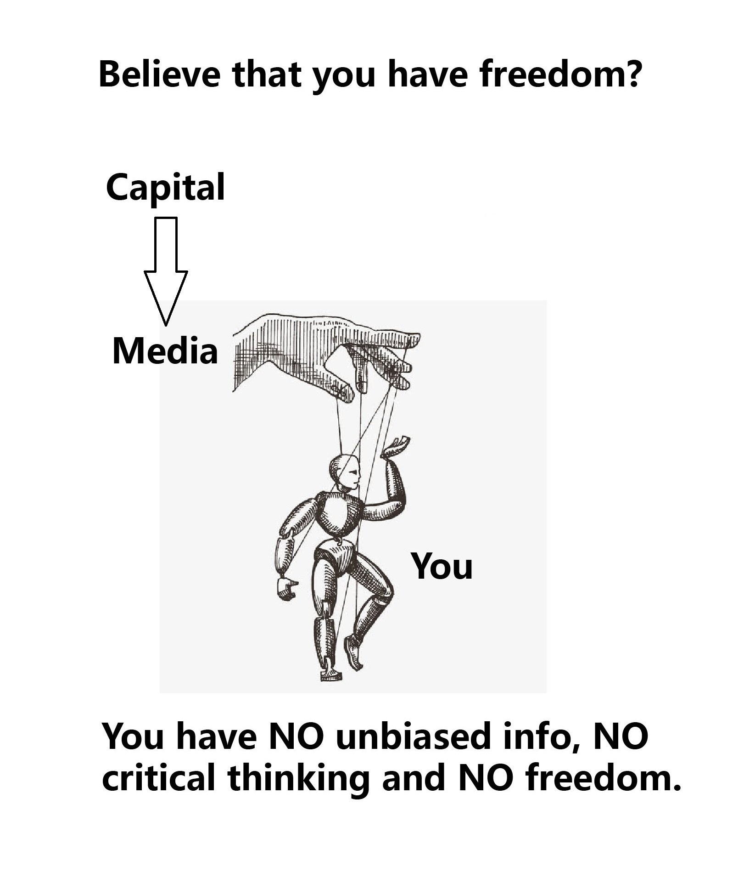

所谓“拥有脑主权”是指，人们对自己的头脑拥有完整的自我控制的权力和能力，是“自主自决”的最高权威。而本文所指的“丧失脑主权”是指，大部分人的头脑虽然还长在自己的脖子上，但是已经不能“自主自决”，而是被外界所影响甚至操纵，这样的人便是“丧失了脑主权”的生物，便不能被认为是一个独立自主的个体。

丧失脑主权这种事，不仅限于某一个国家的人，而是全世界各国人都有的现象；也不只属于当今这个时代，而是古往今来，甚至未来，始终都会有大量的人丧失脑主权。

怎样才能算是拥有脑主权并且能做出合适的判断？以做题为例，先看看一个人怎样才能把题做对：

（1）        你得拥有足够且正确的输入信息，否则，如果题目给的信息不够，或者题目本身有错，那么就算是学霸也不能得到正确答案。

（2）        你得掌握了正确且客观的规律。面对相同的题目，学渣就是会做错，而学霸能做对，这就是因为学霸掌握了正确且客观的规律。

只有同时拥有（1）和（2），你才算得上是拥有脑主权并且能做出合适的判断，少了任何一项，你都难免沦为被人操纵的木偶。

但是，很明显，大部分人都不具备（1）和（2）这两个条件。有一点社会经验的人都应该明白，能早早得到足够且准确的信息是一种特权，大部分人得到的信息都是滞后的，甚至是被加工过的片面的信息；至于掌握正确且客观的规律，那就更少了，大部分人连学校里的那些简单题目都做不明白，更何况去理解这个复杂的世界的规律？

造成这个局面的原因，既有统治阶级故意误导平民的缘故，但也有平民自身的原因。

首先，各国的统治阶级都会掌握媒体系统，垄断重要信息，制造自身对平民的信息优势；其次，以西方统治阶级为例，鼓吹所谓的“快乐教育”，实质是降低教学要求，迎合大部分人贪玩的天性（这一点不分成人或小孩，大部分人都贪玩，不爱学习），用低质量的公立教育体系糊弄平民的子女，平民子女只知道放纵贪玩，但很难学到真才实学。而统治阶级对自己的子女可都是严格要求的，私立精英教育体系可没那么轻松。这样既让平民子女变得麻木愚昧，又减少了统治阶级子女的竞争压力。这是统治阶级故意误导平民的部分。

但是，同时也要看到，平民自身对此也有责任。大部分平民实在是过于懒惰，这里指的是“头脑上的懒惰”。很多平民可以忍受机械的重复劳动，体力层面不算懒惰，甚至能算得上勤劳。但是到了头脑层面，大多数人都是很懒惰的，上学的时候就不好好学习，离开学校后更是完全停止学习。且不说统治阶级故意误导他们，就算统治阶级重点培养他们，他们也上不了道。

总而言之，因为统治阶级和平民双方的原因，导致大多数平民既不能得到及时的、准确的、足够的信息，也不具备认识这个复杂世界的规律的能力，那就不配谈什么“独立思考”、“觉醒”这种烂大街的井底之蛙言论。

那么，“大部分平民”的脑主权属于谁？属于媒体系统。

#### **媒体权，就是洗脑权。**

这个媒体系统，可以是新闻媒体，可以是电视节目，可以是网络上的各种来路不明的大V网红，更广义的媒体系统也可以包括各种电视剧、电影、小说、动漫、游戏。大多数平民都是懒于思考的，媒体系统说什么，他们往往就盲从。久而久之，他们失去了自己的意志，都成了媒体系统的提线木偶。

#### **西方“一人一票”的选举制度不是真正的民主**

在西方国家的制度中，媒体权被资本家集团掌握，资本家集团才是国家的统治阶级，详见[《四元社会模型》](https://lucius.caelumfamily.com/blog/4elements_of_society/)。

对资本家集团而言，他们不介意把选票给平民，因为只要资本家集团能掌握媒体权（洗脑权），也就意味着掌握了大多数平民的脑主权。那么，这些“大多数平民”投出的选票展现出来的立场和意志，其实是他们背后的媒体系统的意志。所以，这些选票看上去是给了各个平民，然而实质上却是给了那些掌握了媒体系统的资本家集团。

而这也是美国统治阶级一定会对Tik Tok赶尽杀绝的原因。媒体权（洗脑权）是至关重要的权力，Tik Tok又是极其高效且重要的媒体工具。美国的统治阶级决不能容忍自己的地盘上出现一个不受自己控制的重要媒体工具（更何况Tik Tok的母公司还是中国公司）。即使Tik Tok保持中立，美国统治阶级都不会放过它，媒体系统必须完全由自己人掌握才行。

至于为什么特朗普会屡次将对Tik Tok的禁令延期？因为美国的媒体系统基本由民主党那一派（包括民主党背后的资本家集团）的势力掌握，对Tik Tok的禁令就是民主党的拜登在任时签署的。而特朗普派系虽然也有一些媒体工具，但还是比不上民主党那一派，因此愿意暂时保留Tik Tok，即使Tik Tok保持中立也能起到对抗民主党媒体工具的作用。

综上而言，所有国家的大部分平民都是没有脑主权的。至于这些“大部分平民”怎样才能夺回自己的脑主权？那就是另一个重大的问题了。
