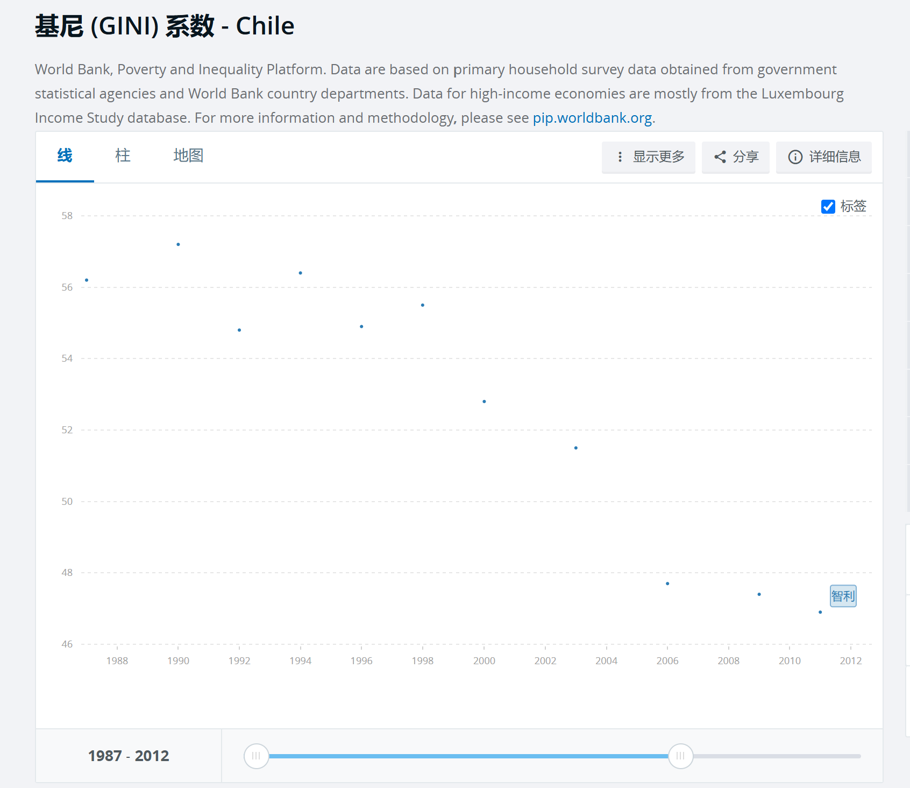
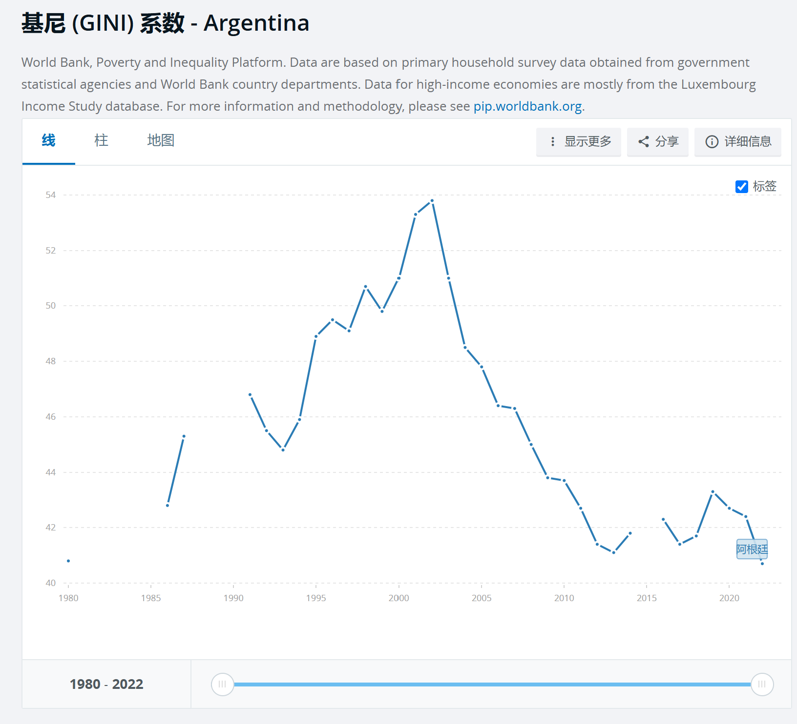
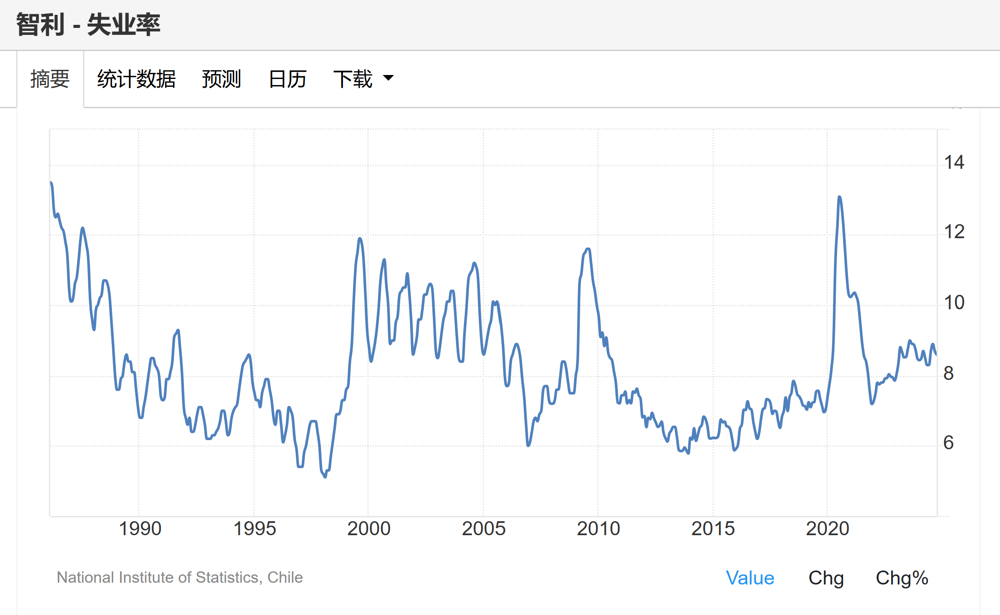
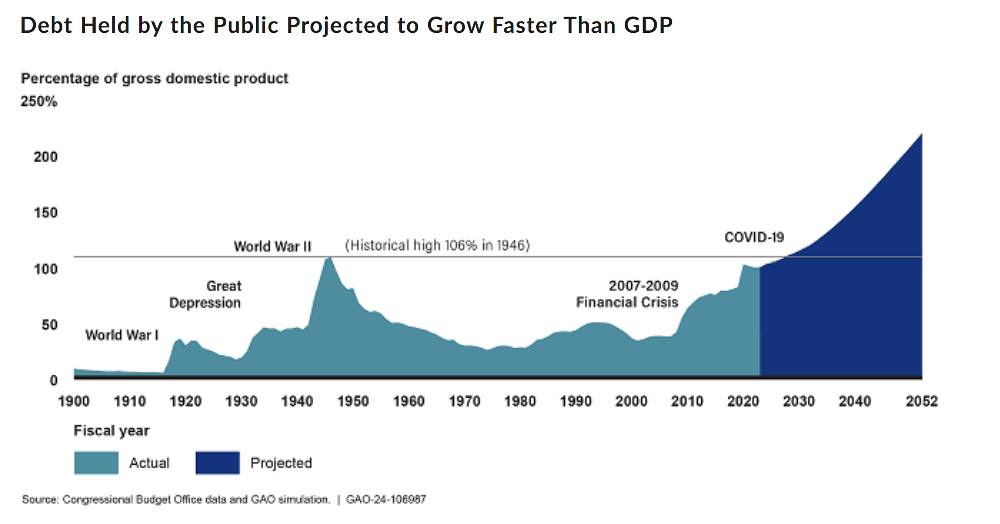

哈耶克，凯恩斯，马克思三人都曾对资本主义制度下的经济危机做出过分析，其中，哈耶克和凯恩斯二人作为资产阶级经济学家，他们的分析似乎只关注了复杂问题的某一面，例如凯恩斯关注“有效需求”，关注如何“拯救危机”（扩大政府财政刺激，提升需求）；哈耶克关注“货币供给”，警惕“干预的代价”（低利率政策扭曲生产结构），主张自由市场。然而，他们都没有看到问题的全貌。只有马克思抓住了资本主义内在矛盾的本质：生产资料私有制导致资本对利润的极致追求，长远来看，必然造成周期性的生产过剩，需求不足，引发经济危机。详细说明如下：

##### **1.**   **哈耶克**

哈耶克主张自由市场，尽量减少政府干预，但是哈耶克将危机归因于“货币供给”的理论未能解释持续大规模失业的现象，也忽视了需求的重要性。例如大萧条中的大规模失业和贫困，解决这些问题具有紧迫性，而如果继续实行自由市场政策，则市场自我修复（如改善劳动者工资和商品价格下降）的过程过于缓慢且痛苦，社会无法承受。并且，长远来看，自由放任的资本主义必然导致马太效应明显，贫富差距失控。

皮诺切特执政智利时期，采取哈耶克派系的主张，实行新自由主义改革。但是，新自由主义改革通过压制劳工权益创造"廉价竞争力"，通过金融自由化转移实体财富，通过公共服务市场化将民生需求转化为盈利工具，这必然导致贫富差距显著增加，这种增长模式本质上是通过透支社会公平换取短期资本积累。而长远来看，贫富差距的增加必然导致新的经济危机，甚至革命。数据如下：

智利的基尼系数：

这里最好是用1973年到1982年间（因为1982年智利又把部分银行国有化，开了倒车，因此考察1982年以前更能展现哈耶克主张的影响）的基尼系数，但没找到那个时期的数据，暂时拿世界银行的智利80年代后的数据代替，智利的基尼系数在上世纪80年代就长期居于0.50以上的高位。相信1973至1980年间的基尼系数也是在高位。

作为对比，80年代的阿根廷的基尼系数一直比智利低，如下图：

失业率情况：

这里最好也是用1973至1982年间的失业率数据（但还是找不到这段时期的数据）。上世纪80年代后半段的失业率已经处于10%以上的高位，由于智利采取哈耶克派系的主张，紧缩的财政政策会导致需求下降，开放自由贸易会打击本国制造业，都会使得失业率上升，因此相信1973至1982年间的失业率总体而言也会呈上升趋势，并处于高位。

直觉上，如果基尼系数和失业率越高，那么革命/战争的风险越高，股市表现也会受负面影响。

因此，智利在该时期采取哈耶克主张，虽然经济有一定发展，但代价是失业率居高不下，基尼系数也长期处于高位，这为智利的经济以及政治环境带来了新的不稳定性。哈耶克的主张不能避免或消除经济危机，反而可能制造新的危机。

##### **2.**   **凯恩斯**

凯恩斯认为，经济衰退的根源在于有效需求不足，主张政府通过财政政策（增加政府支出或减税以刺激需求）和货币政策（降低利率以鼓励投资）主动干预经济，弥补私人部门的有效需求不足。凯恩斯主义获得西方很多国家的采纳，例如1929年大萧条，2008年金融危机时期。

但是：

（1）20世纪70年代“滞涨”时期，凯恩斯主义无法同时应对停滞+通胀的问题（如果继续使用财政扩张，则通胀就更压不住）。美国的里根和英国的撒切尔又开始接受哈耶克主张。

（2）2008年金融危机期间，虽然美国采取凯恩斯主义，实行量化宽松，维护了金融资产价格，但是使美联储资产负债表大幅扩张；超低利率催生股市和房地产泡沫，加剧贫富差距；并且，还加剧了那些“大而不能倒”的大型企业的moral hazard，鼓励大型企业绑架整个经济体的稳定性进行运营活动，一旦失败就由全体国民共同承担后果，呈现一种“劫贫济富”的负面影响。

下图可以看出，自2008金融危机起，公众持有的美国国债占GDP比例显著上升，到新冠疫情后已接近二战时的最高水准。

数据来源：U.S.
Government Accountability Office

凯恩斯主义是在经济危机发生后的一种处理方案，本质是推迟、延缓危机，而非消除危机，更不是提前预防危机的发生，治标不治本。而这种推迟、延缓危机的代价则是让未来的危机的规模更大（国债占GDP比例已经显著大幅上升），更难以处理，后果更严重。而凯恩斯则以名言“长远来看，我们都死了”来回避这种未来的代价。

凯恩斯主义通过政府支出、量化宽松等措施推迟危机，有其合理性，但是不能只靠这种事后弥补的方式来应对经济危机。理想情况下，应该是事前预防为重，如果还是出现经济危机，再配合事后弥补的措施，这两种方案共同实施才是更好的应对办法。不过，在资本主义制度下，事前预防，事前控制资本家的运营活动是一个不现实的目标。这里通过
“四元社会模型”说明这一点。模型详情参照此文《四元社会模型》。

在 “四元社会模型”里，一个国家的参与者可以简化为四种类型：农场主（一个社会真正的主人），工头（为农场主打工的人），肥羊（相对富裕的平民阶层，如中产阶级），瘦羊（最广大的贫穷平民阶层）。在资本主义制度下，农场主是资本家集团，工头是政客集团。资本家集团通过利诱+威逼的手段操控政客集团。

在西方的制度中，分立的三权，行政，司法，立法这三权由政客集团掌握，但是第四权，媒体权却基本由资本家集团掌握。而媒体权的本质是对普通平民的洗脑权，即，资本家可以通过媒体来操纵羊群（平民）的思想，影响政客的公共声誉，媒体权就是攻击政客的武器。因此，政客集团的理性选择是和资本家集团合作，这也意味着事前预防，控制资本家的运营行为往往是不现实的，绝大部分西方政客出于私心，更多是和资本家合谋，而非对立。即使少量政客试图控制某行业的资本家，但是那个资本家往往有其政客盟友，仍有操作回旋余地，例如国会和总统有互相制衡的权力。（相比之下，中国的情况截然不同，中国的政治家集团是可以对资本家集团进行强力管制的）。

因此，既然不能事先控制资本家的经营活动，凯恩斯主义便不能阻止危机的发生，也不能解决危机，而是只能将危机拖到未来，以更大的规模爆发。

经过以上分析，哈耶克和凯恩斯的主张都有自身的问题，并不能阻止经济危机的发生，也没有解释危机爆发的根源。这两位经济学家都代表了资产阶级的利益，似乎不能，或者不愿意直面资本主义的本质问题，而是试图证明人们可以控制资本主义的危机，可以和资本主义共存。因自身阶级的限制，使得哈耶克和凯恩斯不能真正意识到资本主义经济危机的必然性，而革命者马克思意识到了这一点。

##### **3.**   **马克思**

马克思在肯定了资本主义对提高生产技术和生产力的正面作用的同时，也同时提出：在生产资料私有制的前提下，资本必然会产生对利润的极致追求，工人劳动创造出的价值中，有很大一部分是作为剩余价值被资本家剥削走，成为资本家的利润，而工人仅能获得一小部分价值作为自身工资收入。因此，在资本主义制度下，工人阶级永远无法买回其创造的商品的全部价值。

资本主义通过将创造的剩余价值重新投资于新的生产资料以寻求更大的利润。然而，这只会创造更大的生产力，从而产生更多的商品。因此，这不仅不能解决矛盾，反而会加剧生产过剩。

同时，由于资本对利润的极致追求，资本家又会主动压低工人的工资，以及裁员，这又降低了工人阶级的支付能力，以及降低了对商品的有效需求，扩大了有效需求和供应的差距，加剧了生产相对过剩。

因此，在资本主义机制下，生产资料私有制带来的对利润的极致追求，必然导致产生周期性的生产相对过剩，有效需求不足，从而引发经济危机。这就是马克思指出的资本主义经济周期的根源。我们今天的世界的种种乱象证实了他的预言。

##### **4.**   **美国经济周期分析框架**

##### **5.**   **中国经济周期分析框架**

这两个章节是机密，不外传。

##### **6.**   **人类的未来**

马克思对资本主义危机的必然性做出了总结，并提出解决方案就是摈弃资本主义，摈弃生产资料私有制，这样才能从根源上避免资本主义制度下必然会发生的周期性经济危机。

物理学人需要通过实验验证猜想，才能谨慎地得出结论。根据人类已有的经验和数据，我认为马克思提出的“在资本主义机制下，生产资料私有制带来的对利润的极致追求，必然导致产生周期性的生产相对过剩，从而引发经济危机”是正确的。

而“摈弃资本主义，摈弃生产资料私有制就能避免经济危机”是否正确，我仍不能得出肯定的结论（但我觉得有可能是正确的）。苏联式的社会主义制度已经证明无以为继，当然，这不代表其他制度也会得到苏联一样的结局，只是我们仍需要更多的经验和数据才能做出进一步判断。

不过，仅就现阶段而言，中国式特色社会主义可能是符合当前阶段需要，符合我国国情的制度。该制度是一种混合了社会主义和资本主义制度成分，但又对资本主义保持足够控制力的综合性制度，可以一定程度上避免资本主义制度的根本性矛盾，又能适当利用资本主义制度的优势。

例如，政党对国企具有绝对掌控力，国企的生产资料是公有的，且可以在政党指导下适当减少对利润的追求，这就和资本主义制度下极致追求利润形成了对比。同时，政党对民企也有相当高的控制力。这就对政党事先控制资本运营风险提供了基础，与西方国家只能在事后通过凯恩斯主义弥补形成对比。

另一方面，我们也要认识到资本主义极度追求利润对提高生产技术和生产力的正面作用。现阶段仍需要民营资本家为经济发展提供活力和创新精神，因此中国特色社会主义应该为这些民营资本家的经营提供良好环境。

随着AI技术在2025年取得突破，预计将会对人类的生产力发展起到极大的推动作用。等到了生产力高度发展，物质财富极大丰富的阶段，人类是否就能实现共产主义？我们拭目以待。
