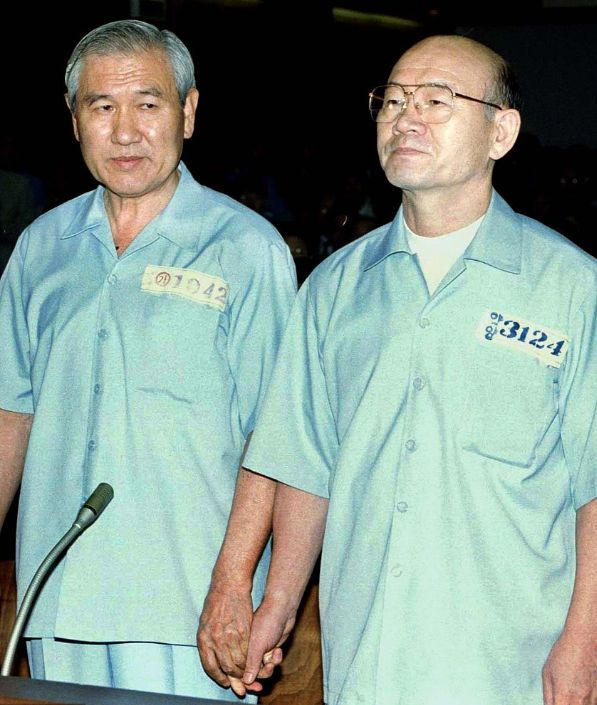

全斗焕和卢泰愚是同乡，自上军校时就认识，当年两人还是宿舍室友，从那时起两人便是好兄弟。毕业后，由于全斗焕善于钻营，早早获得了朴正熙总统的信任，因此全斗焕比同期校友升职速度更快，一直在一心会中处于带头大哥的位置。而卢泰愚就跟在全斗焕身后，充当着二哥的角色。很多时候，全斗焕自己升了官，都会推荐卢泰愚接自己的位置。因此，在这两人相识的前几十年间，他们都关系匪浅，且都是全斗焕地位高于卢泰愚。直到1987年的总统大选，卢泰愚成为韩国第13任总统，全斗焕交出权力，成为前总统，两人的地位发生了变化，而这种变化让他们都不太适应。

站在全斗焕的角度看，他跟卢泰愚是几十年的好兄弟，而且这次大选中，他为了卢泰愚可谓是倾尽全力，甚至让卢泰愚连清算自己的腐败行为这种话都公开承诺了。全斗焕认为自己对卢泰愚已经是义薄云天，于情于理，卢泰愚都该还这个兄弟情，他们兄弟俩应该继续分享韩国的最高权力。所以，全斗焕卸任前就做好了准备，成立了一个“国家元老咨询会议“，希望卸任后通过这个元老会来发挥对政局的影响力。

但是，卢泰愚却有自己的想法。

卢泰愚认为，虽然在自己竞选过程中，全斗焕出力甚多，然而，自己毕竟是全民选举选出的总统，权力来源是全体国民的投票支持，而非来源于全斗焕，而权力只会对权力的来源负责。既然总统权力不是全斗焕给自己的，那自己也没有理由对全斗焕负责。

更何况，人性是很复杂的，没有人愿意分享权力。虽然卢泰愚和全斗焕是几十年的好兄弟，但是，即使是亲兄弟，在分家产的时候尚且都有不少反目成仇的，更何况是总统这种最高权力，没有人愿意把这种权力跟别人分享。即使是几十年的好兄弟，也禁不起这种人性的考验。所以，在全斗焕表达出要干涉政局的意图时，卢泰愚本能地感到了威胁和反感。

不过，全斗焕很明显错误地估计了当时的形势。卢泰愚虽然成为了总统，但民间对全斗焕的声讨不可能消停，全斗焕如果能安稳下台都算走运的了，还想继续掌握权力那就是奢望了。

于是，卢泰愚利用了民意顺势而为，先是和媒体合作，让媒体公开批判全斗焕的“国家元老咨询会议“，再查处了全斗焕亲戚的腐败行为。这下全斗焕才稍微认清了一些现实，很快辞去了在“国家元老咨询会议“中的职务，不再幻想能插手现任政权。

随后，1988年4月，韩国再度进行国会选举，结果是在野党席位超过执政党，卢泰愚刚上任就面临朝小野大的不利局面，为他的政权带来了极大的威胁。三金虽然没有当上总统，但三金的政党在国会里占据主要席位，仍能联合起来对卢泰愚施加巨大压力。于是三金继续要求清算全斗焕执政时期的腐败行为，以及调查光州事件。

此时的卢泰愚左右为难，从主观意愿上来看，他只是不希望全斗焕干涉自己的权力，但也没有动力去清算几十年的好兄弟，更何况以他和全斗焕的关系，真要把全斗焕的问题查清楚的话，自己也免不了一身腥。然而三金控制着国会多数席位，又有巨大的民意支持，卢泰愚如果不向三金妥协，那么自己的总统之位也坐不稳。

对于清算全斗焕这个问题，卢泰愚不清算肯定不行，但是彻底清算肯定也不行，于是卢泰愚只剩下一个选择：适当地查处全斗焕的一些次要问题，造成一些程度较轻的惩罚，用来向反对党和民间交差，即，采取一种“明罚实保”，用相对小的惩罚来避免彻底清算，从而保住全斗焕的策略。

于是，经过全斗焕，卢泰愚双方一系列拉扯和谈判，全斗焕也逐渐接受了现实，双方达成协议：

1.     全斗焕公开发表谢罪声明。

2.     全斗焕交出“全部”个人财产和剩余的政治资金139亿韩元。（其实这点钱根本不是全斗焕的全部财产，他的财产至少在2000亿韩元以上。而且这139亿韩元中，有50亿还是卢泰愚政府出的钱。）

3.     全斗焕离开首尔，去江原道百潭寺隐居。

就这样，1988年11月23日，全斗焕在首尔的家中发表谢罪声明后，就和妻子去了百潭寺，虽然失去了一些人身自由，但百潭寺好歹是名胜古迹，旅游景点，去百潭寺隐居总比去监狱坐牢好。全斗焕在百潭寺住了2年多，直到1990年12月才回到首尔。

作为交换，卢泰愚也顶住反对党的压力，事情就到此为止，在自己任上没有进一步追究全斗焕的问题。

不过，卢泰愚挡得住一时，但肯定挡不住一世。随着卢泰愚干完一届总统任期，三金中的金泳三于1993年接任总统之位，一心会众人的好日子也算是到头了。

金泳三任上启动追查全斗焕卢泰愚的罪行。1996年8月26日，首尔地方法院以主动参与军事叛乱和内乱罪、谋杀上司未遂罪及受贿罪，判处全斗焕死刑，罚款2205亿韩元；以主动参与军事叛乱和内乱罪、谋杀上司未遂罪及受贿罪，判处卢泰愚有期徒刑22年6个月，罚款2628亿韩元。韩国这样同时审判2位前总统（而且全斗焕还是死刑），在国际上都属于罕见，引起了轩然大波。

被告席上的卢泰愚和全斗焕，两人手拉着手接受审判。

1996年12月，首尔高等法院将全斗焕的死刑改为无期徒刑，卢泰愚的刑期降为17年。高等法院的法官认为，全斗焕总统任上发展经济有大功，而且全斗焕当年是和平交权给下一任，没有抵抗，法官援引“降将不杀”的古语，认为不该杀全斗焕，因此改判为无期徒刑。不过，说句实话，由于全斗焕在军队的势力根深蒂固，保守派基本盘还有很大影响力，无论是金泳三总统还是法官估计都不敢真的杀死全斗焕。

而全斗焕和卢泰愚坐牢也没多久。到了1997年12月，当时已是金泳三总统任期的末期，金大中已经确定接任下一任总统之位。此时金大中建议金泳三，赦免全斗焕和卢泰愚这两位前总统。

金大中愿意赦免这两位老对头，一是因为当时处于亚洲金融危机时期，金大中希望通过赦免全卢二人来团结他们背后的保守派势力，所有人齐心协力，共度金融危机的难关。

二是因为，金大中是个非常善良，宽容的人，是三金中私德最高尚的人。其实，在三金中，金大中受到的政治迫害最多，也最有资格报复全斗焕（以及朴正熙）。金大中和朴正熙、全斗焕两位军政府总统抗争了半辈子，有好几次差点被杀，如果不是美国和日本牵制韩国政府，金大中甚至都活不到全斗焕任上，在朴正熙时代就足以死好几次了。然而，金大中一生以“敬天爱人”为人生理念，宽容待人。1980年，全斗焕任上判处金大中死刑，当时金大中在被告席上郑重说道：“我在这里向诸君托付遗言：将来民主政府成立的时候，绝对不能采取政治报复。这个国家的独裁者，一再对政敌滥肆进行残酷的政治报复。我们应该用我们的力量终结这样的报复历史。政治报复就到我为止！”

金大中当年说出“政治报复就到我为止”，等到自己成为总统时真的履行了诺言，绝对不搞政治报复，赦免了曾判处自己死刑的全斗焕（以及卢泰愚），此番以德报怨的胸襟气量以及政治智慧，连全斗焕都服了。金大中晚年病重，全斗焕还去医院探望他。

全斗焕，卢泰愚得到赦免后，返回家中度过晚年。晚年的卢泰愚健康状况不好，长期在家休养，对光州事件表示悔过，并且积极缴纳法院判处的罚金。

而全斗焕晚年健康状况不错，定期和一帮老兄弟们聚会，时不时地怼天怼地怼光州，一边表示没钱交罚金（其实还有不少钱），一边又打打高尔夫球，写写回忆录，晚年生活质量不错。全斗焕这种性格是不会内耗自责的，这种性格虽然获得的评价不好，但是却对健康长寿有利。

直到2021年，卢泰愚和全斗焕相继去世，就这样，第五共和国的一切都该结束了。这兄弟俩，在他们地位大致平等，或者全斗焕略高于卢泰愚的时期，两人的关系都很融洽。只是在卢泰愚当总统期间，卢泰愚高于全斗焕的关系让二人都没有适应，导致二人的关系一度十分紧张。但后来二人又一起坐牢，一起被赦免，他们似乎又回到了以前那种相对平等的兄弟关系。总体而言，全斗焕和卢泰愚称得上是一辈子的兄弟。

国家都是由人组成的，提起大韩民国第五共和国，人们会想到什么？

是一心为了国家发展，但是手段残忍强硬，最后壮志未酬的朴正熙？

是没啥大志向，只想争权夺利，但是却歪打正着，政绩其实还不错的全斗焕？

是跟在全斗焕身后隐忍低调，最终得到总统之位的卢泰愚？

还是为了民主百折不挠坚持抗争，但互相之间亦敌亦友的三金？

亦或是为国为民，才华横溢却天妒英才的金在益首席？

以及其他诸如三许一李，张世东卢信永，一心会众人等五共时期的人物。这些人物都不是绝对的黑或者白，而是灰色的（除了金首席算得上是毫无黑点的白）。正是这些性格迥异，形形色色的人物，共同构成了跌宕起伏的大韩民国第五共和国，一个灰色的，现实的成人政治寓言。

（大韩民国第五共和国系列完结）
