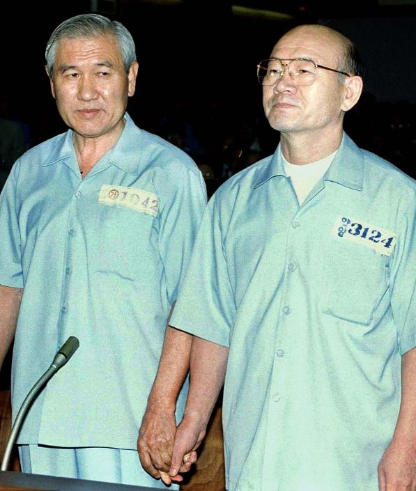

전두환과 노태우는 고향 친구로, 군사학교 시절부터 동기생이자 기숙사 룸메이트로 지내며 형제 같은 우정을 쌓았다. 졸업 후 전두환은 박정희 대통령의 신뢰를 얻어 동기들보다 빠르게 승진했으며, 일심회 내에서 리더 역할을 맡았다. 노태우는 전두환의 뒤를 따르며 "둘째 형" 포지션을 유지했다. 전두환이 승진할 때마다 노태우를 자신의 후임으로 추천했기 때문에, 수십 년간 두 사람의 관계는 전두환이 항상 우위에 있었다. 그러나 1987년 대통령 선거에서 노태우가 제13대 대통령에 당선되며 권력 구조가 역전되었고, 이 변화는 둘 모두에게 적응하기 어려운 도전이 되었다.

전두환의 시각에서 보면, 노태우와의 오랜 우정과 이번 선거에서의 전폭적 지원(심지어 자신의 부패 조사까지 허용한 것)은 "의리의 극치"였다. 그는 노태우가 권력을 공유하며 협력할 것이라 기대했다. 퇴임 직전 전두환은 **"국가원로자문회의"**를 설립해 퇴임 후에도 정계에 영향력을 행사하려 했다.

그러나 노태우는 다른 생각을 품고 있었다.

노태우는 전두환이 대선 과정에서 많은 공헌을 했지만, 결국 자신은 국민 투표로 선출된 대통령이며, 자신의 권력의 원천은 전두환이 아니라 모든 국민의 지지이며, 권력은 권력의 원천에 대해서만 책임을 져야 한다고 생각했습니다. 전두환으로부터 대통령 권한을 받은 것이 아니기에 그에게 충성할 이유가 없었다.

더욱이 인간의 본성은 매우 복잡하며, 누구도 권력을 공유하고 싶어하지 않습니다. 노태우와 전두환은 수십 년간 좋은 형제로 지냈지만, 형제조차도 가족 재산을 분할할 때 종종 서로를 적대시했으며, 대통령과 같은 최고 권력층 사이에서는 더욱 그랬습니다. 아무도 이 힘을 다른 사람과 공유하고 싶어하지 않습니다. 수십 년 동안 친하게 지내온 형제라도 이런 인간 본성의 시험을 견뎌낼 수는 없습니다. 그래서 전두환이 정계에 개입하겠다는 의사를 표명했을 때, 노태우는 본능적으로 위협감과 혐오감을 느꼈다.

전두환은 당시 정세를 잘못 판단했다. 노태우가 대통령이 되었어도 국민의 전두환 비판은 계속되었고, 전두환의 안정적인 퇴임조차 어려운 상황에서 권력 유지는 불가능했다.

노태우는 여론을 활용해 전략을 펼쳤다. 먼저 언론과 협력해 전두환의 **"국가원로자문회의"**를 공개적으로 비판했고, 전두환 측근의 부패 사건을 적발했다. 이에 전두환은 현실을 인정하고 원로회에서 사임하며 현 정권에 간섭하지 않기로 했다.

1988년 4월, 한국은 총선을 실시했고 여당이 패배하며 노태우 정권은 **여소야대(與小野大)**의 불리한 상황에 직면했다. 삼김(김영삼·김대중·김종필)은 대통령 자리는 얻지 못했지만, 국회 다수 의석을 확보해 노태우에게 강력한 압박을 가했다. 이들은 전두환 정권의 부패와 광주 사태 재조사를 계속 요구했다.

노태우는 딜레마에 빠졌다. 개인적으로는 전두환의 간섭을 원치 않았지만, 수십 년간의 우정을 저버리며 철저한 청산을 실행할 의지도 없었다. 더욱이 전두환 문제를 파헤치면 자신도 연루될 위험이 있었다. 그러나 삼김의 국회 장악과 압도적 여론 지지 앞에서 타협은 불가피했다.

결국 노태우는 중도적 해법을 선택했다. 전두환의 2차적 문제만 제한적으로 조사해 상징적 처벌을 내리는 "명벌실보(明罰實保)" 전략으로, 삼김과 국민의 요구를 잠재우며 전두환을 보호하려 했다.

전두환과의 긴 협상 끝에 양측은 합의에 도달했다:

1. 전두환은 공개적으로 사과 성명을 발표한다.
2. 전두환은 "전체" 개인 재산과 잔여 정치 자금 139억 원을 반납한다.  
   (실제로 이 금액은 전두환 재산의 극히 일부에 불과했다. 그의 재산은 최소 2000억 원 이상이었으며, 139억 원 중 50억 원은 노태우 정부에서 지원한 자금이었다.)
3. 전두환은 서울을 떠나 강원도 백담사로 은거한다.

1988년 11월 23일, 전두환은 서울 자택에서 사과 성명을 발표한 후 아내와 함께 백담사로 떠났다. 비록 자유가 제한되긴 했지만, 백담사는 명승지이자 관광지였기에 감옥보다는 낫다는 평가였다. 그는 1990년 12월 서울로 돌아올 때까지 2년 넘게 백담사에서 머물렀다.

이에 대한 조건으로 노태우는 야당의 압박을 견디며 임기 내 추가 수사를 중단했다.

그러나 노태우의 영향력은 일시적이었다. 1993년 김영삼이 대통령에 취임하며, 일심회 세력의 시대는 완전히 끝났다.

김영삼 정부는 전두환과 노태우의 범죄 재조사에 돌입했다. 1996년 8월 26일, 서울지방법원은 전두환에게 군사 반란 및 내란 주도, 상관 살해 미수, 뇌물 수수 혐의로 사형과 2,205억 원의 벌금을 선고했다. 노태우도 동일한 혐의로 징역 22년 6개월과 2,628억 원의 벌금을 받았다. 두 전 대통령을 동시에 재판에 회부하고 사형을 선고한 것은 국제적으로도 이례적이어서 큰 파문을 일으켰다.

피고인석에 선 노태우와 전두환은 손을 맞잡은 채 재판을 받았다.

1996년 12월, 서울고등법원은 전두환의 사형을 무기징역으로 감경했고, 노태우의 형량도 17년으로 줄였다. 재판부는 "전두환이 경제 발전에 기여했으며 평화적 권력 이양을 했다"는 이유를 들어 "항복한 장수를 죽이지 않는다(降將不殺)"는 옛 격언을 인용하며 사형 집행을 거부했다. 그러나 사실상 전두환의 군부 내 영향력과 보수층의 압력이 작용했으며, 김영삼 대통령과 법원 모두 그를 처형할 정치적 용기가 없었다는 해석이 지배적이었다.

전두환과 노태우는 오랫동안 감옥에 머물지 않았다. 1997년 12월, 김영삼 대통령의 임기가 끝나갈 무렵, 김대중이 다음 대통령으로 확정되었습니다. 이때 김대중은 김영삼에게 전두환, 노태우 두 전직 대통령을 사면해 줄 것을 건의했다.

김대중이 두 라이벌(전두환·노태우)을 사면한 이유는 두 가지였다. 첫째, 1997년 아시아 외환 위기 당시 보수층의 지지를 얻어 국론을 통합해야 했기 때문이다. 둘째, 김대중 본인이 **"경천애인(敬天愛人)"**을 신조로 삼은 관용적인 인물이었기 때문이다. 삼김(김영삼·김대중·김종필) 중에서도 김대중은 가장 많은 정치적 탄압을 받았으며, 박정희와 전두환 군사 정권과 평생을 싸웠다. 그는 박정희 시대에 여러 차례 사형 위기를 겪었고, 미국과 일본의 압력이 없었다면 생존조차 어려웠을 것이다.1980년 전두환 정권은 김대중에게 사형을 선고했고, 그는 재판장에서 이렇게 선언했다: "유언을 남깁니다. 미래 민주 정부가 수립되면 결코 정치 보복을 해서는 안 됩니다. 이 나라 독재자들은 정적에게 잔혹한 보복을 반복해왔습니다. 우리의 힘으로 이런 역사를 끝내야 합니다. 정치 보복은 내게서 끝나게 하십시오!"

대통령이 된 김대중은 이 약속을 지켰다. 자신에게 사형을 선고했던 전두환과 노태우를 특별 사면했으며, "원수를 은혜로 갚는" 그의 정치적 포용력은 전두환조차 감복시켰다. 김대중이 말년에 병석에 눕자 전두환은 병문안을 가기도 했다.

전두환과 노태우는 특별 사면 후 집으로 돌아가 여생을 보냈다. 노태우는 건강이 악화되어 오랫동안 요양하며 광주 사태에 대한 후회를 표명하고, 법원이 부과한 벌금을 성실히 납부했다.

반면 전두환은 건강이 양호했으며, 옛 동료들과 정기적으로 모임을 가지며 골프를 치고 회고록을 집필하는 등 편안한 말년을 보냈다. 그는 "벌금을 낼 돈이 없다"고 주장했지만(실제로는 상당한 재산을 보유했음), 자신의 과오를 반성하는 모습은 보이지 않았다. 이런 성격은 평가는 좋지 않았지만, 오히려 건강과 장수에 도움이 되었다.

2021년, 노태우와 전두환이 차례로 세상을 떠나며 제5공화국의 모든 것이 막을 내렸다. 두 사람은 권력 관계가 평등하거나 전두환이 우위에 있을 때는 우호적이었지만, 노태우가 대통령이 되며 긴장감이 고조되었다. 그러나 함께 수감되고 사면되며 다시 평등한 형제 관계로 돌아간 듯했다. 결국 그들은 평생의 형제로 남았다.

국가는 사람들로 이루어져 있습니다. 제5공화국이라고 하면 사람들은 무엇을 떠올릴까요?

국가 개발에 헌신했지만 잔혹하고 강경한 방법을 동원해 결국 야망을 이루지 못한 박정희가 맞나요?

전두환은 큰 야망이 없고 오로지 권력 다툼만 하다가 우연히 성공하고 정치적 업적이 실제로 꽤 좋은 사람인가요?

전두환을 따르며 조용히 지내다가 결국 대통령이 된 노태우가 맞나요?

아니면 그들은 민주주의를 위해 끈기 있게 투쟁하지만 서로 적이기도 하고 친구이기도 한 3김씨일까요?

아니면 재능은 있지만 불쌍한 사람으로 나라와 국민을 위해 봉사한 김재익일까요?

그 외에도 삼허일이(三許一李), 장세동·노신영, 일심회 구성원 등 제5공화국 시대 인물들이 있었다. 이들은 모두 절대적인 흑백으로 구분될 수 없는 회색이었다 (단, 김재익만은 흠잡을 데 없는 순백으로 남았다). 각양각색의 성격과 선택이 교차하며, 이들은 격동의 대한민국 제5공화국—회색빛 현실주의 정치의 우화—를 형성했다.

(제5공화국 시리즈가 마무리되었습니다)
