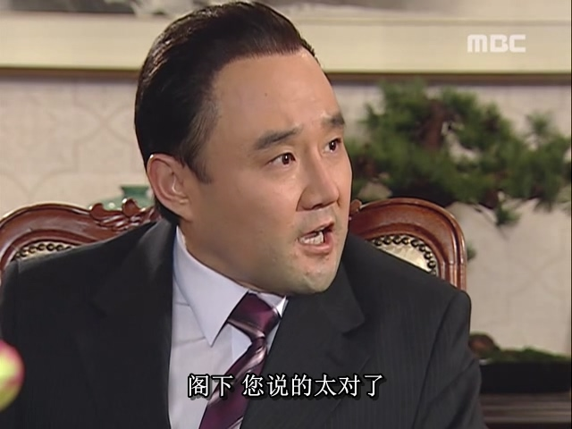
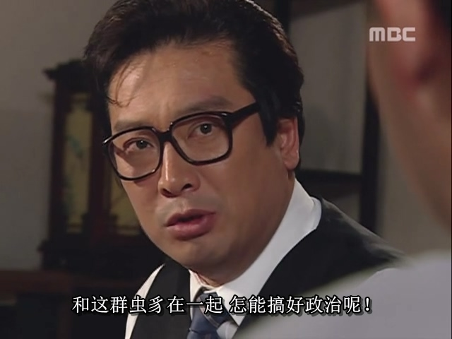

한국 현대 정치는 동아시아 정치의 특성을 이해하는 데 매우 좋은 접근점입니다. 한편으로는 동아시아 삼국(한국, 일본, 중국)은 문화적으로 동일한 뿌리를 가지고 있어(일본과 한국의 문화는 중국의 영향을 많이 받았음), 이 세 나라 사람들의 사고방식과 행동 패턴에는 공통점이 많으며, 서로 거의 무리 없이 이해할 수 있습니다. 다른 한편으로, 가장 중요한 점은 한국의 특수한 국정 상황으로 인해 각 파벌 간의 투쟁이 치열하고, 후임자가 전임자를 청산하는 일이 끊이지 않아, 한 차례 한 차례의 청산 과정에서 전임 정권의 사건들이 매우 상세하게 드러납니다. 이러한 고위 정치의 세부 사항을 적극적으로 노출시키는 특징은 전 세계적으로도 드문 현상이지만, 이를 통해 대중이 한국 현대 정치의 많은 세부 사항을 알 수 있게 된 것은 매우 귀중한 일입니다.

한국 정치사를 이해하려면 그들의 대통령들의 행적을 보면 됩니다. 한국의 대통령들은 몇 명의 대행 대통령(윤보선, 최규하)을 제외하고는 모두 상당히 개성적이고 화제성이 있으며, 심지어 가장 무능하다고 평가받는 윤석열조차도 무능함이 특별해서 새로운 경지를 열었다고 할 수 있습니다. 이렇게 개성 넘치는 한국 대통령들 중에서, 제가 가장 이야기할 가치가 있다고 생각하는 인물은 아마도 대한민국 제5공화국의 전두환일 것입니다.

그러나 제5공화국을 이야기하려면 제4공화국의 결말인 박정희의 죽음을 빼놓을 수 없습니다.

박정희(1917년 11월 14일 ~ 1979년 10월 26일), 호는 중수, 대한민국 제5대부터 제9대 대통령으로, 한국 헌정사상 가장 오랜 기간 집권한 국가 원수이며, 한국 제18대 대통령 박근혜의 아버지입니다.

이 시리즈는 주로 "5공"에 관한 이야기를 다루며, "4공"의 전반적인 부분은 가능한 한 간단히 설명하겠습니다.

박정희는 말년에 쿠데타를 일으켜 종신 대통령제, 즉 독재를 실시했습니다. 그의 독재 통치는 두 가지 큰 기둥으로 이루어져 있었습니다:

1. 경제 고속 성장. 박정희 통치 기간 동안 한국은 가난한 농업국에서 초기 산업국으로 도약했으며, 1인당 국민 총생산(GNP)은 1961년 82달러에서 1979년 1644달러로 증가했습니다. 박정희는 이로 인해 "한강의 기적의 창조자"로 불리게 되었습니다.
2. 정보 통치, 즉 정보 기관을 통해 정국을 장악하고 반대자를 제거하여 박정희의 지위를 유지했습니다.

1979년 시점에서 박정희는 다음과 같은 세 사람을 통해 정보 통치를 실시했습니다:

1. 중앙정보부(한국판 CIA, 주로 국내외 전략 정보 수집 담당), 김재규;
2. 경호실(본래 업무는 대통령의 신변 보호이지만, 박정희 말년 독재로 인해 경호실에 더 많은 기능이 추가됨), 차지철;
3. 보안사(주로 군대 내부의 정보 기관), 전두환.

독재자로서 박정희는 이 세 부하를 조종하여 서로 견제하게 함으로써 자신의 절대적인 지도자 지위를 보장했습니다. 이 세 사람 중 차지철과 전두환은 박정희에게 절대적으로 충성했지만, 김재규는 박정희의 고향 친구로 원래는 충성스러웠을 테지만, 차지철과의 권력 다툼에서 밀리면서(차지철은 리더의 최고 아첨꾼이었고, 김재규는 그런 면에서 차지철을 이길 수 없었음) 결국 충성심이 절대적이지 않게 되었습니다.

1979년, 한 차례의 시위 운동이 박정희와 김재규 사이의 갈등을 크게 악화시켰습니다.

간단히 말해, 당시 최대 야당 총재인 김영삼(이 이름은 기억해두세요, 한국 유명한 "삼김" 중 하나로, 한국 정계에서 수십 년간 활약한 익숙한 얼굴입니다)은 박정희의 독재 통치에 반대하며 헌법 개정을 요구했고, "YH 무역 회사" 노동자 투쟁을 지지했기 때문에 박정희의 지시로 국회의원 자격을 박탈당했습니다.

김영삼이 국회에서 제명된 후, 한국 정계는 큰 파장을 일으켰습니다. 김영삼의 정치적 근거지인 부산, 마산, 창원 등지에서 대규모 시위가 발생했고, 김영삼의 지지 기반인 부산, 마산 등의 한국인들이 거리로 나섰습니다.

"부마 시위"를 어떻게 진압할 것인가에 대한 문제에서, 중앙정보부장 김재규는 분명히 두려움을 느꼈습니다. 그는 상대방의 민의가 거세고 인원이 많다는 것을 발견했기 때문에 강경 진압을 두려워했습니다.

반면, 대통령 박정희는 쿠데타로 권력을 잡은 전 군인으로서, 한편으로는 그의 성격 자체가 강경했고, 다른 한편으로는 독재자가 말년에 갈수록 냉혹해지고 "고립된 자"가 되는 경향이 있습니다. 이는 마치 고대의 황제와 비슷합니다. 오랜 독재 통치는 필연적으로 박정희가 수많은 적을 만들게 했고, 그는 이러한 강경한 태도와 실력을 계속 유지해야만 다양한 반대자들을 억누를 수 있었습니다. 일단 조금이라도 타협하거나 약해지는 모습을 보이면 많은 반대자들이 움직이기 시작할 것입니다. 따라서 독재자로서 박정희는 계속 강경하게 대처하는 것을 선택했는데, 이는 성격적인 이유도 있었지만, 현실적인 자기 보호의 필요성도 있었습니다.

최고의 아첨꾼 차지철은? 당연히 "리더님 영명하십니다"라고 말하며, 리더가 하자는 일을 최선을 다해 실행하겠다고 말했습니다.

이 외에도, 김재규와 차지철은 평소에도 끊임없이 마찰을 빚었습니다. 차지철은 자신이 (박정희의) 총애를 받고 있다는 것을 믿고 김재규를 존중하지 않았습니다. 또한, 김재규는 선배이고 차지철은 후배인데, 한국 문화에서는 특히 상하 관계를 중시하며, 후배가 선배에게 존댓말을 사용하지 않는 것도 큰 문제입니다. 따라서 후배 차지철의 다양한 무례한 행동에 대해 김재규는 극도로 분노했습니다.

김재규는 점점 박정희의 신뢰를 잃고 해임될 가능성이 있으며, 이 권력 투쟁에서 패배자가 될 것이라고 느꼈습니다. 그는 가만히 앉아서 기다릴 수 없다고 생각했고, 적극적으로 나서기로 결정했습니다: 박정희를 암살하고, 최고의 아첨꾼을 제거하는 것(이 이유가 더 중요할 수도 있습니다). 그는 이 생각을 한 후, 서둘러 행동에 나섰고, 시간은 바로 그날인 1979년 10월 26일 저녁, 박정희가 "대판"으로 열린 만찬 자리에서 암살을 실행하기로 했습니다.

"대판"이란 중앙정보부가 정기적으로 박정희의 만찬을 주선하는 것으로, 참석자에는 박정희와 몇몇 측근 고관들, 그리고 몇몇 미녀들이 술을 따라주고 노래를 부르는 자리입니다.

1979년 10월 26일 저녁의 "대판"에는 박정희와 그의 그림자처럼 따라다니는 최고의 아첨꾼 외에도 김재규가 참석했습니다. 자리에서 박정희가 "부마 시위" 진행 상황을 묻자 김재규를 다시 질책했고, 최고의 아첨꾼도 예상대로 불을 지피며 김재규를 공격했습니다. 결국 김재규는 폭발했고, 다음과 같은 명대사를 남겼습니다:

이후, 김재규는 총을 꺼내 최고 지도자 박정희와 최고의 아첨꾼 동료를 현장에서 사살했고, 많은 직장인들이 꿈꾸지만 감히 하지 못하는 일을 해냈습니다. 보아하니, 아첨꾼이라는 생물은 어디에서나 미움을 받는 것 같습니다.

한국의 드라마에서는 종종 김재규를 독재에 반대하고 민주화를 추진하는 "고귀한 이미지"로 묘사하는데, 이는 입장이 머리를 결정하는 것으로, 사실 역사적 사실과는 다릅니다. 현재 한국에서는 민주주의를 지지하고 군사 정권을 반대하는 것이 절대적인 정치적 올바름이며, 또한 드라마 뒤의 재벌들은 군사 정권을 증오하면서도 두려워합니다(군사 정권의 몇몇 대통령들이 재임 중 재벌들을 PTSD 상태로 만들었음). 따라서 이 주제의 모든 드라마는 군사 정권을 비판하고 폄하하는 방향으로 흐릅니다(특히 전두환에 대해). 이러한 "반군사 정권"의 기조 아래, 박정희를 암살한 김재규는 드라마 제작자의 입장을 보여주는 도구로 사용되며, 그들이 미화할 수 있는 "민주주의 상징"이 되었습니다. 그러나 역사적 사실에서의 김재규는 "민주주의를 위해"라고 보기 어렵고, 다양한 요소가 합쳐져 순간적으로 충동을 느끼고, 너무 많은 고민 없이 서둘러 행동한 것으로 보입니다.

객관적으로 말하자면, 김재규의 이번 암살은 한국의 역사적 과정을 바꾸었고, 다양한 세력들에게 큰 이익을 가져다주었습니다. 이에는 다음과 같은 것들이 포함됩니다:

1. 가장 먼저 이익을 본 사람은 전두환입니다. 박정희와 경호실장 차지철이 모두 사망했고, 중앙정보부장 김재규도 곧 체포되어 진상이 밝혀진 후 처형되었기 때문에, 한국의 고위 권력 기구는 순간적으로 큰 혼란에 빠졌습니다. 대통령, 경호실, 중앙정보부 세 자리가 모두 기능을 상실했고, 세 정보 통치 기구 중 유일하게 보안사만 남았습니다. 전두환 파는 손실을 입지 않았을 뿐만 아니라, 이번 암살 사건 조사의 최전선에 서게 되었습니다. 김재규의 이번 암살은 전두환이 최고 권력의 자리에 오르는 데 방해물을 제거해주었고, 신의 한 수가 되었습니다(비록 이것이 김재규의 본래 의도는 아니었지만).
2. 민주파 인사들도 이익을 보았습니다. 박정희는 한국 대통령 자리를 18년간 장악했고, 그의 독재 통치는 당시 흔들리기 어려웠으며, 민주파는 박정희를 막을 힘이 없었습니다. 결과적으로 김재규가 폭력적으로 박정희의 통치를 종식시켰고, 박정희 사후 한국 민주파 인사들은 희망을 보았고, 민주화 운동의 절정을 이루었습니다. 그 기간은 "서울의 봄"이라고 불리며, 민주파는 일시적으로 승리에 가까워졌지만, 전두환이 나서서 패배시켰습니다.
3. 가장 기이한(또한 가장 우스운) 점은 암살당한 박정희 본인도 이익을 보았다는 것입니다. 당시 박정희는 이미 "부마 시위"를 강경하게 진압하기로 결정했고, 민간인 사상자가 수없이 발생해도 상관없다는 입장이었습니다(말년의 박정희는 점점 독단적이고 잔혹해졌음). 만약 그가 실제로 그렇게 했다면, 박정희의 역사적 평가는 아마도 전두환보다 더 낮았을 것입니다. 그러나 김재규가 박정희를 "절벽에서 말을 멈추게" 하여 그가 그런 일을 하지 못하게 했고, 이는 박정희의 역사적 평가를 구했습니다. 현재 한국인들이 공통적으로 인정하는 최고의 대통령은 여전히 박정희입니다. 이 관점에서 보면, 박정희 본인도 이로 인해 이익을 본 셈입니다.

이상이 대한민국 제5공화국의 전반적인 배경입니다. 김재규는 개인적인 원한과 정치적 견해 차이로 인해 박정희를 암살했고, 의도치 않게 전두환에게 도움을 주어 그를 역사의 무대에 올려놓았습니다. 뿐만 아니라, 김재규는 암살 당일 밤의 "대판"에서 또 다른 고관을 초대했는데, 바로 한국 육군 참모총장(육군의 최고 지도자) 정승화입니다. 이 초대는 전두환에게 또 다른 큰 도움을 주었습니다. 이는 제5공화국의 첫 번째 클라이맥스인 전두환과 그의 형제들의 일생의 하이라이트, 12·12 군사 반란으로 이어집니다.
