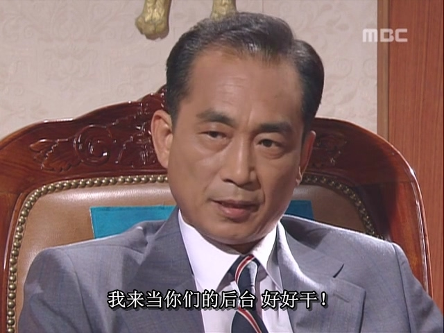
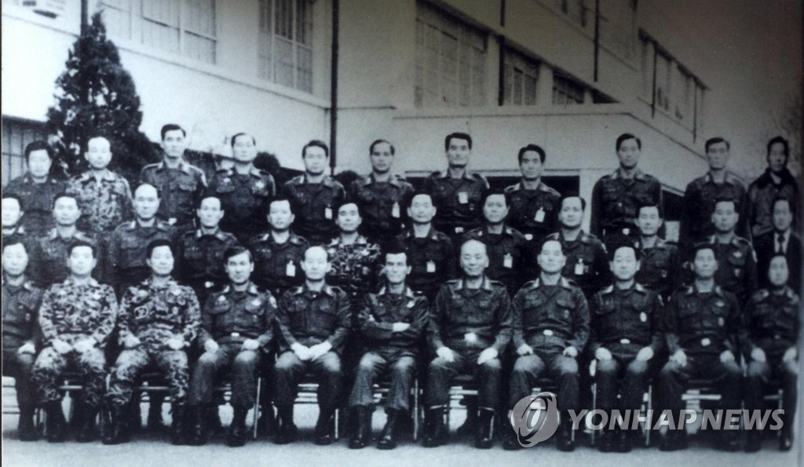

由于金载圭刺杀朴正熙并没有周密计划，反而处处露出破绽，因此很快就暴露了，当晚即被逮捕。紧接着，剩下的韩国高官的当务之急就是宣布戒严，并授权保安司令官全斗焕全权负责查清朴正熙遇刺一案的真相，追查金载圭的同党。

就这样，韩国第一好大哥，五共第一男主角，全斗焕就这样被历史的潮流裹挟着走上了前台。

朴正熙的突然死亡，让韩国的最高权力陷入真空，而权力讨厌真空，多方势力都不约而同地盯上了最高权力的宝座。在权力的游戏中，所有参与者都只有“一往无前获得胜利”和“斗争落败失去权力”两个结局二选一，想要维持原状都是不可能的。双12政变正是在这一背景下必然发生的事件。

一句话解释双12政变发生的原因，正是中国人都很熟知的：一朝天子一朝臣。

全斗焕很久以前就在军队中成立了一个秘密组织——一心会，这是以全斗焕为核心的少壮派军官小团体，而这些一心会成员向朴正熙效忠，因此被认为是朴正熙在军中的亲信。

朴正熙活着的时候，他就是一心会的后台，因此军中其他大佬也不方便对一心会成员怎么样。不过现在朴正熙这个“天子”死了，那就要一朝天子一朝臣了。陆军一把手，参谋总长郑昇和开始着手铲除一心会这个不受自己控制的“前朝旧臣”小团体，首当其冲的就是一心会的带头大哥，全斗焕。

当时的情形是，郑总长一方具有权力的优势，因为他是陆军一把手，对军队的人事任免有重要影响力，因此郑总长打算走正规程序，逐步将一心会成员调往虚职岗位，剥夺他们的实权，各个击破。

而全斗焕一方则具有武力的优势，即，一心会很多成员都在军中担任中高级军官，有权调动军队，是实权武官。一心会众人经过多年经营，首都圈附近的军队，绝大部分都由一心会成员们控制着。

而权力的底层基础（之一），正是武力，而非虚名职位。

全斗焕这边很快也收到了风声，知道自己这方和郑总长的矛盾已经无可避免。在保安司令部的下属“二许一李”（许和平，许三守，李鹤捧，也是一心会成员）的建议下，全斗焕决定，先下手为强，以“内乱帮助罪”的名义秘密逮捕郑总长，将郑总长牵扯进朴正熙遇刺一案，从而打倒对手。

这里就要回顾一下，金载圭帮了全斗焕的大忙：在刺杀朴正熙当晚鬼使神差地邀请了郑总长一起赴宴。当时郑总长虽然和朴正熙不在一个包间内，但也在同一栋建筑内，因此也算是擦着边的“在现场”，这就给了全斗焕做文章的空间。金载圭刺杀了朴正熙，这属于内乱罪，而郑总长被金载圭邀请一同前往现场，全斗焕就可以给郑总长安一个“内乱帮助罪”，至于是怎么帮助的，这都是技术性问题，交给手下小弟们审讯，要什么样的口供证据都不难。只要能用武力获得胜利，抓住郑总长，这些技术性问题就都是小事。毕竟，历史是由胜利者书写的。

郑总长以为自己能在规则范围内玩死全斗焕一帮人，却不知，全斗焕可以不跟他玩规则，直接用武力破局。只要武力足够强，规则，就是用来打破的。

全斗焕在1979年12月12日，叫上了一心会的骨干兄弟们一起来到首尔景福宫内，联手发动了韩国近代最成功的政变，双12政变：先出其不意抓捕郑总长，再打败反政变方的军人，胜负已定后再逼代行总统（崔代行）签署逮捕郑总长的逮捕令完成合法程序，一夜之间，军队变天。

韩国在2023年上映了一部电影《首尔之春》，故事原型正是这场双12政变。但整部电影只有开头和结尾是真的，而过程都是胡编乱造的。真实的双12政变过程远没有电影那样跌宕起伏反转多次，反倒几乎是全斗焕一边倒地占据着优势。全斗焕能赢，主要有以下几个原因：

1.      一心会各成员高度团结，即使面对一时的挫折也毫不退缩，反而紧密团结在全斗焕周围，兄弟一心，同生共死。

2.      军中有大量的中立派，不反对全斗焕夺权，于是在政变当晚就事不关己高高挂起，谁赢他们就帮谁。事实上，全斗焕赢了后对这些中立派的将领也确实都不错。

3.      美国的核心利益是朝鲜半岛稳定，韩方谁夺权对美国而言并不是大问题，但如果韩军内斗打成两败俱伤，勾引朝鲜南下，那是美国绝对不能接受的。因此在这场政变中，美国不支持镇压全斗焕一方。

4.      郑总长一方人数不多，也就首警司的张泰玩和特战司的郑炳宙坚持反对全斗焕，而这两个将军又很倒霉，他们手下的军官大多数都是全斗焕的小弟，在政变当晚全都跑去支持全斗焕了，导致张、郑两人根本无兵可用。甚至更离谱的是，张、郑两人最后都是被自己的下属反叛并抓捕的，这在下级绝对服从上级的军队中也是一大奇观。由此也可见，全斗焕在军中确实是非常得人心，众小弟们为了全大哥不惜反叛自己的顶头上司。

《首尔之春》这部电影为了黑全斗焕，黑军政府，于是捏造了多个情节，例如：电影中的全斗焕让1空输的旅长小弟去把自己的兵带到首尔来，小弟不愿意，全斗焕就用枪逼着小弟，要么杀了自己要么就回去带兵。电影表现出来的一心会就像个仅靠利益维持的乌合之众团体，一有困难就打退堂鼓，然而实际并不是这样。

实际是：全斗焕让1空输的小弟回去带兵进首尔，小弟二话不说立刻就去，拿命跟全斗焕共进退；全斗焕让3空输的小弟去逮捕自己的顶头上司，小弟只犹豫了片刻就下定决心干。至于全斗焕的同辈，“一辈子的同志”卢泰愚，不需要全斗焕开口就召来了自己下属的前线军队，韩军王牌“白马师团”，而不经美军同意就调动前线军队是赤裸裸的违反军纪行为（因为韩军前线军队要防范北边的朝鲜），卢泰愚也是搭上了身家性命和全斗焕一起干。总之，政变当晚，一心会众骨干成员可谓是齐心协力，和全斗焕共进退。

一心会内部如此团结，主要有以下几个原因：

1.      一心会众人利益一致，唇亡齿寒。他们如果不团结起来，只会被郑总长各个击破，逐渐边缘化。

2.      各成员之间，尤其是各晚辈和全斗焕之间，可能真的有一些兄弟情。

这就不得不提到全斗焕这个人，是个比较复杂的人，对外界的敌人确实不行，堪称冷酷狡诈；但是在对自己人方面，那确实是公认的好大哥。全斗焕因为深得朴正熙信任，在军中升职较快，而且他升上去后也不忘记一心会的兄弟们，主动牵线搭桥跑关系，帮忙将各兄弟安排到好岗位上，带着兄弟们一起飞。而且全斗焕很会花钱，搞到钱后往往更多是花在打点关系上，有福同享，平时定期搞搞聚会，拉近一心会成员间的感情。而且，全斗焕在对一心会的嫡系兄弟好的同时，对其他山头的中立派也没怠慢，时不时地送点礼给其他山头的大佬。全斗焕的这种“会来事”，而且背景硬（有朴正熙做靠山），导致他在军中的人缘相当好，因此混得风生水起，拥趸众多。

总之，在一心会众人齐心协力之下，全斗焕政变成功，打败郑总长，一心会控制了军方的势力。政变成功后，全斗焕一方留下了这张著名的合照（下图是历史真实照片，不是电影剧照）。

在全斗焕通往最高权力宝座的路上，他有两个敌人，一是军中如郑总长这样的反对者，不过现在已经被他打败。剩下的敌人就是民间的政客，民主派“三金”，即金泳三，金大中，金钟泌。“三金”也是韩国政坛的传奇人物，尤其是金泳三和金大中，和军政府不屈不挠斗争了半辈子，最终先后成为韩国总统。

就在全斗焕思考如何打败“三金”时，一个人主动靠近了全斗焕。
