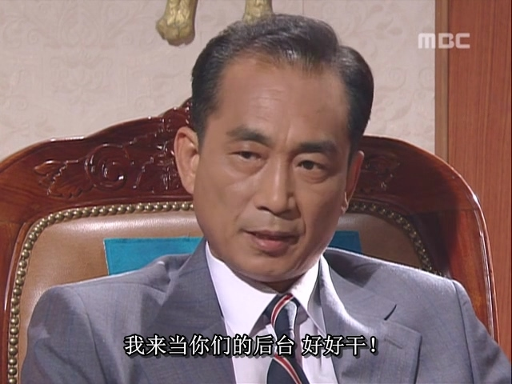
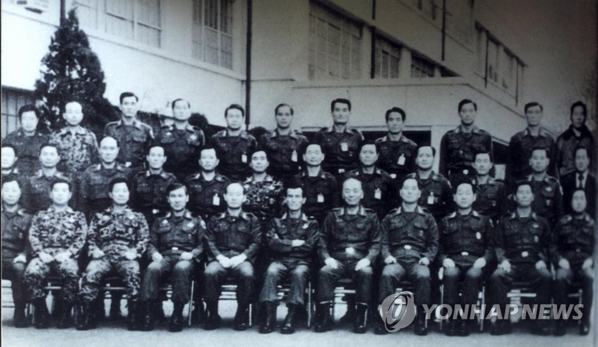

김재규가 박정희를 암살한 계획은 치밀하지 못하고 도처에 허점이 노출되어 결국 빠르게 발각되었으며, 당일 밤 체포되었습니다. 이어 남은 한국 고관들의 급선무는 계엄을 선포하고 보안사령관 전두환에게 박정희 암살 사건의 진상 규명과 김재규의 공범자 추적을 전권 위임하는 것이었습니다.

이렇게 해서 한국 제1의 큰형님이자 5공의 주인공 전두환은 역사의 흐름에 휩쓸려 전면에 등장하게 되었습니다.

박정희의 갑작스러운 죽음으로 한국의 최고 권력은 공백 상태에 빠졌고, 권력은 공백을 싫어하기 때문에 여러 세력이 최고 권력의 자리를 노리게 되었습니다. 권력 게임에서 모든 참여자는 "승리를 향해 전진"하거나 "투쟁에서 패배해 권력을 잃는" 두 가지 결말 중 하나만 선택할 수 있으며, 현상 유지는 불가능했습니다. 12·12 군사 반란은 이러한 배경에서 필연적으로 발생한 사건입니다.

한 마디로 12·12 군사 반란의 원인을 설명하자면, 중국인들에게 잘 알려진 "새 임금이 등극하면 새로운 신하들이 따라온다"는 말과 같습니다.

전두환은 오래전부터 군대 내에 비밀 조직인 일심회를 결성했는데, 이는 전두환을 중심으로 한 중급, 고급 군 장교들로 구성된 소규모 집단이었습니다. 이 일심회 멤버들은 박정희에게 충성을 바쳤기 때문에 군 내에서 박정희의 측근으로 간주되었습니다.

박정희가 생존해 있을 때는 그가 일심회의 후원자였기 때문에 군 내 다른 대형 간부들도 일심회 멤버들에게 손을 대기 어려웠습니다. 그러나 이제 박정희라는 "임금"이 사망했으니 새로운 신하들이 등극해야 했습니다. 육군 수장인 참모총장 정승화는 일심회라는 자신의 통제 밖에 있는 "전대 신하" 집단을 제거하기 시작했고, 가장 먼저 표적이 된 것은 일심회의 리더인 전두환이었습니다.

당시 정황은 정승화 측이 군대의 수장이어서 군대의 인사 임명과 해임에 상당한 영향력을 행사할 수 있어 권력 우위를 점하고 있었기
때문에 정승화는 정식 절차를 밟아 이신회 구성원을 점차 명목상의 직위로 전직시키고 실권을 박탈하고 하나하나씩 격파할 계획을 세웠다.

반면 전두환 측은 무력적 우위를 가지고 있었습니다. 일심회의 많은 멤버들이 군대에서 중고급 장교로 복무하며 군대를 동원할 수 있는 실권을 가진 무관들이었습니다. 일심회는 오랜 시간 수도권 인근 군대의 대부분을 장악하고 있었습니다.

권력의 기반 중 하나는 바로 무력이지, 허울뿐인 직위가 아닙니다.

전두환 측도 곧 소식을 접하고 자신들과 정총장의 갈등이 피할 수 없음을 알게 되었습니다. 보안사 소속 "허평화, 허삼수, 이학봉"(일심회 멤버)의 조언에 따라 전두환은 선제 공격을 결정했습니다. "내란 방조죄"라는 명목으로 정총장을 비밀리에 체포해 박정희 암살 사건에 연루시키고 상대를 타도하려 한 것입니다.

여기서 김재규가 전두환에게 큰 도움을 준 점을 되짚어 볼 필요가 있습니다：박정희가 암살당하던 날 밤, 그는 어떻게인가 정승화를 저녁 식사에 초대하게 되었습니다. 당시 정총장은 박정희와 같은 방에 있지는 않았지만 같은 건물 안에 있었기 때문에 "현장에 있었다"는 식의 근거를 제공했습니다. 이는 전두환에게 공작의 여지를 주었습니다. 김재규가 박정희를 암살한 것은 내란죄이고, 정승화는
김재규의 권유로 현장에 함께 갔다. 전두환은 정승화에게 "내란방조" 혐의를 적용할 수 있다. 구체적인 방조 방법은 기술적 문제로 남겼고, 수하 부하들의 심문을 통해 필요한 진술과 증거를 확보하는 것은 어렵지 않았습니다. 무력으로 승리해 정총장을 체포하기만 하면 이러한 기술적 문제는 사소한 일이었습니다. 결국 역사는 승리자가 쓰는 법이니까요.

정총장은 규칙 안에서 전두환 일파를 제압할 수 있을 것이라 생각했지만, 전두환은 규칙을 따르지 않고 무력으로 국면을 타개할 수 있었습니다. 무력이 충분히 강력하다면 규칙은 깨기 위한 것입니다.

전두환은 1979년 12월 12일, 일심회의 간부 형제들을 데리고 서울 경복궁에 모여 한국 근대사에서 가장 성공한 쿠데타인 12·12 군사 반란을 일으켰습니다. 먼저 기습적으로 정총장을 체포한 뒤 반란 진압 세력을 제압하고, 승리가 확정된 후 대행 대통령(최규하)에게 정총장 체포령 서명을 강요해 합법적 절차를 완료했습니다. 하룻밤 사이에 군대는 변했습니다.

한국에서는 2023년 영화 《서울의 봄》이 개봉되었는데, 이 영화의 원형이 바로 12·12 군사 반란입니다. 그러나 영화 전체의 시작과 끝만 실제 사건을 바탕으로 했을 뿐, 과정은 대부분 허구입니다. 실제 12·12 군사 반란 과정은 영화처럼 반전과 긴장감이 넘치지 않았으며, 오히려 전두환 측이 압도적 우위를 점했습니다. 전두환이 승리할 수 있었던 주요 원인은 다음과 같습니다:

1. 일심회 멤버들의 높은 단결력. 일시적인 좌절에도 굴하지 않고 전두환을 중심으로 긴밀히 뭉쳤습니다.
2. 군 내 다수의 중립파가 전두환의 권력 장악을 반대하지 않았고, 쿠데타 당밤에도 중립을 지키며 승리한 쪽을 지원했습니다. 실제로 전두환은 승리 후 이들 중립파 장군들을 잘 대우했습니다.
3. 미국의 핵심 이익은 한반도 안정이었습니다. 한국에서 누가 권력을 잡든 미국에게는 큰 문제가 아니었지만, 한국군 내부 분쟁이 북한의 남하를 유발한다면 미국은 절대 용납하지 않았을 것입니다. 따라서 이 쿠데타에서 미국은 전두환 측 진압을 지지하지 않았습니다.
4. 정총장 측의 인원은 적었습니다. 수도경비사령부의 장태완과 특전사령부의 정병주만이 전두환을 반대했지만, 이들 휘하 장교 대부분이 전두환의 부하들이어서 쿠데타 당밤 모두 전두환을 지지해 달아났습니다. 결국 장태완과 정병주는 부하들의 배신으로 체포되는 진기록을 남겼습니다. 이는 군대의 계급 질서 하에서도 이례적인 일이었습니다. 이를 통해 전두환이 군대 내에서 얼마나 인심을 얻었는지 알 수 있습니다.

《서울의 봄》은 전두환과 군사 정권을 비하하기 위해 여러 허구적 장면을 만들었습니다. 예를 들어, 영화 속 전두환은 1공수여단장 부하에게 자신의 부대를 서울로 데려오라 명령했지만 부하가 거부하자 총으로 협박하는 장면이 나옵니다. 영화는 일심회를 이익으로 뭉친 오합지졸로 묘사하지만, 실제는 전혀 달랐습니다.

실제로는: 전두환이 1공수 부하에게 서울로 군대를 이끌고 오라 명령하자 부하는 즉시 실행에 옮겼습니다. 전두환이 3공수 부하에게 상관을 체포하라 명령하자 부하는 잠시 망설인 뒤 결행했습니다. 전두환의 동료이자 "평생의 동지" 노태우는 전두환의 요청 없이도 자신의 직속 부대인 한국군 최정예 "백마부대"를 소집했습니다. 미군의 동의 없이 전선 부대를 이동시키는 것은 명백한 군기 위반이었지만(북한을 경계해야 하는 전선 부대였음), 노태우는 목숨을 걸고 전두환과 함께했습니다. 쿠데타 당밤, 일심회 간부들은 한마음으로 전두환과 생사를 함께했습니다.

일심회 내부의 이러한 단결력은 다음과 같은 이유에서 비롯되었습니다:

1. 일심회 구성원들의 이익이 일치했으며, 서로가 운명 공동체였습니다. 단결하지 않으면 정총장에게 각개격파당할 위험이 있었습니다.
2. 구성원들, 특히 후배들과 전두환 사이에는 진정한 형제애가 존재했을 가능성입니다.

이는 전두환의 복잡한 성격과 연결됩니다. 그는 외부의 적에게는 냉혹하고 교활했지만, 자신의 사람들에게는 인정받는 "좋은 형님"이었습니다. 전두환은 박정희의 신뢰를 받아 군대 내 신속한 승진을 이뤘고, 출세 후에도 일심회 형제들을 잊지 않고 좋은 자리로 추천하며 함께 성장시켰습니다. 또한 전두환은 돈을 잘 쓰는 인물이었는데, 모은 돈으로 관계 유지에 투자하며 일심회 멤버들과의 유대를 강화했습니다. 그는 일심회 핵심 형제들에게 잘해주는 동시에 다른 파벌의 중립파들도 소홀히 하지 않았습니다. 이러한 "눈치 있는" 행동과 박정희라는 든든한 배경 덕분에 군대 내에서 인망이 두터웠고, 결국 수많은 지지자를 확보할 수 있었습니다.

결국 일심회의 단결력으로 전두환은 쿠데타에 성공해 정총장을 제압하고 군사권을 장악했습니다. 쿠데타 성공 후, 전두환 일파는 아래의 유명한 단체 사진을 남겼습니다(아래 사진은 영화 스틸이 아닌 실제 역사적 사진입니다).

전두환이 최고 권력의 자리에 오르는 길에는 두 명의 적이 있었습니다. 하나는 군대 내 정총장과 같은 반대자들이었지만 이미 제압했습니다. 남은 적은 민간 정치인인 민주파 "삼김" 즉 김영삼, 김대중, 김종필이었습니다. "삼김"은 한국 정계의 전설적인 인물들로, 특히 김영삼과 김대중은 군사 정권과 반평생을 싸우며 결국 한국 대통령에 오른 인물들입니다.

전두환이 "삼김"을 어떻게 제압할지 고민하던 중, 한 사람이 전두환에게 접근했습니다.
