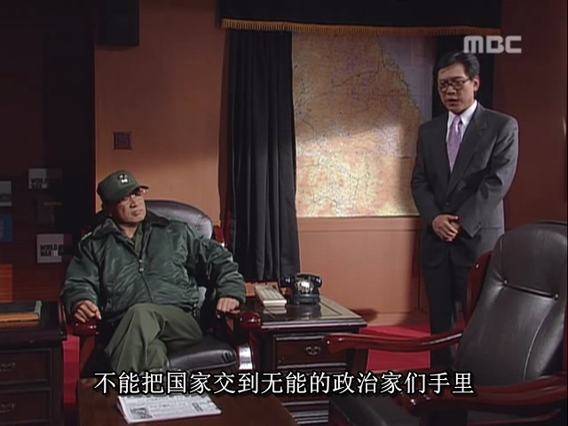
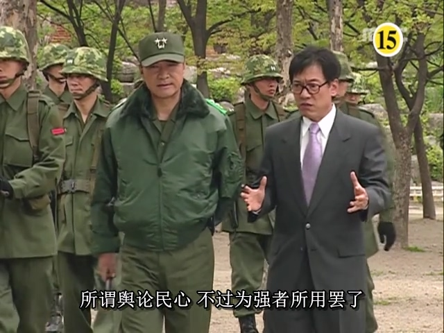
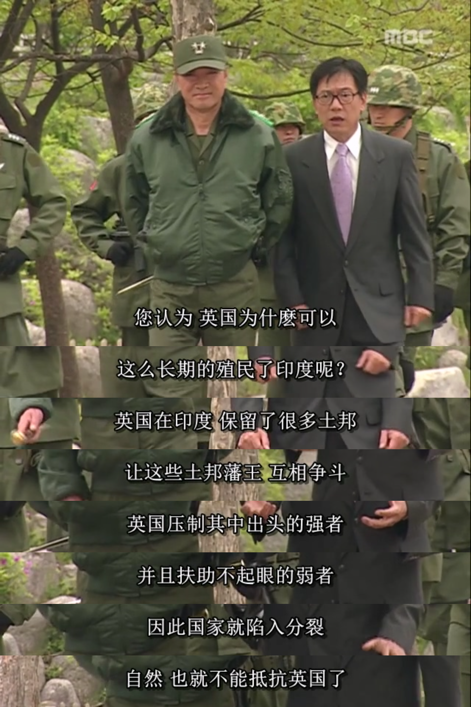

朴正熙一死，当时韩国很多人都认为，民主化运动必将取得突破，只要实行全民选举，民主派“三金”中的一位将会获得总统之位，首尔之春正式揭幕，直到1980年5月17日戛然而止。

但是，日本媒体首先找到了正确答案：军人全斗焕最有可能成为最终的赢家。

日韩这两个国家，文化同源，并且日本曾经对朝鲜半岛殖民统治过（1910年-1945年），这期间在朝鲜半岛培养了一批亲日派朝鲜人代为统治朝鲜，这些亲日派后来很多都成为了韩国军政商界的高层，像朴正熙，曾经在日本军校上过学，还有个日本名字高木正雄。后来即使日本人战败退出朝鲜半岛后，仍与韩国的高层有千丝万缕的联系，因此对韩国极为了解。况且，日本人很熟悉“下克上”，“军部独走”这种剧情，对韩国即将发生的事洞若观火。

在日本媒体的分析宣传下，韩国驻日本大使馆的宣传官许文道也看出了这一点，他决定，火速回国，靠近全斗焕。

许文道（1940年2月26日—2016年3月5日），韩国记者、政治家。曾任朝鲜日报记者、青瓦台公报秘书官、国土统一院长官等职务。由于在位期间主管文化宣传，一手主导了被称为“言论统废合”的媒体合并政策，被称为“全斗焕政权的戈培尔”。

许文道这个人，他靠近全斗焕主要倒不是为了升官发财（这应该只是次要目的），他应该是个有自己政治理想的人。作为前记者，他对言论管控却有着不同于一般记者的追求，是个强硬保守派。他认为不能将国家政权交给无能政客，而应该让有实权的强硬派主导政局，带领国民。他希望通过辅佐全斗焕来实现自己的政治目标。

许文道回到韩国后，通过高中校友，“二许一李”中的许三守的介绍，联系上了全斗焕，找到机会为全斗焕献策。

许文道向全斗焕建议，舆论民心都是可以操纵的，全斗焕要想登上总统之位，必须将全国新闻媒体的审查权收到自己手上。

至于“三金”，他们三个人并非铁板一块，全斗焕可以利用三金之间的利益矛盾，分化三金，各个击破。许文道还举了英国殖民印度的例子。

这就是大英帝国的“扶弱治强术”，我曾经专门写过一篇文章《帝国的扶弱治强术

》介绍。

全斗焕听后，极为高兴，又获得一员能吏。从此，许文道获得了全斗焕的信任，进入其核心幕僚团队，和“二许一李”并称为“三许一李”。

全斗焕当时有两个目标：

1.      扩大戒严范围。朴正熙死后，韩国实行的是非常戒严，取消除国会以外的政治活动，国会功能仍正常运行。而全斗焕希望扩大戒严，将国会的政治活动也禁止掉，从而让军队获得实际政治权力。

2.      分化并打败三金。

这时，卢泰愚建议全斗焕，要想扩大戒严，可以声称朝鲜将要南下进攻韩国，造成社会恐慌，那扩大戒严就是理所应当的。（这里多提一句，第一次用“朝鲜南下”的理由的人也许是天才，但同样的招式再用一次，那就是东施效颦，尹锡悦在2024年还用这种理由就显得很可笑了。）全斗焕采纳了这个建议，并且为了让韩国人深信不疑，他决定通过日本方面的关系，先将“朝鲜南下”的假消息发给日本那边，再由日本传回韩国，并配合舆论控制，让韩国人相信“朝鲜南下”的假象。

至于三金，金钟泌和金大中、金泳三这两人有明显不同。后两者都是在野党人士，之前未曾进入过最高权力圈，而金钟泌则是青瓦台的前朝旧臣。全斗焕首先盯上了金钟泌。

金钟泌是韩国前总统朴正熙之兄朴相熙的女婿，1961年参加了由朴正熙领导的5·16军事政变，1971年－1975年和1998－2000年两次出任国务总理。

全斗焕这个人，虽然学习成绩不怎么样，但似乎有一种神奇的天赋，而且是做一把手领导必备的才能：知人善任。他在冥冥之中似乎有一种直觉，知道要办成一件事需要找哪些正确的人。

为了打败金钟泌，全斗焕很快想到了另一位前朝旧臣，前中央情报部部长李厚洛。李厚洛离开青瓦台后，加入了民主共和党，和金钟泌属于同一政党。当时李厚洛因为被指控贪污腐败而已经逃亡至美国。

于是，全斗焕很快联系上远在美国的李厚洛，两人很快达成了一笔交易：李厚洛回韩国发出对金钟泌的负面言论，全斗焕就承诺不追究他贪污腐败的事。

于是，李厚洛很快回到韩国，召开了记者发布会，发布了对金钟泌不利的言论：

1.      金钟泌没有经过正当程序就当上了民主共和党的总裁。

2.      金钟泌是前朝旧臣，如果朴正熙前总统有错，那金钟泌也应该为其一味服从朴正熙而承担责任。

3.      他作为同党党员，对金钟泌表示不信任。

就这样，李厚洛对外呈现出了金钟泌对内不能服众，党内分裂的迹象，打击了金钟泌的民望。这也为全斗焕日后逮捕金钟泌消除了阻力。

至于金大中和金泳三，“二许一李”中的李鹤捧建议全斗焕，在扩大戒严后，以“煽动学潮”的理由抓捕金大中，而对金泳三则网开一面，抓一放一，不让这两金背后的势力抱团取暖。全斗焕一方已经预计，到时抓了金大中后，其家乡光州的人受到刺激，必定会扩大示威规模，军方已做好镇压光州的准备。这时就更不能把金泳三也一起抓起来，免得金泳三的基本盘釜山地区的人也一同示威，如果两边都要镇压，就对军方不利。全斗焕采纳了抓一放一的方案，到时候只用集中力量镇压光州一个地区。

1980年5月17日，在“朝鲜南下”的假消息以及军方催促下，代行总统崔代行宣布扩大戒严，禁止全国一切政治活动，连同国会一同禁止，首尔之春结束。军方在扩大戒严期间获得了更大的权力空间，全斗焕一方立刻派人去金大中家将其逮捕，送到西冰库。对金钟泌则以不正当蓄财的罪名逮捕他。对金泳三，全斗焕一开始本准备放了他，不过后来很快改为将其软禁在家中，不过好歹没有正式逮捕他。

就这样，三金瞬间被全斗焕控制住，失去了从事政治活动的能力。

不过，这当然还不是结局。全斗焕早有准备，控制三金只是开始，只要抓了金大中，光州必乱，只有镇压了光州，他才能安心坐上总统之位。

于是，韩国近代最大的悲剧，光州事件即将登场，而镇压光州也是全斗焕一生最大的罪名。
