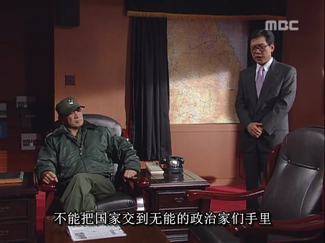
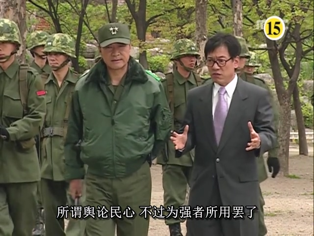
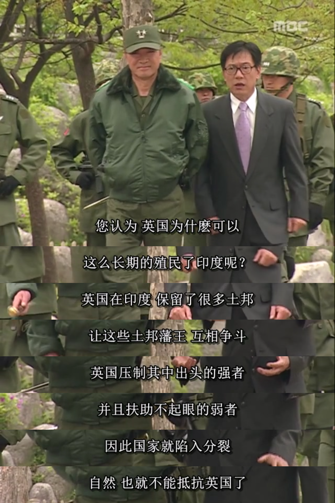

박정희가 사망하자 당시 한국의 많은 사람들은 민주화 운동이 반드시 돌파구를 찾을 것이며, 총선을 실시하면 민주파 "삼김" 중 한 명이 대통령 자리에 오를 것이라 믿었습니다. 서울의 봄이 시작되었으나 1980년 5월 17일 갑작스럽게 막을 내렸습니다.

하지만 일본 언론이 먼저 정답을 찾아냈습니다: 군인 전두환이 최종 승리자가 될 가능성이 가장 높다는 것이었습니다.

일본과 한국은 문화적 동질성을 지녔을 뿐만 아니라, 일본이 한반도를 식민지 지배(1910년-1945년)한 시기 친일파 조선인들을 양성해 통치를 대행시켰습니다. 이들 친일파 중 상당수는 이후 한국 군·정·재계의 고위층이 되었습니다. 박정희 역시 일본 군사학교에서 수학했으며 일본식 이름 '다카기 마사오'를 사용한 적이 있습니다. 일본이 패전 후 한반도에서 물러난 후에도 한국 고위층과의 유착 관계는 지속되었고, 이로 인해 일본은 한국을 매우 잘 이해하고 있었습니다. 게다가 일본인들은 "하극상(下克上)"과 "군부 독주" 같은 시나리오에 익숙했기에 한국에서 벌어질 일을 예리하게 간파했습니다.

일본 언론의 분석과 선전 속에서 한국 주재 일본 대사관 홍보관 허문도도 이를 눈치챘고, 서둘러 귀국해 전두환에게 접근하기로 결심했습니다.

허문도(1940년 2월 26일~2016년 3월 5일)는 한국의 기자이자 정치가였습니다. 조선일보 기자, 청와대 공보비서관, 국토통일원 장관 등을 역임했습니다. 재임 기간 언론 통제 정책인 "언론 통폐합"을 주도해 "전두환 정권의 괴벨스"로 불렸습니다.

허문도가 전두환에게 접근한 주된 이유는 출세나 부(富)가 아니라 자신의 정치적 이상 때문이었습니다. 전직 기자로서 그는 일반 기자들과 달리 강경 보수주의적 입장에서 언론 통제를 추구했습니다. 그는 무능한 정치인들에게 국가 권력을 넘겨서는 안 되며, 실권을 가진 강경파가 정국을 주도해야 한다고 믿었습니다. 그는 전두환을 보좌해 자신의 정치적 목표를 실현하고자 했습니다.

허문도는 귀국 후 고등학교 동창인 "허평화·허삼수·이학봉" 중 허삼주의 소개로 전두환과 연결돼 조언을 할 기회를 얻었습니다.

허문도는 전두환에게 여론과 민심은 조작 가능하다고 조언했습니다. 전두환이 대통령 자리에 오르려면 전국 언론의 검열권을 장악해야 한다고 강조했습니다.

"삼김"에 대해선 세 사람이 결속력이 없으므로 이들 간의 이해관계를 이용해 분열시키고 각개격파할 것을 제안했습니다. 허문도는 영국이 인도를 식민지배할 때 사용한 "약자 지원으로 강자 제압 전략"을 예로 들었습니다.

이것이 바로 대영제국의 "약자 부양으로 강자 통제 전략"입니다. 저는 이를 설명한 《제국의 약자 부양 전략》이라는 글을 쓴 적이 있습니다.

전두환은 이 말을 듣고 크게 기뻐하며 또 한 명의 유능한 인재를 얻었습니다. 이후 허문도는 전두환의 신임을 얻어 핵심 참모팀에 합류해 "허평화·허삼수·이학봉"과 함께 "삼허일이"로 불렸습니다.

전두환은 당시 두 가지 목표를 가지고 있었습니다:

1. 계엄령 확대. 박정희 사후 한국은 국회를 제외한 정치 활동을 금지하는 비상계엄 상태였으나, 전두환은 국회 정치 활동까지 금지해 군부가 실질적 정치 권력을 장악하려 했습니다.
2. 삼김 분열 및 제압.

이때 노태우는 전두환에게 계엄 확대를 위해 "북한의 남하 공격 위협"을 주장해 사회적 공포심을 조성할 것을 제안했습니다. (이 방법을 처음 사용한 이는 천재일 수 있지만, 같은 수법을 반복하는 것은 우스꽝스러운 일입니다. 윤석열이 2024년에도 이를 사용한 것은 코미디 같은 일이었습니다.) 전두환은 이 제안을 받아들였고, 한국 국민들이 "북한 남하" 가짜 정보를 확신하도록 일본 측 경로를 통해 먼저 정보를 유출한 뒤 역수입하는 방식을 채택했습니다. 여론 통제와 병행해 가짜 정보를 확산시켰습니다.

삼김 중 김종필은 김대중·김영삼과 달리 청와대 전직 측근 출신이었습니다. 전두환은 먼저 김종필을 겨냥했습니다.

김종필은 박정희 전 대통령의 형 박상희의 사위로, 1961년 박정희 주도의 5·16 군사정변에 참여했으며 1971-1975년, 1998-2000년 두 차례 국무총리를 역임했습니다.

전두환은 학업 성적은 좋지 않았지만 특별한 리더십을 가진 인물이었습니다. 그는 사물을 성사시키기 위해 필요한 인재를 직관적으로 알아보는 능력이 있었습니다.

김종필을 제압하기 위해 전두환은 전 중앙정보부장 이후락을 떠올렸습니다. 이후락은 청와대를 떠난 후 민주공화당에 합류해 김종필과 같은 당 소속이었으나, 부패 혐의로 미국으로 도피한 상태였습니다.

전두환은 미국에 있던 이후락과 긴급히 접촉해 거래를 성사시켰습니다. 이후락이 한국으로 돌아와 김종필에 대한 부정적 발언을 하면, 전두환이 그의 부패 혐의를 추궁하지 않겠다는 조건이었습니다.

이후락은 곧 한국으로 돌아와 기자회견을 열고 다음과 같은 내용을 발표했습니다:

1. 김종필은 정당한 절차 없이 민주공화당 총재 자리에 올랐다.
2. 김종필은 전직 측근으로 박정희 전 대통령의 과오가 있다면 그 역시 맹목적 복종에 책임이 있다.
3. 동당원으로서 김종필을 신뢰할 수 없다.

이로 인해 김종필은 당내 지지기반이 약화됐고, 이는 전두환이 그를 체포하는 데 저항을 줄이는 효과를 냈습니다.

김대중과 김영삼에 대해선 이학봉이 "계엄 확대 후 '학운동 선동' 명목으로 김대중을 체포하고 김영삼은 풀어주어 양측 세력이 연대하지 못하게 하라"고 조언했습니다. 전두환 측은 김대중 체포 시 그의 고향 광주에서 시위가 확대될 것을 예상하고 군부가 진압할 준비를 마쳤습니다. 이때 김영삼까지 체포하면 그의 지지기반인 부산 지역까지 시위가 확산될 수 있어 군부에 불리할 것으로 판단했습니다. 전두환은 "하나 잡고 하나 풀기" 전략을 채택해 광주 지역에만 집중 진압할 계획을 세웠습니다.

1980년 5월 17일, "북한 남하" 가짜 정보와 군부의 압력 아래 최규하 대행 대통령은 계엄령을 확대해 전국 모든 정치 활동을 금지시켰고, 서울의 봄은 종말을 고했습니다. 군부는 계엄 확대로 더 큰 권력을 확보했고, 전두환 측은 즉시 김대중을 자택에서 체포해 서빙고 보안사로 이송했습니다. 김종필은 부정축재 혐의로 체포했으며, 김영삼은 처음엔 풀어주려 했으나 곧 가택연금 상태로 전환했습니다.

이렇게 삼김은 순식간에 전두환의 통제 하에 놓여 정치 활동 능력을 상실했습니다.

하지만 이게 끝이 아니었습니다. 전두환은 김대중 체포로 인한 광주의 반발을 예상하고 있었습니다. 광주를 진압해야만 안정적으로 대통령 자리에 앉을 수 있다고 판단했습니다.

결국 한국 현대사 최대의 비극인 광주 사건이 시작됐고, 이 진압은 전두환 일생 최대의 죄악이 되었습니다.
