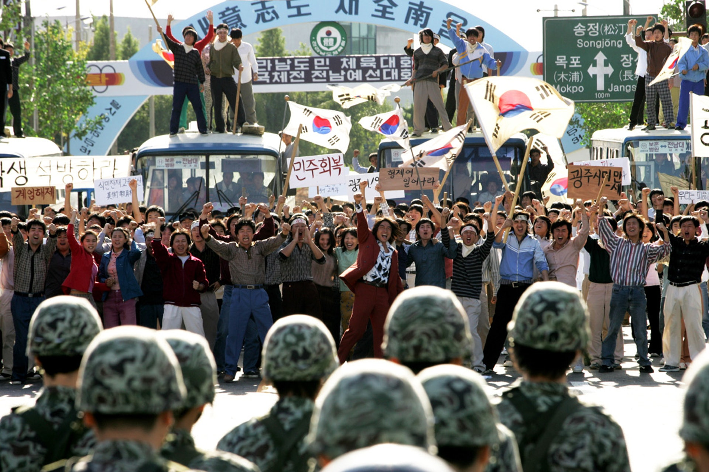
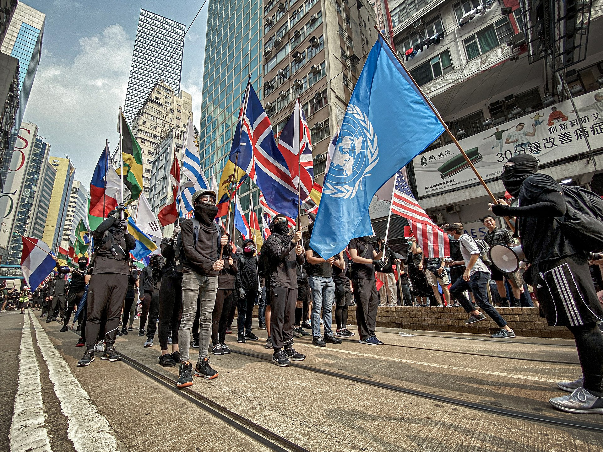

全斗焕早已料到韩国国民在扩大戒严后会有反对行为，光州更是其重点防范地区，除了因为他逮捕了光州派政客金大中以外，还因为光州是左派大本营，天然的和军政府独裁势如水火。

1980年5月17日晚，韩国政府刚一宣布扩大戒严，全斗焕就让7空输连夜进驻光州。5月18日，空输部队的士兵就打伤了光州参与示威活动的大学生，光州市民的怒火开始被点燃，军民双方的仇恨越演越烈。由于全斗焕一方早有准备，断绝了光州对外的道路和通信渠道，使得韩国其他地区的人不知道光州发生了什么事，光州市民将独自面对韩国军队。

在空输部队镇压光州人民的同时，身处首尔的全斗焕一方全程关注事件进展。而全斗焕的幕僚，“三许一李”中的李鹤捧在审讯金大中时发现了一个他很感兴趣的线索。

这里就要提一下李鹤捧这个人，他是全斗焕手下的对共处长，就是中国人很熟悉的那个“共”，共产主义的共。当然，他一个韩国人，对付的主要是朝鲜的共产主义者，处理一切和朝鲜相关的情报。

李鹤捧接受许文道的提议，希望把金大中往“私通朝鲜，煽动学潮”的方向抹黑。他在查阅金大中家的访客记录的时候，发现一个感兴趣的名字——郑东年，光州全南大学复读生协会会长。一个来自光州的学生曾经去了金大中的家，这让李鹤捧立刻打起了精神。他又查阅光州的军队逮捕的示威学生的名单，正好也发现了郑东年的名字。于是李鹤捧发挥了他的专业所长，杜撰了一个将金大中和光州事件串联起来的虚假剧本。

郑重说明，以下都是李鹤捧杜撰的剧本，并不真实。

1.      金大中是私通朝鲜的间谍，受朝鲜指使，在韩国煽动学潮反对政府。

2.      光州学生郑东年在1980年4月13日曾去过金大中的家，金大中让下属给了郑东年一笔活动资金，让他回光州煽动暴乱。

3.      郑东年回到家乡光州开始行动，1980年5月18日，光州示威活动开始失控。

以上的剧本都是胡编乱造的。不过，全斗焕对这个剧本很是满意，既为镇压光州提供了理由，又给政敌金大中安上了一个叛国死罪，一箭双雕。于是，全斗焕信心满满，强硬镇压光州人民的决心更加坚定，又往光州派出了更多军队。

从5月18日开始，军队每一次殴打光州市民都会引发更多的愤怒的光州市民站出来反对，为了应对不断增多的光州市民，军方也不断地派兵往光州增援。双方的仇恨螺旋式上升，到了5月21日，一部分激进的市民冲进当地军械库，抢到了枪支弹药，和军方开枪对射。也就在这一天，全斗焕正式下令，允许军方使用实弹射击光州市民。

关于光州市民抢枪这件事，只能威胁到一线的大头兵，但是对身在首尔的全斗焕等高级军官毫无威胁。相反，因为光州人抢枪，导致全斗焕可以以此为理由，名正言顺地让军队升级武力手段，堂而皇之地使用实弹镇压。从这一刻开始，光州事件已经注定不能善终。

5月27日，军队开着坦克进入光州，光州市民自发组成的“抗争领导部”战斗到了最后一刻，力尽而亡，光州事件结束。

得知此事后，全斗焕大喜，最后一个障碍也已经解决，韩国已经无人可以阻挡他成为总统。随后，他对没有实权的崔代行软硬兼施，逼迫崔代行在1980年8月16日辞去总统一职。

1980年8月27日，全斗焕操纵下举行的统一主体国民会议选举全斗焕为韩国第11届总统，展开其近八年的独裁统治，史称“第五共和国”。

1980年9月11日，金大中被军事法庭以策动光州事件的“内乱阴谋罪”和1972年“十月维新”政变之后在海外组织“韩民统”的“反国家团体的罪魁”两项罪名判处死刑（不过后来在美国的压力下，金大中被改判为无期徒刑，并于1982年获得特赦，前往美国）。

光州市民付出了惨痛代价仍不能阻止全斗焕上台，他们到底是为了什么呢？他们做的一切到底有意义吗？

光州市民的牺牲，虽然没能阻止全斗焕，但也绝非毫无意义。光州人用自己的生命让全斗焕政权沾上了洗脱不掉的污点，这个污点在第五共和国期间持续发酵，让第五共和国仅过了一届任期就无以为继。史书中的全斗焕在面临后人评价时，光州事件是他永远避免不了的一页。并且，光州市民的牺牲，成了韩国民主派的精神支柱，鼓舞了无数韩国民主派人士前赴后继。

光州市民绝不是反对他们的祖国，他们只是反对全斗焕军政府，可以看他们在现场的照片（下图是剧照，但也能反映真实情况）：

光州市民在示威现场挥舞的是韩国国旗。

举一个反面例子：

上图是2019年香港暴乱时，香港黄丝举着各种外国国旗，但就是不举自己国家的国旗，他们这是什么意思，还不明显吗？所以，香港暴乱和光州事件有本质区别。

光州市民并未反对自己的韩国人身份认同，只是政见不同，他们反全斗焕，支持民主派政客，尤其是自己家乡的金大中，这只是内部矛盾，并非叛国。当然，期间有部分光州市民抢枪也确实属于过激行为。仇恨一旦开始，只会螺旋式上升，直到一方彻底打败另一方，这是一场可能双方本来都不想看到的悲剧。

全斗焕血腥镇压光州，这点也确实有罪。不过，不能因为全斗焕一方有罪，就天然地认为光州市民一方的政见就是对的。我们需要回顾下，在1980年那个风起云涌的年代，韩国的现实处境。

1980年正值第二次石油危机，当时伊朗伊斯兰革命和两伊战争爆发，原油价格从1979年的每桶15美元左右最高涨到1981年2月的39美元，是20世纪下半叶三大能源危机之一。石油危机使得经济秩序出现紊乱，资本主义国家普遍都出现了较为严重的经济衰退。物价大幅上涨、经济增速下降，这种经济环境组合被称作为“滞胀”（Stagflation）。韩国作为资本主义阵营里的小国，自然不能幸免。韩国经济在1980年出现自1956年以来的首次负增长，而通货膨胀率更是上升到28.7%的离谱程度。且朴正熙时代的“汉江奇迹”的副作用已经暴露，低水平发展已经无以为继，韩国经济已经危在旦夕。

而且，当时的美国总统是吉米·卡特，1978年至1980年期间，卡特先后从韩国撤出了6000名美军，并计划在1982年底前将美军地面部队全部撤出，这就等于是勾引朝鲜南下，韩国要面临的北方压力瞬间大增。当然，从事后来看，这些都没有发生。1981年，卡特宣布将重新考虑撤军政策，而他连任总统失败，继任者里根马上取消了这项政策。不过，站在1980年的时间点上，谁都没法预测未来，韩国要面临的外部压力确实在增加。何况当时还处于冷战时期，苏联还在，韩国身处冷战最前线，前总统朴正熙又突然死亡，政局高层动荡，人心惶惶。

我作为一个外国人，试图站在第三方中立的角度，尽量客观地说，韩国当时这个局面，堪称是内忧外患，可能真的需要一个有实力的强权人物才能接得住这个烂摊子。

三金作为民间政客，虽有名望，但不代表会治国。尤其是金泳三和金大中，之前都是在野党，并未进入过最高权力圈。他们大半辈子宣扬民主观念，反抗军政府固然精神可嘉，但他们擅长的这些事，和发展经济，处理外交关系，指挥军队等治国才能毕竟不是一回事。全民选举式的民主终究只是手段，并非目的本身。对普通老百姓而言，发展经济惠及民生，让普通人也能安居乐业，就是最大的善。

不管怎样，全斗焕在一心会兄弟们和众多幕僚的辅佐下，经过10个月的文攻武斗，打败了所有政敌，终于坐上韩国总统之位，属于他的第五共和国正式开始。
