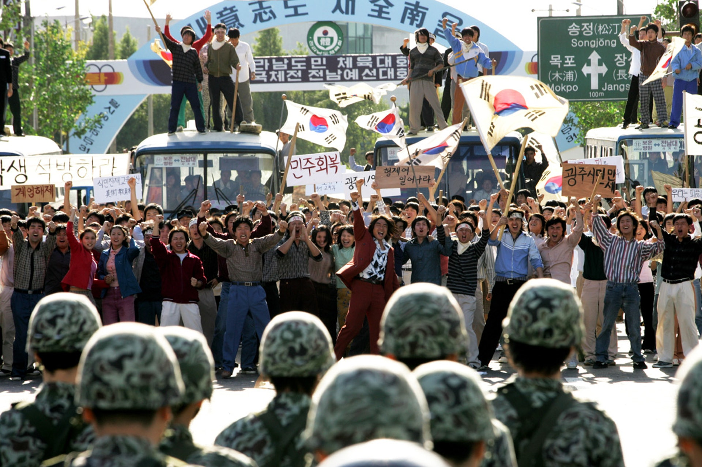
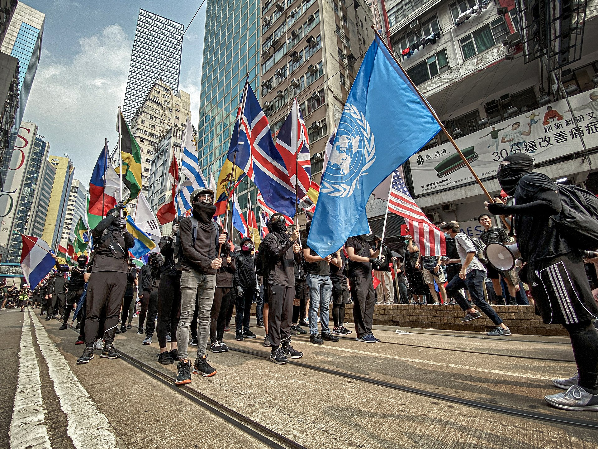

전두환은 계엄령 확대 후 국민의 반발이 있을 것을 예상했으며, 특히 광주를 중점 관리 지역으로 삼았습니다. 이는 광주 출신 정치인 김대중을 체포했을 뿐만 아니라 광주가 좌파의 거점으로 군사 정권과 자연스럽게 대립각을 세우고 있었기 때문입니다.

1980년 5월 17일 밤, 한국 정부가 계엄령 확대를 선포하자마자 전두환은 7공수부대를 광주로 급파했습니다. 5월 18일, 공수부대 병사들은 광주 시위에 참여한 대학생들을 구타하며 시민들의 분노를 촉발시켰습니다. 군과 민간의 적대감은 점차 고조되었고, 전두환 측은 사전에 광주의 대외 통신망과 도로를 차단해 다른 지역 사람들이 광주 상황을 알지 못하도록 했습니다. 광주 시민들은 홀로 한국군을 맞서야 했습니다.

공수부대가 광주 시민을 진압하는 동안, 서울에 있던 전두환 측은 사태 전개를 주시하고 있었습니다. 전두환의 측근인 "삼허일이" 중 이학봉은 김대중 심문 중 흥미로운 단서를 발견했습니다.

이학봉은 전두환 휘하 대공처장으로, 한국판 "공산주의 대응 전문가"였습니다. 그는 허문도의 제안을 받아들여 김대중을 "북한과 내통해 학운동을 선동한 인물"로 모략하려 했습니다. 김대중 자택 방문 기록을 조사하던 중 광주 전남대 복학생협 회장 정동년이라는 이름을 발견한 이학봉은 즉시 경각심을 높였습니다. 광주 군부가 체포한 시위 학생 명단에서도 정동년의 이름을 확인한 그는 전문성을 발휘해 김대중과 광주 사건을 연결하는 허위 시나리오를 조작했습니다.

**주의:** **아래** **내용은** **모두** **이학봉이** **조작한** **허위** **서사입니다.**

1. 김대중은 북한의 간첩으로, 북한의 지시를 받아 한국에서 학운동을 선동했다.
2. 광주 학생 정동년은 1980년 4월 13일 김대중 자택을 방문해 활동 자금을 받고 광주로 돌아가 폭동을 선동했다.
3. 정동년은 1980년 5월 18일 광주 시위를 폭력화시켰다.

이 모든 내용은 허구였지만, 전두환은 이 시나리오에 만족했습니다. 광주 진압의 명분을 확보함과 동시에 정적 김대중에게 반역죄를 씌울 수 있었기 때문입니다. 전두환은 더욱 확고해진 의지로 광주에 추가 병력을 투입했습니다.

5월 18일부터 군의 폭력 진압은 시민들의 분노를 더욱 부채질했고, 군 역시 증원 병력을 파견하며 악순환이 반복됐습니다. 5월 21일, 일부 시민이 군 무기고를 습격해 총기를 탈취하며 군과 교전에 돌입했습니다. 이날 전두환은 군에 실탄 사용을 공식 허가했습니다.

시민들의 총기 탈취는 일선 병사들에게만 위협이었을 뿐, 서울의 고위 장성들에게는 영향이 없었습니다. 오히려 이는 군이 무력을 증폭시키는 명분이 되었고, 광주 사태는 피할 수 없는 비극으로 치닫게 됐습니다.

5월 27일, 군은 탱크를 동원해 광주로 진입했습니다. 시민들이 자발적으로 구성한 "투쟁 지도부"는 최후까지 저항하다 전멸했고, 광주 사건은 종결됐습니다.

이 소식을 접한 전두환은 마지막 장애물이 사라졌다며 기뻐했습니다. 1980년 8월 16일, 그는 허수아비 대통령 최규하를 압박해 사임시켰고, 8월 27일 통일주체국민회의를 조작해 대한민국 제11대 대통령에 취임했습니다. 이후 8년간의 독재 통치인 "제5공화국"이 시작됐습니다.

1980년 9월 11일, 김대중은 군사법정에서 광주 사건 "내란 음모죄"와 해외에서 "한민통"을 조직한 "반국가단체 수괴죄"로 사형 선고를 받았습니다(미국 압력으로 무기징역으로 감형됐고, 1982년 특별사면으로 미국으로 망명).

광주 시민들은 엄청난 대가를 치렀지만 전두환 집권을 막지 못했습니다. 그들의 희생은 무의미했을까요?

광주 시민의 희생은 전두환 정권에 씻을 수 없는 오점을 남겼습니다. 이 오점은 제5공화국 기간 내내 부패와 독재의 상징으로 작용했고, 결국 단임으로 정권이 종말을 고하도록 만들었습니다. 역사 속 전두환은 광주 사건에서 벗어날 수 없으며, 이 사건은 한국 민주주의의 정신적 지주가 되어 수많은 민주 인사들에게 용기를 주었습니다.

광주 시민들은 시위 현장에서 태극기를 흔들며 대한민국 정체성을 버리지 않았습니다(사진은 영화 스틸이지만 실제 상황 반영).

반례는 다음과 같습니다：

위의 사진은 2019년 홍콩 폭동을 보여줍니다. 홍콩 노란 리본에는 다양한 외국 국기가 있었지만 중국 국기는 없었습니다. 무슨 뜻일까요? 당연하지 않나요? 따라서 홍콩 폭동과 광주 사건 사이에는 본질적인 차이가 있다.

광주 사람들은 그들의 한국적 정체성에 반대하지 않았고, 단지 다른 정치적 견해를 가졌을 뿐이었습니다. 그들은 전두환에 반대했고, 특히 고향의 김대중을 비롯한 민주 정치인들을 지지했습니다. 이것은 반역이 아니라 단지 내부 갈등이었습니다. 물론, 이 시기 일부 광주 시민들이 총을 빼앗은 일은 실로 극단적인 행위였다. 일단 증오가 시작되면, 그것은 한쪽이 다른 쪽을 완전히 패배시킬 때까지 계속 치솟을 뿐인데, 아마도 어느 쪽도 보고 싶어하지 않는 비극이겠죠.

전두환은 광주를 잔혹하게 진압한 죄가 있습니다. 하지만 전두환이 유죄라는 이유만으로 광주 시민들의 정치적 견해가 반드시 옳다고 단정할 수는 없습니다. 우리는 격동의 80년대 한국이 처한 실제 상황을 돌아볼 필요가 있다.

1980년은 두 번째 석유 위기가 발생한 해였습니다. 이란 이슬람 혁명과 이란-이라크 전쟁이 발발했습니다. 원유 가격은 1979년 배럴당 15달러에서 1981년 2월 최고치인 39달러로 급등했습니다. 이는 20세기 후반의 세 가지 주요 에너지 위기 중 하나였습니다. 석유 위기로 인해 경제 질서가 붕괴되었고, 자본주의 국가들은 대체로 심각한 경제 침체를 경험했습니다. 가격 급등과 경제 성장 둔화가 결합된 현상을 스태그플레이션이라고 합니다. 자본주의 진영에 속한 작은 나라인 한국도 당연히 예외는 아니었습니다. 1980년, 한국 경제는 1956년 이후 처음으로 마이너스 성장을 경험했고, 인플레이션율은 28.7%라는 엄청난 수준까지 치솟았습니다. 게다가 박정희 시대의 '한강의 기적'의 부작용이 그대로 드러나 저수준 개발은 더 이상 지속 가능하지 않고, 한국 경제는 위기에 처해 있다.

게다가 당시 미국 대통령은 지미 카터였다. 카터는 1978년에서 1980년 사이에 한국에서 6,000명의 미군을 철수했고 1982년 말까지 모든 미국 지상군을 철수할 계획이었다. 이는 북한을 남쪽으로 유인하는 것과 마찬가지였고, 한국이 직면한 북한의 압력은 즉시 커졌다. 물론, 지금 돌이켜보면 이런 일은 일어나지 않았습니다. 1981년 카터는 철수 정책을 재고하겠다고 발표했지만, 대통령 재선에 실패했고, 그의 후임자인 레이건은 즉시 이 정책을 취소했습니다. 그러나 1980년대에 들어서면서 누구도 미래를 예측할 수 없게 되었고, 한국이 직면한 외부의 압력은 실제로 커져가고 있었습니다. 게다가 아직 냉전 시대였고, 소련이 여전히 존재했으며, 한국은 냉전의 최전선에 있었고, 박정희 전 대통령이 갑자기 죽었고, 최고위층의 정치 상황이 혼란스러웠고, 사람들은 공황 상태에 빠져 있었습니다.

외국인으로서 저는 중립적인 제3자 관점에서 입장을 취하고 가능한 한 객관적으로 당시 한국 상황은 내부적, 외부적 문제가 섞인 상황이었고, 이 혼란스러운 상황을 수습하려면 정말 강력하고 유능한 사람이 필요할 것이라고 말씀드리겠습니다.

산진은 명성이 있는 문인 정치인이지만, 그렇다고 해서 그가 나라를 다스릴 수 있는 것은 아니다. 특히 김영삼과 김대중은 야당 출신으로 권력의 최상위에 오른 적이 없었습니다. 그들은 대부분의 삶을 민주주의 사상을 장려하고 군사 정부에 저항하는 데 바쳤습니다. 칭찬할 만한 일이지만, 그들이 잘하는 일은 경제를 발전시키고, 외교 관계를 맺고, 군대를 지휘하고, 다른 국가 정책을 운영하는 것과는 다릅니다. 보통선거에 기초한 민주주의는 결국 수단일 뿐이지 그 자체가 목적이 아닙니다. 일반인들에게는 국민의 생계에 도움이 되는 경제를 발전시키고, 일반인들이 평화롭고 만족스럽게 생활하고 일할 수 있도록 하는 것이 가장 큰 선입니다.

어쨌든, 일신회 형제들과 많은 직원들의 도움으로 전두환은 10개월간의 언어적, 신체적 싸움 끝에 모든 정치적 반대자들을 물리치고 마침내 남한의 대통령 자리를 차지했습니다. 그의 제5공화국이 공식적으로 시작되었습니다.
