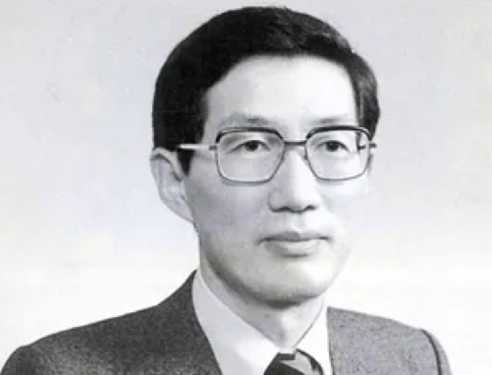
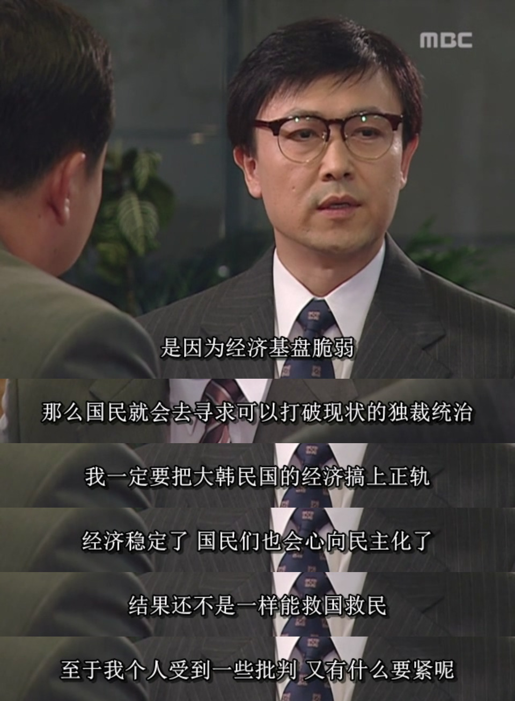
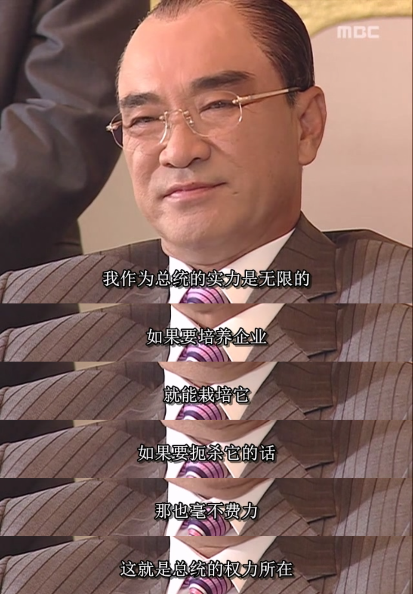

上世纪80年代，韩国在国际上的影响力与日俱增，在外交层面给朝鲜带来了极大压力。朝韩双方都声称自己是朝鲜半岛的正统，然而，随着韩国在国际上的盟友越来越多，影响力越来越大，风头明显盖过了朝鲜。尤其是韩国在1981年成功申请到1988年奥运会的主办权，意味着获得了世界上很多国家的认同与支持，更是让朝鲜如鲠在喉。

1983年，为了加强国际经贸合作关系，韩国总统全斗焕计划从10月8日起访问亚洲和大洋洲的五个国家，第一站是亚洲的缅甸。缅甸这个国家，在1975年和朝韩两边同时建立外交关系，使得朝韩都想拉拢缅甸，剔除对方，这为1983年的仰光爆炸事件埋下了祸根。

全斗焕到缅甸后，按计划会去缅甸国父昂山之墓参拜。韩方人员分乘2辆车前往昂山之墓，全斗焕因为迟到，所以乘坐的是第2辆车。结果第1辆满载韩方人员的车先到达昂山之墓后，墓地屋顶发生了剧烈爆炸，当场炸死16名韩方人员及4名缅甸人士，另有47名人员受伤，全斗焕则因为晚到两分钟而幸免于难（这人真是有主角光环），他立刻取消所有活动并回到韩国。

缅甸政府很快抓到3名朝鲜特工，查清了真相，原来是朝鲜政府得知全斗焕的行程后，派了特工事先在昂山之墓藏好了遥控炸弹。朝鲜特工看到韩国第1辆汽车到达后，以为全斗焕已到，便引爆了炸弹，却没料到全斗焕坐的是第2辆车，致使暗杀行动失败。真相大白后，缅甸政府立刻和朝鲜断交。

全斗焕虽然逃过一劫，但本次仰光爆炸事件让他的执政团队死伤大半，多个外交和经济领域的技术官僚的去世更是难以估量的损失。其中，全斗焕最惋惜的就是他的首席经济顾问，青瓦台经济首席秘书官，金在益，金首席。

金在益（1938年11月26日—1983年10月9日），斯坦福大学经济学博士，韩国经济学家、政治家。金在益是全斗焕政府时期的青瓦台经济首席秘书官，同时也是金融实名制的设计者。他在总统秘书任内积极制定稳定物价、贸易自由和信息化政策，使韩国得以顺利加入经济合作与发展组织。他于1983年10月9日在缅甸仰光爆炸事件中丧生，享年44岁，他被追授“大韩民国勋章”。

金首席堂堂斯坦福大学经济学博士，即使在今天，在自视甚高的Ph.D圈内也是能让人高看一眼的存在，更何况在上世纪80年代，就算是整个亚洲，这种级别的人才也不多见。

当年全斗焕刚登上总统之位时，因为名声太差，很多知识分子都不想为他办事。金首席虽然一度也有顾虑，但他认为只要把韩国的经济搞好了，老百姓富裕了以后自然就会追求民主。因此，金首席不顾个人声誉，还是决定辅佐全斗焕，进入青瓦台负责经济类事务。

这里又要提到全斗焕的一个巨大的优点：对自己有自知之明，这在一把手领导中是非常难得的。人登上高位后难免飘飘然，觉得自己是天选之子，而且底下也少不了一堆阿谀奉承之辈，时间长了难免会觉得自己无所不能。世上外行指导内行的事，大多就是这么来的。但全斗焕作为一个军队大老粗，甚至在军校时成绩也不怎么样，他很清楚自己对经济一窍不通，便挑选了金首席作为他的首席经济顾问，并且用人不疑，直接对金首席说：“不用什么废话，在经济上，你就是总统！”

全斗焕不仅有自知之明，而且知人善任，这两点都很重要，也都很困难，但他都做到了。金首席也不负所托，兢兢业业，为国为民。金首席提的政策建议，全斗焕大多都采纳了。而且，所有反对金首席政策的官员都没有好下场，包括全斗焕早期的亲信，“二许一李”中的许和平，许三守。这二许曾经为了争权而排挤金首席，但全斗焕始终支持金首席，最后二许离开青瓦台（当然，二许出局不仅是因为反对金首席一个原因）。

金首席刚上任之初，韩国通胀率因为遇到第二次石油危机而居高不下，在金首席的一套政策组合拳下，成功地将通胀率从1980年的28.7%降低到1982年的7.2%，在1983年又降到3.4%，大大稳定了经济秩序和民心。韩国经济增长率也从1980年的-1.6%提高到1981年的7.2%和1983年的13.4%，此后平均增长率在10%左右。

金首席不仅是经济学家，而且擅长数学和工程学，这种理工科背景让他具备前瞻性的产业布局眼光。金首席进入青瓦台后，力排众议，全力支持TDX电子交换机国产化项目。并且，随着交换机技术的发展，韩国还将半导体和计算机也列为战略产业并大力培育。金首席领衔的青瓦台经济首席秘书室起草了这几个行业的发展规划，在关键时间节点上推动了韩国产业升级。而正是这三个行业的突破，对韩国日后成为发达国家至关重要。

金首席作为一个纯粹的技术官僚，没有被全斗焕的差名声牵连到，韩国各方人士都对金首席评价极高。只可惜天妒英才，他最终成了朝韩对立的牺牲品。但朝韩对立只是直接原因，根本原因却是美苏争霸。美苏为了各自的霸权利益，人为地将一个完整的国家分为两半，朝鲜半岛人民80多年来的悲剧皆来源于此，金首席的去世只是一个微小的缩影。

缅甸爆炸事件发生后，韩国大财阀，现代集团创始人郑周永为讨好全斗焕，提出可以设置一个“日海基金会”（“日海”是全斗焕的号），用来给在爆炸案中殉国的官员家属提供抚恤金，基金会的资金来源可以由韩国的顶尖财阀们捐赠。全斗焕一听觉得这个建议不错，立刻同意了。全斗焕刚失去一帮精英下属，惋惜归惋惜，但很快冷静下来，觉得借着这次事件的理由建立起日海基金会，以后便能成为自己的小金库，这样也算有所收获。

于是，全斗焕在自己任期内通过日海基金会这个敛财工具定期向各大财阀们收钱，名义上是财阀们“自愿捐赠”，当然，肯定都是“被自愿的”。所以，韩国不是某些营销号描述的“财阀的国家”，事实上，在朴正熙和全斗焕任上，韩国财阀们都快被这些强权总统的各种黑的白的手段整出了PTSD。

