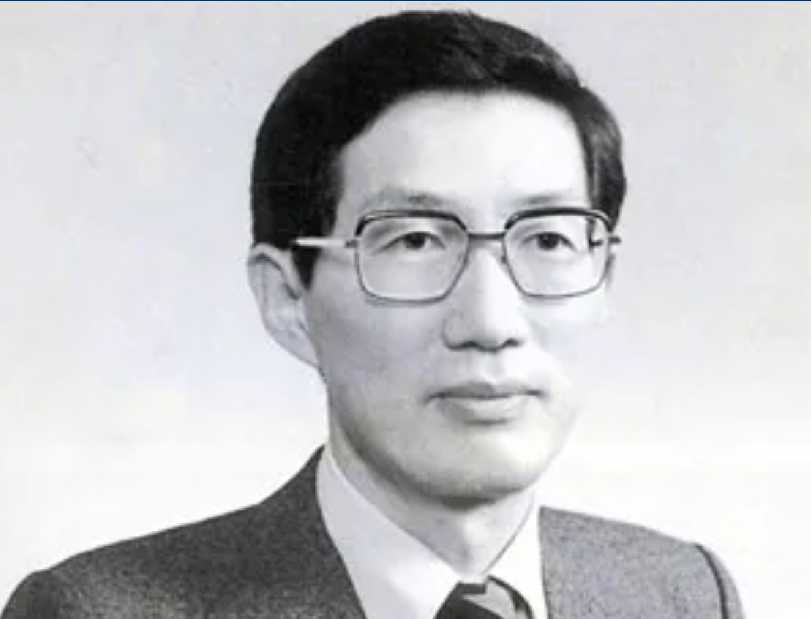
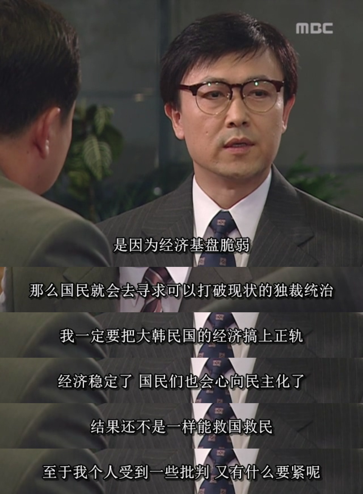
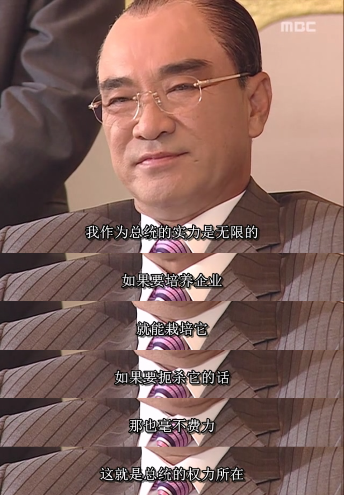

1980년대에는 남한의 국제적 영향력이 커지면서 외교적으로 북한에 엄청난 압박을 가하게 되었다. 북한과 남한은 모두 한반도의 합법적 통치자라고 주장합니다. 그러나 남한이 점점 더 많은 국제적 동맹과 더 큰 영향력을 가지면서 북한을 분명히 압도했습니다. 특히, 한국은 1981년 1988올림픽 개최권을 획득함으로써 세계 여러 나라의 인정과 지지를 얻었고, 이는 북한에게는 큰 장애물이 되었습니다.

1983년, 전두환 대통령은 국제 경제 및 무역 협력을 강화하기 위해 10월 8일부터 아시아와 오세아니아의 5개국을 순방할 계획을 세웠는데, 첫 번째 순방국은 아시아의 미얀마였다. 미얀마는 1975년에 북한과 남한 모두와 외교 관계를 수립하였는데, 이로 인해 남한과 북한 모두 미얀마가 상대방을 제거하기를 원하였고, 이는 1983년 양곤 폭탄 테러의 원인이 되었다.

전두환은 미얀마에 도착한 후 미얀마의 건국의 아버지인 아웅산의 무덤을 참배할 계획을 세웠습니다. 남한 관리들은 두 대의 차를 타고 아웅산 묘역으로 향했다. 전두환은 늦었기 때문에 두 번째 차를 탔다. 그 결과, 한국 공무원으로 가득 찬 첫 번째 차가 아웅산 묘에 도착한 후 묘지 지붕에서 격렬한 폭발이 발생하여 한국 공무원 16명과 버마인 4명이 그 자리에서 사망하고 47명이 부상을 입었습니다. 전두환은 2분 늦게 도착했기 때문에 살아남았습니다(이 사람은 정말 주인공의 아우라가 있습니다). 그는 즉시 모든 활동을 취소하고 한국으로 돌아갔습니다.

미얀마 정부는 재빨리 북한 요원 3명을 체포해 진실을 알아냈다. 북한 정부가 전두환의 행적을 알게 된 뒤, 사전에 요원을 보내 아웅산 묘에 원격조종 폭탄을 숨겼다는 게 드러났다. 북한 요원들은 첫 번째 남한 차량이 도착하는 것을 보고 전두환이 도착했다고 생각하여 폭탄을 터뜨렸습니다. 하지만 전두환이 두 번째 차량에 있을 것이라고는 예상하지 못했고, 이로 인해 암살 시도는 실패했습니다. 진실이 밝혀지자 미얀마 정부는 즉시 북한과 외교 관계를 단절했습니다.

전두환은 재난에서 살아남았지만, 양곤 폭발 사고로 그의 집권 세력 대부분이 죽거나 부상을 입었고, 외교와 경제 분야의 여러 기술 관료들이 죽는 것은 헤아릴 수 없는 손실이었습니다. 그 가운데 전두환이 가장 안타까워했던 인물은 자신의 수석경제보좌관이자 청와대 경제수석비서관이었던 김재익, 김 수석이다.

김재익(1938년 11월 26일 ~ 1983년 10월 9일)은 스탠포드 대학교에서 경제학 박사 학위를 받은 한국의 경제학자이자 정치인이다. 김재익은 전두환 정부 시절 청와대 경제수석비서관을 지냈으며, 금융실명제를 고안한 인물이기도 하다. 대통령 비서관 재임 시 그는 가격 안정, 무역 자유화, 정보화 촉진을 위한 정책을 적극적으로 수립하여 한국이 경제협력개발기구(OECD)에 성공적으로 가입할 수 있도록 했습니다. 그는 1983년 10월 9일 미얀마 양곤에서 일어난 폭탄 테러로 44세의 나이로 사망했습니다. 그는 사후에 "대한민국 훈장"을 받았습니다.

김재익 위원장은 스탠포드 대학에서 경제학 박사 학위를 받았습니다. 그는 오늘날에도 거만한 박사계에서 높은 평가를 받고 있습니다. 게다가 1980년대에는 이 수준의 인재가 아시아에서도 드물었습니다.

전두환이 처음 대통령에 취임했을 때 많은 지식인들은 그의 나쁜 평판 때문에 그를 위해 일하기를 원하지 않았습니다. 김재익 수석도 한때 우려를 품은 적이 있지만, 대한민국의 경제가 발전하고 국민이 번영하면 자연스럽게 민주주의를 추구할 것이라고 믿었습니다. 그래서 김재익 수석은 전두환을 보좌하고, 개인적 명예와는 상관없이 청와대에 들어가 경제를 담당하기로 결심했습니다.

여기서 우리는 전두환의 또 다른 큰 장점을 언급하지 않을 수 없습니다. 그는 자신에 대한 좋은 이해를 가지고 있는데, 이는 최고 지도자들 중에서는 매우 드뭅니다. 사람들이 높은 지위에 오르면 필연적으로 자부심을 느끼고 자신이 선택받은 사람이라고 생각할 것입니다. 게다가 그들 아래에는 아첨꾼들이 많을 것입니다. 오랜 시간이 지나면 필연적으로 무엇이든 할 수 있다고 느낄 것입니다. 이것이 바로 세상의 평범한 사람들이 전문가를 지도하는 대부분의 방식입니다. 하지만 전두환은 군인이었고, 군 학교 다닐 때도 성적이 좋지 않았습니다. 그는 자신이 경제에 대해 아무것도 모른다는 것을 잘 알고 있었기 때문에 김재익 수석을 경제 수석 보좌관으로 선택하고 김재익 수석에게 직접 말했습니다. "경제적으로는 당신이 대통령입니다!"

전두환은 자신을 잘 알았을 뿐만 아니라, 적절한 직위에 적절한 사람을 선택하는 법도 알았습니다. 이 두 가지 요점은 모두 중요하고 어렵지만, 그는 모두 해냈습니다. 김재익은 기대에 부응하여 나라와 국민을 위해 부지런히 일했습니다. 전두환은 김재익이 제시한 정책 제안의 대부분을 채택했다. 게다가 김재익의 정책에 반대했던 모든 간부들은 좋은 결말을 맞이하지 못했는데, 전두환의 초기 심복이었던 '이서일리'로 불리는 서화평, 서삼수도 그 중 하나였다. 두 서씨는 권력 다툼을 위해 김재익을 배제한 적이 있었지만, 전두환은 항상 김재익을 지지하였고, 결국 두 서씨는 청와대를 떠났습니다.(물론 두 서씨가 배제된 것은 단순히 김재익에 대한 반대 때문만은 아닙니다.)

김재익이 처음 집권했을 당시, 제2차 석유파동으로 인해 한국의 물가상승률은 높은 수준을 유지했습니다. 김재익의 정책 결합으로 1980년 28.7%였던 물가상승률이 1982년 7.2%로, 1983년 3.4%로 성공적으로 낮아져 경제질서와 여론이 크게 안정되었습니다. 한국의 경제성장률도 1980년 -1.6%에서 1981년 7.2%, 1983년 13.4%로 증가하였으며, 그 이후 연평균 성장률은 10%대를 유지하고 있습니다.

김재익은 경제학자일 뿐만 아니라 수학과 공학에도 능숙합니다. 이러한 과학과 공학적 배경은 그에게 산업 레이아웃에 대한 미래지향적인 비전을 제공합니다. 김재익은 청와대에 입성한 뒤 온갖 역경에도 불구하고 TDX 전자식 스위치 국산화 사업을 전폭적으로 지원했다. 또한, 스위치 기술의 발달로 한국은 반도체와 컴퓨터를 전략산업으로 지정하고 적극 육성하였습니다. 김재익이 이끄는 청와대 경제수석비서관실은 이들 산업에 대한 발전 계획을 초안하고 중요한 시점에서 한국의 산업 고도화를 촉진했습니다. 한국이 선진국으로 발전하는 데 있어서는 이 세 가지 산업의 획기적인 발전이 매우 중요합니다.

순수한 기술관료였던 김재익은 전두환의 나쁜 평판에 연루되지 않았으며, 대한민국의 모든 계층의 사람들이 김재익을 높게 평가했습니다. 그가 그렇게 재능이 뛰어났음에도 불구하고 결국 북한과 남한의 대결에서 희생양이 된 것은 안타까운 일이다. 그러나 북한과 남한의 대립은 직접적인 원인일 뿐이며, 근본적인 원인은 미국과 소련의 경쟁입니다. 미국과 소련은 자기들의 패권적 이익을 추구하기 위해 한 나라 전체를 인위적으로 두 부분으로 나누었습니다. 80년 이상 한반도 국민이 겪은 비극은 여기에서 비롯된 것이고, 김재익의 죽음은 그 작은 축소판일 뿐입니다.

미얀마 폭탄 테러 이후, 현대그룹 창업자이자 한국 재벌인 정주영은 전두환을 기쁘게 하기 위해 "일해재단"(일해는 전두환의 별명)을 설립하자고 제안했습니다. 이 재단은 한국 재벌들의 기부금으로 운영될 것입니다. 전두환은 이 말을 듣고 좋은 제안이라 여겨 즉시 수락했다. 전두환은 엘리트 부하들을 잃은 직후였다. 그는 후회했지만, 금세 진정하고 이 사건을 빌미로 선시아 재단을 설립할 수 있을 것이라고 생각했다. 선시아 재단은 앞으로 자신의 작은 보금자리가 될 터이니, 이는 이익으로 볼 수 있을 것이다.

그래서 전두환은 재임 기간 동안 돈벌이 도구인 선시아재단을 통해 주요 재벌들로부터 정기적으로 돈을 모았다. 재벌들은 명목상 "자발적 기부"를 했지만, 물론 "강요"를 받은 것은 확실하다. 따라서 한국은 일부 마케팅 계정에서 묘사한 "재벌의 나라"가 아닙니다. 사실, 박정희와 전두환의 임기 동안, 한국 재벌은 이 강력한 대통령들이 사용한 다양한 흑백 전략으로 인해 거의 PTSD에 시달렸습니다.

