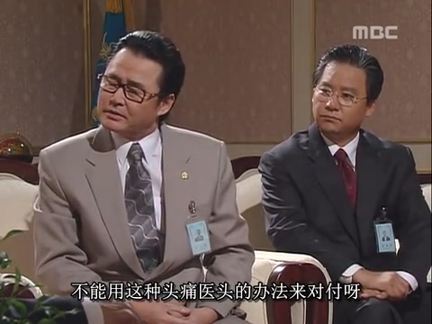
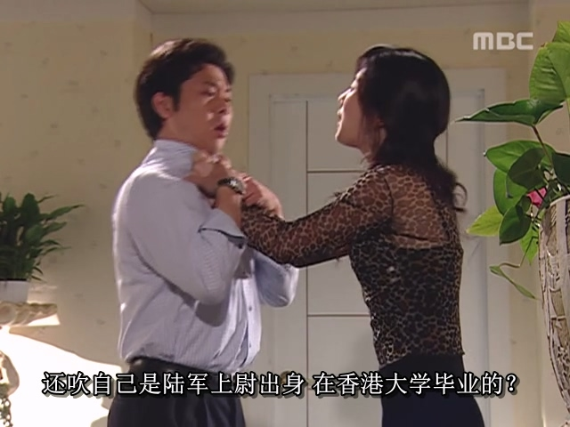
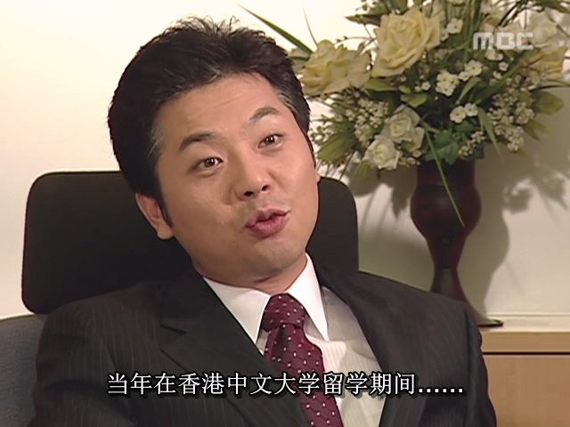

全斗焕上台执政的那几年，韩国经济高速发展，但是政治环境始终不太平，民间对全斗焕军政府的不满没有因为经济发展而平息，反而始终抗议不断。

到了1985年韩国国会选举的时候，2个主要在野党（新韩民主党、民韩党）的支持率之和已经高于全斗焕的执政党（民正党），这给全斗焕带来了巨大的麻烦。而且在当年国会选举前，金大中为了声援在野党的选情，执意从美国回到韩国鼓舞自己的基本盘们，这就让金泳三和金大中两金合流，联合起来反对全斗焕，两金声势大增。韩国民主派人士和学潮运动联合抗议，提出两个主要诉求：修改宪法，以及追查光州事件的责任。

这里就要简单介绍下韩国第四、第五共和国的宪法渊源。

在第四共和国的宪法制度下，选举总统不是一人一票制，而是通过一个“统一主体国民会议”以间接选举产生，而这个国民会议的成员名单是由总统决定的。并且，总统没有连任限制，只要能获得这个国民会议的投票支持，就可以一直连任下去。在这两个机制下，朴正熙当了总统后，就可以把自己的亲信纳入“统一主体国民会议”的成员名单中，因此足以保证自己无限连任总统，这就是实质上的终身总统制。

全斗焕的第五共和国脱胎于朴正熙的第四共和国，五共宪法相对四共宪法的最重要改革就是设置了总统任期限制，总统只能干一届，一届任期为7年，到期后不得连任，这就避免了终身总统制。朴正熙当年实行终身总统制后，面临的各方反对力量太大，不仅民间反对他独裁，高层的各方势力也对朴正熙独揽权力不满。第四共和国政权到了末期已经摇摇欲坠，朴正熙树敌无数，最终内部矛盾爆发导致他遇刺身死，这一切，全斗焕作为朴正熙的亲信都是全程亲眼目睹的。朴正熙的死让全斗焕意识到，如果延续终身总统制必然导致他也树敌无数，稍有不慎就会走上朴正熙的老路。全斗焕觉得还是保住小命安心享福更重要，因此他建立第五共和国之初就废除了终身总统制。

不过，全斗焕自然也不可能那么老实就交出权力。虽然五共不再沿用终身总统制，但“统一主体国民会议”间接选举总统的制度还是保留了下来。只要有了这个间接选举制，全斗焕就可以通过操纵会议成员名单的方式来指定自己的亲信当下一任总统。这样，全斗焕仍可以当一个“太上皇”保持对政权的影响力。

韩国民主派针对的正是这个间接选举制，他们要求修改宪法，使用一人一票全民选举的方式选出总统，阻止全斗焕指定下一任总统。

全斗焕自然不能接受这个要求。指定继承者是他作为总统的核心权力，自然不会轻易地让出。双方就改宪问题你来我往，绝不退缩。

许文道先来向全斗焕献策，针对学潮运动，他提出可以设置一个“学园稳定法”，将激进闹事的领头学生甄别出来进行隔离，不让大多数学生接触这些领头学生，那么学潮运动少了积极分子的牵头，自然就可以逐渐平息下去。全斗焕觉得不错，随即和核心团队商量“学园稳定法”的可行性。但时任国务总理的卢信永则建议不要直接推出这个稳定法，因为这和宪法冲突，而且学生们也不会因为法律的威慑就放弃抗议，不能用头痛医头的方法来应对学潮运动。

卢信永倒是建议，可以“虚空造牌”，即，先找人放出小道消息，宣传要推出“校园稳定法”。当国民对“校园稳定法”感到担忧时，全斗焕再宣布不会推动这个法律，展现自己的英明决断。并且，全斗焕还可以拿这张牌和在野党做交易，以放弃“校园稳定法”为筹码让在野党放弃修改宪法。全斗焕对卢信永的建议甚是满意，便让卢信永负责此事。

但韩国国民对修改宪法的诉求并没有减弱，反而愈演愈烈，到了1986年的时候，改宪已经成了主流民意，声势浩大，全斗焕政府逐渐捉襟见肘。

就在这一年，朝鲜政府宣布将在朝鲜境内，汉江上游建立一座金刚山大坝。张世东（此时已成为安全企划部部长，也就是原来的中央情报部）和李鹤捧敏锐地察觉到机会，认为可以借朝鲜的金刚山大坝做一番文章。

张世东和李鹤捧建议全斗焕，可以操纵媒体，宣传朝鲜是为了破坏韩国将要举办的奥运会而建立金刚山大坝，到时候只要开闸放出巨量的水，顺着汉江而下流到首尔，就可以淹没首尔，造成巨大破坏。民主终究是上层需求，而安全则是更为重要的基础需求。韩国国民听了此番宣传后必然会把注意力转移到国家安全上，自然就没空再顾及修改宪法的事。全斗焕听了这个“转移注意力”的策略后大喜，炒作朝鲜威胁是他最喜欢用的手段，一旦激起了国民对朝鲜的恐惧，便会增加国民对强权政府的依赖，必要时他还可以宣布戒严收紧权力。这种内部出问题就拿朝鲜出来恐吓人的做法，也是韩国很多政客的路径依赖了，直到2024年还有尹锡悦这个活宝还在使用。

随着全斗焕政府开始炒作金刚山大坝威胁论后，韩国国民果然中招，注意力确实都转移了，一切都如张世东和李鹤捧所料。而且，全斗焕政府还趁机推出一个“和平大坝”计划，即在韩国境内，金刚山大坝下游，修建一个“和平大坝”，拦住金刚山大坝放出的水。有了“修建和平大坝”这个借口，全斗焕便有理由动用国库资金，以及发动民间捐款来完成这一工程，当然，全斗焕团队在这个大工程中上下其手，肯定也少不了各种好处。这样，金刚山大坝威胁论不仅让国民暂时不再关注修改宪法，还能顺便让全斗焕捞一笔油水，可谓一举两得。全斗焕就是这样，对于捞钱的嗅觉非常灵敏。

随后又过了几个月，李鹤捧向全斗焕报告：一位叫尹泰植的韩国商人向韩国驻新加坡大使馆求助，声称自己在香港认识的韩国妻子其实是朝鲜的间谍，先将他骗到新加坡，再意图将他绑架到朝鲜，他找机会逃了出来，便向韩国驻新加坡大使馆求助。

只不过，这个尹泰植说的都是谎言，他并非名人，韩国驻新加坡的官员觉得朝鲜根本没有理由要绑架他。而且他向韩国官员讲述的故事漏洞百出，很快就露出了马脚。这件事就是第五共和国末期名噪一时的“美女间谍Suzy金”一案。

事情的完整真相是：尹泰植的妻子本名为金玉芬，英文名Suzy，韩国金州市人，早年因为认识了一个香港商人而嫁到香港来。但她到了香港才发现，那个香港商人原来早已经有了妻室，于是Suzy愤怒地离开了他。不过，Suzy也没有立刻回到韩国，而是在香港做起了酒吧陪酒的工作。1986年，Suzy认识了来香港寻找生意机会的尹泰植，她原本因为计划去日本，准备把自己租的房转租给尹泰植，但后来计划有变，就没去成日本，而是和尹泰植住在了一起。

这里提一句，香港的住房情况，我是非常清楚的，肯定是因为他们那个房子面积太小，而孤男寡女住在一个狭小的空间，更容易擦出火花，于是两人很快就产生了感情，不到1个月就闪婚了。

然而，感情终究会被生活的琐事和物质的窘迫冲淡，而且Suzy后来发现尹泰植对他的身份吹牛说谎，没过多久，两人就不断争吵。

香港大学躺着中枪

1987年1月2日，两人又因为钱的事激烈争吵，尹泰植失手杀死了Suzy。尹泰植慌乱之下，丢下Suzy的尸体，锁上房门，立刻买了机票逃离香港，飞往新加坡。

到了新加坡后，尹泰植先是投奔朝鲜驻新加坡大使馆，希望流亡到朝鲜，但朝鲜官员审查后觉得这人一点利用价值都没有，就拒绝了他。后来尹泰植又去美国驻新加坡大使馆碰碰运气，不出意外也遭到了拒绝。于是，尹泰植走投无路之下，终于肯动一下脑筋，找到了唯一的保命方法：栽赃Suzy是朝鲜间谍，这样他回到韩国才能不被政府追责。

不得不说，至少是部分韩国人吧，已经把“有事就拉朝鲜出来背黑锅”当成本能了，总统全斗焕是这样，这个平民尹泰植也是这样。

安全企划部长张世东知道这个真相后，又觉得可以像金刚山大坝威胁论一样，拿Suzy一案做同样的文章。人这种生物，天生就是有猎奇八卦的心理的。“朝鲜美女间谍绑架韩国人”这种充满了话题性的猎奇八卦事件可以极大地转移民众的注意力，且又可以煽动韩国人仇恨朝鲜，对韩国政府可谓是有利无害。因此张世东明知尹泰植在说谎，还是决定把这个谎言演到底。张世东派人把尹泰植接回韩国，控制起来，尹泰植为了保命，对安全企划部的指示言听计从，在韩国国民面前讲述了一个美女间谍妻子意图绑架他，而他宁死不从逃回韩国的弥天大谎。

此案一经报道，立刻引发全国关注，韩国民众纷纷谴责朝鲜，同情尹泰植。尹泰植受到了国民无比热情的欢迎，而他也因此成为了民族英雄。

然而，1987年1月26日，香港警方接到Suzy的邻居报警，已经发现了Suzy的尸体，很快就把尹泰植列为头号嫌疑人，向韩国政府发出了引渡函，要求引渡尹泰植到香港接受调查。但全斗焕政府是明知故犯，自然不可能把尹泰植交给香港警方。香港警方总不可能去韩国抓人，因此只能终止了调查。当时还没有互联网，没有智能手机，韩国民众获取信息的渠道只有本国的媒体，看不到来自香港的新闻，因此一直被蒙在鼓里。

随着韩国媒体大量采访报道，此事引发了滔天巨浪，立刻让Suzy在韩国的家人面临绝境。她的家人被安全企划部严刑拷打，被无知群众污蔑为“间谍之家”，下场凄惨。

而尹泰植却被奉为民族英雄，此后在韩国经商混得风生水起，甚至成为了足以进出青瓦台的成功商人。

香港中文大学躺着中枪（郑重声明，尹泰植跟香港Top 2大学没有任何关系，他的真实学历应该是高中辍学）

不过尹泰植终究没能逃脱制裁。2001年，到了第六共和国金大中总统任上，Suzy还有一个弟弟没有放弃为姐姐伸冤，弟弟通过一名记者的帮助，将Suzy被杀的证据递交给了韩国检察院，于是金大中政府重新调查此案，韩国警方积极与香港警方合作，获得了当年案件的大量证据，随后便逮捕了尹泰植，时隔多年才为Suzy和其家人洗刷了冤情。只是，这迟来的正义终究不能抚平Suzy一家的伤痛。

就这样，凭借金刚山大坝威胁论和美女间谍Suzy金一案，张世东在一段时间内成功地转移了韩国国民的注意力，大大降低了民众对修改宪法的关注，为全斗焕减轻了很大压力。张世东就是这样，为了他的一心会大哥全斗焕可以不择手段，赴汤蹈火，是全斗焕最忠诚的亲信小弟，也是韩国人眼中的鹰犬酷吏。

不过，长期的高压统治总有出错失控的时候，很快张世东就遇到了改变他人生走向的大事——死钟哲走生世东。
