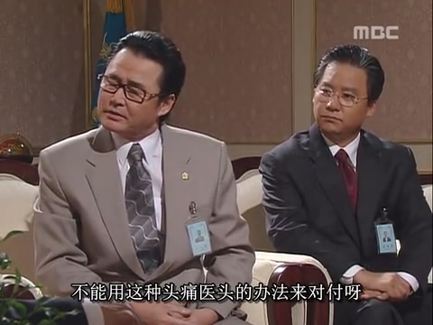
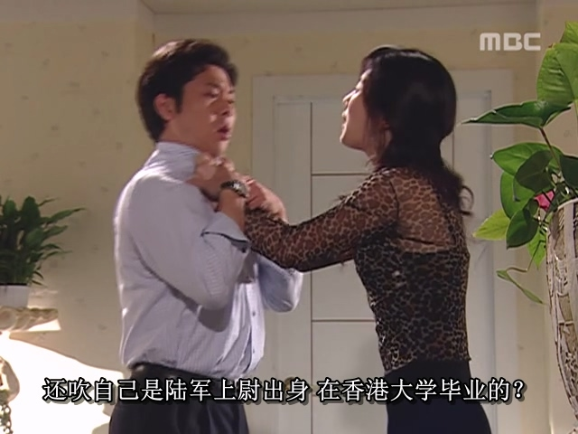
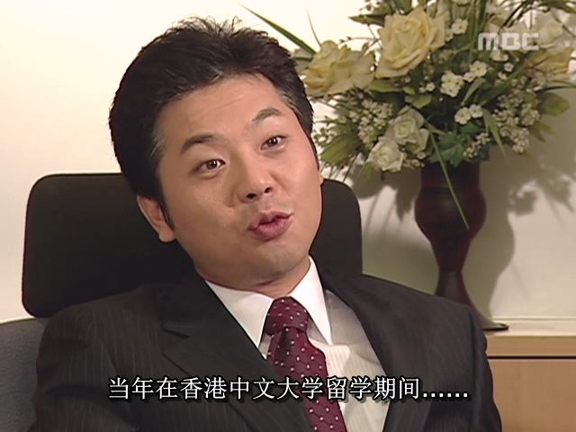

전두환이 집권하던 시절, 남한의 경제는 급속히 발전했지만 정치적 환경은 늘 불안정했다. 경제 발전으로 전두환 군사정권에 대한 국민의 불만은 가라앉지 않았고, 오히려 시위가 계속되었다.

1985년 대한민국 국회의원 선거 당시, 두 주요 야당(신한민주당과 민한국당)의 합산 지지율이 전두환의 집권 여당(민정당)의 지지율보다 높아서 전두환은 큰 곤경에 처하게 되었다. 게다가 그해 국회의원 선거를 앞두고 김대중은 야당의 선거를 지지하기 위해 미국에서 한국으로 돌아와 자신의 기반을 격려하겠다고 고집했습니다. 이로 인해 김영삼과 김대중이 힘을 합쳐 전두환에 반대하게 되었고, 이로 인해 두 김의 기세가 크게 높아졌습니다. 한국의 민주화 운동 인사와 학생 운동은 헌법 개정과 광주 사건에 대한 책임 조사라는 두 가지 주요 요구를 내세워 공동으로 시위에 나섰습니다.

이 자리에서 저는 대한민국의 제4공화국과 제5공화국의 헌법적 기원에 대해 간략히 소개하고자 합니다.

제4공화국의 헌법 제도에 따르면 대통령은 1인 1표로 선출되는 것이 아니라, 대통령이 의원 명단을 결정하는 '통일국민회의'를 통해 간접적으로 선출됩니다. 게다가 대통령의 임기에는 제한이 없습니다. 국회의 투표 지지를 얻을 수 있는 한 재선될 수 있습니다. 이 두 메커니즘에 따라 박정희는 대통령이 된 후 자신의 심복들을 "통일국회" 의원 명단에 포함시켜 대통령으로서 무제한 재선을 보장할 수 있었습니다. 이는 본질적으로 종신 대통령직입니다.

전두환의 제5공화국은 박정희의 제4공화국에서 탄생했다. 제4공화국 헌법과 비교했을 때 제5공화국 헌법의 가장 중요한 개혁은 대통령 임기 제한을 정한 것이다. 대통령은 7년의 단 한 번의 임기만을 맡을 수 있고 임기가 끝난 후에는 재선될 수 없으므로 종신 대통령직을 피할 수 있다. 박정희가 종신 대통령직을 수행한 후, 그는 사방에서 너무 많은 반대에 직면했습니다. 국민은 그의 독재에 반대했을 뿐만 아니라, 상층의 여러 세력도 박정희의 권력 독점에 불만을 품고 있었습니다. 제4공화국의 정권은 이미 존재의 끝에서 흔들리고 있었고, 박정희는 수많은 적을 만들었습니다. 결국 내부 갈등이 터지고 그는 암살당했습니다. 박정희의 심복인 전두환은 이 모든 것을 자신의 눈으로 목격했습니다. 박정희의 죽음을 계기로 전두환은 종신 대통령 체제를 이어간다면 필연적으로 수많은 적을 만들게 되며, 조심하지 않으면 박정희의 발자취를 따르게 될 것이라는 사실을 깨닫게 되었다. 전두환은 자신의 목숨을 구하고 평화로운 삶을 누리는 것이 더 중요하다고 여겨져 제5공화국 수립 초기에 종신대통령제를 폐지했습니다.

하지만 전두환이 그렇게 정직하게 권력을 내놓을 수는 없었다. 제5공화국은 더 이상 종신 대통령 제도를 사용하지 않지만, "통일국민회의"에 의한 간접 선거로 대통령을 선출하는 제도는 유지되었습니다. 이러한 간접선거제도가 존재하는 한 전두환은 회의 구성원 명단을 조작해 자신의 심복들을 다음 대통령으로 지명할 수 있다. 이렇게 하여 전두환은 여전히 ​​'명예 황제'의 지위를 유지하며 정권에 대한 영향력을 유지할 수 있었다.

한국의 민주당은 이 간접선거 제도를 표적으로 삼고 있습니다. 그들은 전두환이 다음 대통령을 지명하는 것을 막기 위해 1인 1표의 보통선거로 대통령을 선출하도록 헌법을 개정할 것을 요구합니다.

당연히 전두환은 이 요청을 받아들일 수 없었다. 후계자를 지정하는 것은 대통령으로서 그의 핵심 권한이고, 그는 그것을 쉽게 내놓지 않을 것이다. 양측은 헌법 개정 문제를 놓고 논쟁을 벌여 왔으며, 어느 쪽도 물러서지 않았습니다.

허문도가 먼저 전두환에게 건의를 하며, 학생운동을 겨냥해 "학원안정법"을 제정해 과격 시위 주동 학생들을 선별해 격리시키고 대다수 학생들이 이들과 접촉하지 못하게 하면 학생운동이 주도 세력을 잃어 자연스럽게 잠잠해질 것이라고 제안했다. 전두환은 이를 긍정적으로 평가하며 즉시 핵심 팀과 "학원안정법"의 실행 가능성을 논의했다. 그러나 당시 국무총리였던 노신영은 이 법안이 헌법과 충돌할 뿐만 아니라 학생들이 법의 위협으로 시위를 포기하지 않을 것이며, 두통에 머리만 다루는 방식으로 학생운동에 대응해서는 안 된다고 경고하며 직접 법을 추진하지 말 것을 권고했다.

루신융은 "공중에서 카드를 만드는 것"이 ​​어떨까 제안했습니다. 즉, 먼저 누군가를 찾아 소문을 퍼뜨리고 "캠퍼스 안정법"의 도입을 홍보해야 한다는 것입니다. 국민이 '대학 캠퍼스 안정화법'에 대한 우려를 표명했을 때 전두환은 다시 한번 이 법을 추진하지 않겠다고 선언하며 현명한 선택을 했습니다. 게다가 전두환은 이 카드를 이용해 야당과 협상을 할 수도 있는데, '대학 캠퍼스 안정법' 폐지를 협상 카드로 삼아 야당이 헌법 개정을 포기하도록 만들 수 있다. 전두환은 노신영의 건의에 크게 만족하여 노신영에게 이 일을 맡겼다.

하지만 국민들의 개헌 요구는 약해지지 않았고, 1986년에 이르러서는 개헌이 주류 의견으로 부상하며 전두환 정부는 점차 수세에 몰렸다.

바로 이 해, 북한 정부가 한강 상류에 금강산댐 건설을 발표했다. 장세동(당시 안전기획부장, 구 중앙정보부)과 이학봉은 이 기회를 놓치지 않고 금강산댐을 정치적 도구로 활용할 계획을 세웠다.

그들은 전두환에게 언론을 조작해 "북한이 서울올림픽 방해를 위해 금강산댐을 건설 중이며, 댐을 개방하면 한강을 따라 내려온 대홍수가 서울을 침수시킬 것"이라는 허위 정보를 퍼뜨릴 것을 건의했다. "민주주의는 상층부의 요구이지만 안보는 더 근본적인 문제"라는 논리로, 국민들의 관심을 국가 안보로 돌려 개헌 논의를 묻어버리겠다는 전략이었다. 전두환은 이 '주의 분산 전략'에 크게 기뻐했는데, 북한 위협론을 부각시켜 국민의 공포심을 자극하면 강권 정부에 대한 의존도를 높일 수 있었고, 필요시 계엄령으로 권력을 더욱 강화할 수 있었기 때문이다. 이러한 '내부 문제 발생 시 북한 카드 꺼내기'는 2024년 윤석열 대통령까지 이어지는 한국 보수 정권의 고질적 수법이 되었다.

전두환 정부가 금강산댐 위협론을 본격화하자 국민들의 관심은 예상대로 안보 쪽으로 쏠렸다. 더불어 정부는 "평화의 댐" 건설 계획을 발표하며 금강산댐 하류에 한국 측 댐을 세워 북한의 위협을 막겠다고 선전했다. 이 명분으로 국고 자금과 민간 기부금을 동원한 대규모 공사 과정에서 전두환 측근들은 각종 비리로 부정 축재를 일삼았다. 이처럼 금강산댐 위협론은 개헌 논의를 묻어버리는 동시에 전두환 정권의 '돈줄'을 마련하는 일석이조의 효과를 거뒀다. 전두환은 탈세와 부정부패에 대한 후각이 남달랐다.

몇 달 후, 이학봉은 전두환에게 윤태식이라는 한국 상인이 싱가포르 주재 한국 대사관에 도움을 요청했다는 보고를 올렸다. 윤태식은 홍콩에서 만난 한국인 아내 수지 김(본명 김옥분)이 북한 간첩이라 주장하며, 자신을 북한으로 납치하려 했다가 탈출했다고 진술했다.

그러나 윤태식의 주장은 허구였다. 그는 무명인사였고, 북한이 그를 납치할 동기도 없었으며 진술 내용은 허점이 투성이였다. 이 사건은 5공화국 말기의 유명한 뷰티 스파이 사건이다Suzy.

사건의 완전한 진실은 이러했다. 윤태식의 아내 본명은 김옥분으로 영문명은 수지였으며, 한국 김주시 출신이었다. 그녀는 홍콩 상인을 알게 되어 결혼을 위해 홍콩으로 건너갔으나, 그 상인이 이미 유부남임을 알고 분노하며 떠났다. 그러나 수지는 한국으로 귀국하지 않고 홍콩에서 바 접대원으로 일하며 생활했다. 1986년, 사업 기회를 찾아 홍콩에 온 윤태식을 알게 된 수지는 원래 일본으로 이사할 계획으로 자신의 임대주택을 윤태식에게 넘기려 했으나, 계획이 변경되어 일본 행을 포기하고 윤태식과 동거하게 되었다.

한마디 덧붙이자면, 홍콩의 주택 상황을 잘 아는 필자로서 말하자면, 그들의 거주 공간이 매우 협소했을 것이 분명하다. 남녀가 좁은 공간에서 함께 지내며 금세 사랑의 불꽃이 튀었고, 불과 한 달도 채 되지 않아 번개결혼을 하게 되었다.

그러나 일상의 사소한 갈등과 경제적 궁핍은 감정을 서서히 식혔고, 수지는 윤태식이 자신의 신분에 대해 허풍을 떨며 거짓말을 한 사실을 알게 되었다. 이내 둘은 끊임없는 다툼을 이어갔다.

홍콩대학이 억울하게 휘말렸다

1987년 1월 2일, 둘은 다시 돈 문제로 격렬하게 다투던 중 윤태식이 실수로 수지를 살해했다. 당황한 윤태식은 수지의 시체를 방에 두고 문을 잠근 뒤 즉시 비행기 티켓을 구매해 홍콩을 탈출, 싱가포르로 향했다.

싱가포르에 도착한 윤태식은 먼저 북한 대사관을 찾아가 망명을 요청했으나, 북한 측은 그에게 아무런 가치가 없다고 판단해 거부했다. 이후 미국 대사관에도 도움을 요청했으나 역시 거절당했다. 절망에 빠진 윤태식은 생존을 위해 유일한 방법을 찾아냈다. 수지를 북한 간첩으로 모략해 한국 정부의 처벌을 피하겠다는 계획이었다.

한국인들의 "문제 발생 시 북한 탓하기" 본능은 전두환 대통령부터 평민 윤태식까지 고루 퍼져있었음이 틀림없었다.

안전기획부장 장세동은 이 진상을 알자마자 금강산댐 위협론과 동일한 수법을 적용하기로 결심했다. 인간의 호기심과 선정성을 자극하는 "북한 미녀 간첩의 한국인 납치극"은 국민의 관심을 완전히 돌릴 수 있는 최적의 소재였다. 장세동은 윤태식의 거짓말을 알고도 일부러 연기를 지시했으며, 윤태식을 한국으로 데려와 통제하면서 "간첩 아내의 납치 시도에서 도주한 영웅"이라는 허위 증언을 강요했다.

이 사건이 보도되자마자 전국적인 주목을 받았고, 한국 국민들은 북한을 규탄하고 윤태식에게 공감을 표했다. 윤태식은 국민들로부터 큰 환영을 받았고 그는 국민적 영웅이 되었다.

하지만 1987년 1월 26일, 홍콩 경찰은 수지의 이웃으로부터 수지의 시신이 발견되었다는 신고를 받았습니다. 그들은 즉시 윤태식을 1순위 용의자로 지정하고, 윤태식을 수사를 위해 홍콩으로 인도해 달라고 요청하는 인도 서한을 한국 정부에 보냈습니다. 하지만 전두환 정부는 고의로 범죄를 저지르고 있었고 당연히 윤태식을 홍콩 경찰에 넘기지 않았을 것입니다. 홍콩 경찰이 한국에 가서 사람들을 체포하는 것은 불가능했기 때문에 수사를 종료해야 했습니다. 당시에는 인터넷이나 스마트폰이 없었고, 한국인들이 정보를 얻을 수 있는 유일한 통로는 자국 언론뿐이었습니다. 그들은 홍콩 소식을 볼 수 없었기 때문에 어둠 속에 갇혀 있었습니다.

이 사건은 한국 언론의 광범위한 인터뷰와 보도로 인해 엄청난 파장을 일으켰고, 수지의 한국 가족은 즉시 절망적인 상황에 빠졌습니다. 그녀의 가족은 안보기획부에 의해 고문을 당했고, 무지한 사람들로부터 "간첩 가족"이라는 모함을 받으며 비참한 최후를 맞이했습니다.

하지만 윤태식은 국민적 영웅으로 추대받고 이후 한국에서 사업에 성공하여 청와대에도 드나들 수 있을 만큼 성공적인 사업가가 되었다.

홍콩중문대학이 억울하게 휘말렸다 (엄중히 밝히건대, 윤태식은 홍콩 상위 2개 대학(Top 2)과는 전혀 무관하며, 그의 실제 학력은 고등학교 중퇴입니다).

하지만 윤태식은 결국 처벌을 피하지 못했다. 2001년 제6공화국 김대중 정부 시절, 수지의 남동생은 누나의 억울함을 풀기 위해 기자를 통해 사건 증거를 검찰에 제출했다. 김대중 정부는 재수사에 착수했고, 한국 경찰은 홍콩 경찰과 협력해 당시 사건 관련 증거를 확보한 뒤 윤태식을 체포했다. 비록 늦었지만 수지와 그 가족의 누명은 벗겨졌다. 그러나 이迟到的正义는 그들의 상처를 완전히 치유할 수는 없었다.

이처럼 금강산댐 위협론과 미녀 간첩 수지 김 사건을 통해 장세동은 일시적으로 국민의 관심을 분산시켜 전두환 정권의 개헌 압력을 줄이는 데 성공했다. 그는 전두환의 '일심회' 조직원으로서 수단과 방법을 가리지 않았으며, 주군을 위해 모든 위험을 감수하는 충신이자 민중에게는 폭압의 앞잡이로 기억되었다.

그러나 장기간의 강압 통치는 결국 실수를 낳았고, 장세동의 인생을 뒤바꿀 사건이 기다리고 있었다——죽은종철이산세동을쫓아냈다。
