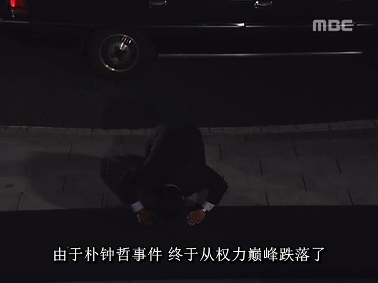

第五共和国期间，学潮运动此起彼伏，层出不穷，大学生参与示威运动被警察逮捕的事情已经成了家常便饭。其中，首尔大学一个名为朴钟哲的大学生在某次集会活动中被捕。1987年1月14日，韩国治安本部对共处（还是那个“共”，共产主义的共）的几个警察在审讯朴钟哲时动用了水刑，结果用力过猛导致朴钟哲当场死亡，这下就把事闹大了。

虽然在第五共和国期间，全斗焕政府大规模抓捕持不同意见的反对人士已经是见多不怪了，但没有定罪就搞出了人命还是使事情发生了质变。因此，治安本部一开始就想掩盖住朴钟哲死亡一事，希望蒙混过关。

然而，这个事很快传到了韩国检察厅那里。检察厅和治安本部属于2个不同的体系，检察官们决定插手此案，既可以打击治安本部，也可以提升检察厅的影响力。于是，检察官将朴钟哲死亡的事透露给记者，报道出来。

这里要回顾下，虽然全斗焕政府在政权早期牢牢控制住了媒体，但受到的反对压力越来越大。到了1986年夏天的时候，全斗焕政府再也顶不住压力，只能被迫放松了媒体舆论管制。而朴钟哲一案发生在1987年，此时全斗焕政府对媒体的管控能力已经大幅下降，因此压不住媒体对此案的报道。

朴钟哲之死一经报道，立刻在韩国引起轩然大波。首尔大学相当于韩国的清华北大，朴钟哲作为首尔大学的大学生可谓是天之骄子。在东亚这片推崇读书的土地上，成绩好的学霸天然就能吸引更多的关注。而且，韩国民主派对全斗焕政府可谓是积怨已久，之前因为被张世东用“金刚山大坝威胁论”和“美女间谍Suzy金”一案转移了民众的注意力而不知所措，现在遇到了“朴钟哲之死”这种可以用来攻击全斗焕的牌，自然是不会放过机会，于是各路民主派人士全力宣传此事，以此为契机团结众人，联合反对全斗焕政府。

眼见纸包不住火，治安本部先是准备避重就轻，在新闻发布会上声称审讯的警察只是拍了一下桌子，然后朴钟哲就倒地死亡了，让在场的记者忍不住笑了，觉得治安本部骗三岁小孩呢。

安全企划部长张世东得知治安本部在新闻发布会上的表现后，立刻打电话把治安本部的人大骂了一顿。张世东倒不是嫌弃他们坏，而是嫌弃他们菜，这事办得也太弱智了，这理由根本糊弄不了人，反而激发了民间的愤怒和对政府的不信任。

于是，治安本部又使出丢卒保车的策略，被迫承认朴钟哲死亡是因为遭受了水刑，并交出了2个参与审讯的警察去顶罪。张世东又从安全企划部的资金里拿出1亿韩元，让治安本部的高层去威逼利诱顶罪的那2个警察，让他们把罪全揽下来，别咬出其他人，这样就会给他们每家5000万韩元，照顾他们的家人。如果不从，那治安本部有的是办法整治他们的家人。于是两个小警察只能被迫答应。

然而，到了1987年5月18日，这一天是光州事件7周年，韩国民众因为光州事件和朴钟哲之死两件事加在一起，新仇旧恨一起算，发动了全国大规模追悼游行。在检察官和记者孜孜不倦地追查下，媒体也开始大力报道朴钟哲案的更多细节。韩国民众认为两个小警察不足以背下全部的黑锅，民间愤怒的矛头直指全斗焕政府。

这时候，全斗焕政权内部的问题也开始爆发了出来。这里需要介绍张世东，卢泰愚，卢信永的继承人之争这一背景。

由于第五共和国宪法规定了总统最多只能干一届，不能连任，因此在全斗焕执政末期，就必须要考虑选谁做继承人当下一任总统。当时民间纷纷猜测，继承者将从张世东（一心会成员，时任安全企划部长），卢泰愚（一心会成员，时任国会议员），卢信永（文官，时任国务总理）三人中选出。

从当时的政治局面来看，首先排除的是卢信永。卢信永终究是文官，在军队毫无根基，如果全斗焕选卢信永，必然遭到军队系统的反对，而全斗焕不太可能主动得罪军队这个基本盘。而且，全斗焕身上最大的两个黑点，双12政变和光州事件，卢信永都没有参与过，便不能算是自己人。如果是卢信永当了下一任总统，那么一旦日后有民主派人士清算全斗焕的这两个黑点，卢信永未必会力保他。所以，全斗焕只能选择一心会的自己人，当年的事都是大家一起干的，这样自己人才会顶住民主派清算的压力，既是保住全斗焕，也是保住自己。

至于张世东，虽然对全斗焕忠心耿耿，但当时资历还是不足以独当一面，不能胜任总统一职，这点连张世东自己也清楚。而且张世东相继在警卫室长和安全企划部长这两个强力职位上，一直都为全斗焕干了不少黑活，所以名声跟全斗焕一样差，选他当继任者实在难以服众。全斗焕把张世东扶上高位，主要还是需要他牵制其他人。

而卢泰愚才是最合适的人选，他资历足够，和全斗焕是同辈，是一心会的二号人物，全斗焕的黑点他也都参与了。而且全斗焕卢泰愚二人从上军校时就认识（还是室友），毕业从军后也是关系匪浅，一般都是全斗焕升官后，推荐卢泰愚接自己的位置。两人算得上是一起上学，一起从军，一起升官，一起政变，一起镇压光州，一起进青瓦台，甚至到了第六共和国时期，两人又一起接受审判，一起坐牢，一起获得特赦。即使是亲兄弟，也做不到像全斗焕卢泰愚二人这样命运紧密相连，全斗焕把卢泰愚当成一辈子的同志。而且卢泰愚从政后不像张世东那样沾了很多黑活，卢泰愚的底子相对干净一些，接任总统受到的阻力会小很多。

所以，全斗焕其实本来就有意选卢泰愚为下一任总统，只是只有卢泰愚并不能让他完全放心，所以他还扶持了张世东牵制卢泰愚。

只是从卢泰愚的角度来看，只要全斗焕还没正式宣布扶持自己做下一任，那么靴子没落地，张世东就还是他卢泰愚的政敌。并且，在一心会内部，全斗焕是绝对的核心和带头大哥，所有人都会给全斗焕面子。但是除了全斗焕以外的其他人则各有派系，也有内部矛盾。张世东作为一心会晚辈，只对全斗焕一人效忠，只要全斗焕一声令下，张世东就是赴汤蹈火也在所不辞。但张世东对一心会其他前辈（如卢泰愚）则一般般，因此惹得卢泰愚不满。所以，卢泰愚也准备借“朴钟哲之死”一案除掉张世东。

在朴钟哲之死被记者报道后，卢泰愚积极运作，将郑镐溶（一心会三号人物，卢泰愚的铁杆盟友）送进内阁成为新的内务部长，准备借郑镐溶之手打倒张世东。

面对民间对全斗焕政府的滔天怒火，国务总理卢信永建议，只处理几个警察肯定是不够的，他作为总理，考虑带领内阁全部成员辞职，以平息民众的怒火。张世东还想挣扎一下，准备先观望情况，暂时不希望内阁（包括他自己）辞职。但郑镐溶此时出来拱火，说朴钟哲这个事都是张世东派系的人捅出的篓子，一人做事一人当，揶揄张世东如果还有担当的话就该辞职。否则，内阁不担责，就该全斗焕出来担责了。

于是，为了维护大哥，张世东还是决定向全斗焕请辞。但全斗焕一开始坚决不同意他辞职。全斗焕最信任的就是张世东，只要还有一线希望就会力保这个小弟。

不过，郑镐溶很快又挖出了张世东动用安全企划部资金去威逼利诱那两个顶罪的警察的黑料，这下连政府内部都建议全斗焕追究张世东的责任了。在内外重压之下，全斗焕也保不住张世东了，只能含泪让张世东辞去安全企划部长一职，离开了青瓦台。于是，当时的韩国社会上流传出一句话，死钟哲走活世东。韩国人这是也读过中国的《三国演义》。

离开青瓦台后，忠心耿耿的张世东朝着青瓦台全斗焕的方向跪下磕头。张世东这一辈子，对不起很多人，但唯独对得起全斗焕，为了全大哥可谓是誓死追随，从未有过一丝犹豫。全斗焕对张世东也是深信不疑，完全当成自家兄弟对待。

朴钟哲本是一个籍籍无名的大学生，但他的死成了各方势力斗争的一张牌。或许确实有人是想伸张正义，但更多的人估计还是想借这张牌打倒自己的政治对手。检察厅要斗治安本部，民主派要攻击全斗焕，卢泰愚郑镐溶要逼走张世东，所有人都在这个局里激烈博弈。政治斗争就是这样，明面上是为了各种大义名分，实际往往都只是为了自身利益。六朝何事，只成门户私计。

卢信永和张世东都因为朴钟哲之死而辞职了，三个继承人选项里只剩下卢泰愚。于是全斗焕不再拖延，开始大力扶植卢泰愚，在执政党内公开宣布卢泰愚为自己的继承人。

春风得意的卢泰愚觉得下一任总统之位已经在向自己招手，然而，民主派势力不会让他轻易到达目标的彼岸。
