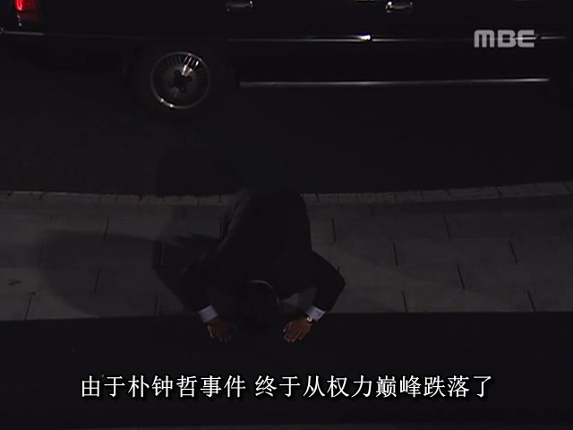

제5공화국 기간 동안 학운동은 끊이지 않고 계속되어 대학생들이 시위 도중 경찰에 체포되는 일이 흔한 일이 되었습니다. 그중 서울대학교 박종철이라는 학생이 한 집회 활동 중 체포되었습니다. 1987년 1월 14일, 한국 치안본부 공안계(共안계) 소속 경찰들이 박종철을 심문하는 과정에서 물고문을 가했고, 이 과정에서 과잉 진압으로 인해 박종철이 현장에서 사망하면서 사건은 커다란 파문으로 이어졌습니다.

비록 제5공화국 시기 전두환 정부가 반체제 인사들을 대규모로 체포하는 것이 흔한 일이었지만, 유죄 판결도 없이 사망 사건이 발생하자 사태는 본질적으로 변했습니다. 이에 치안본부는 처음부터 박종철 사망 사건을 은폐하려 했고, 사실을 무마하려고 시도했습니다.

그러나 이 사건은 곧바로 한국 검찰청에 알려지게 되었습니다. 검찰청과 치안본부는 서로 다른 체계였으며, 검찰 측은 이 사건을 수사함으로써 치안본부를 견제하고 동시에 검찰의 영향력을 확대할 수 있다고 판단했습니다. 결국 검찰은 박종철 사망 사건을 기자들에게 유출해 보도하게 만들었습니다.

이 당시의 상황을 돌아보면, 전두환 정부가 집권 초기 언론을 철저히 통제했지만 점차 커지는 반발 압력에 1986년 여름을 기점으로 더 이상 버티지 못하고 언론 통제를 완화할 수밖에 없었습니다. 박종철 사건이 발생한 1987년 당시에는 이미 전두환 정부의 언론 통제 능력이 크게 약화된 상태였기 때문에 이 사건에 대한 보도 역시 막아내지 못했습니다.

박종철 사망 소식이 보도되자마자 한국 사회에 큰 충격을 일으켰습니다. 서울대학교는 한국의 최고 명문대학으로, 박종철이 서울대 학생이라는 점은 그를 '엘리트 중의 엘리트'로 부각시켰습니다. 학업을 중시하는 동아시아 사회에서 우수한 성적의 학생은 자연스럽게 더 많은 관심을 받았습니다. 또한 한국 민주화 세력은 오랫동안 전두환 정부에 대한 불만이 쌓여 있었는데, 이전에 장세동이 '금강산 댐 위협론'과 '미녀 스파이 수지 김' 사건으로 국민의 관심을 분산시킨 데 당황했던 경험이 있었습니다. 이번 '박종철 사망 사건'은 전두환 정부를 공격할 절호의 기회였기에 각계 민주화 인사들이 이 사건을 적극 활용해 대중을 결집시키고 정부 반대 세력을 규합했습니다.

진실을 숨길 수 없게 되자 치안본부는 처음엔 사건을 축소하려 했습니다. 기자회견에서 "심문 경찰이 책상을 두드리자 박종철이 쓰러져 사망했다"는 터무니없는 설명을 내놓았고, 현장 기자들은 '3살 어린이도 속이지 못할 거짓말'이라며 웃음을 참지 못했습니다.

안전기획부장 장세동은 이 같은 치안본부의 어이없는 대응 소식을 접하고 즉시 전화로 관계자들을 호되게 질책했습니다. 장세동이 분노한 이유는 그들의 악행이 아니라 '너무 저능한 방식'으로 사태를 악화시켜 민중의 분노와 정부 불신을 키웠기 때문이었습니다.

결국 치안본부는 '하급자 버리기' 전략으로 물고문 사실을 인정하고 심문 경찰 2명을 책임자로 내세웠습니다. 장세동은 안기부 자금에서 1억 원을 인출해 치안본부 고위층을 통해 이들 경찰에게 "죄를 모두 인정하면 가족에게 각각 5000만 원을 주고 보호하겠다"며 회유하는 동시에 "거부하면 가족을 처벌하겠다"고 협박했습니다. 결국 두 하급 경찰은 모든 죄를 뒤집어쓰고 재판장에 서게 되었습니다.

그러나 1987년 5월 18일, 5·18 광주 민주화 운동 7주기를 맞은 한국 민중은 광주의 아�운 기억과 박종철 사망 사건이 겹치며 폭발했습니다. 오랜 분노와 새롭게 쌓인 적개심이 결합된 대규모 추모 집회가 전국적으로 확산되었습니다. 검찰과 기자들의 끈질긴 수사로 언론은 박종철 사건의 세부적 고문 증거들을 속속들이 보도하기 시작했고, 시민들은 두 하급 경찰만으로는 이 모든 책임을 떠맡기엔 부족하다고 판단하며 분노의 화살을 전두환 정부 자체로 돌렸습니다.

이 시점에서 전두환 체제 내부의 권력 갈등도 수면 위로 떠올랐습니다. 여기서 당시 권력 계보를 장악하려던 장세동, 노태우, 노신영 세 인물의 '후계자 전쟁' 배경을 짚어야 합니다.

제5공화국의 헌법은 대통령의 임기를 단 한 번으로 규정하고 연임이 불가능하므로 전두환 정부의 마지막 국면에서 후계자와 다음 대통령을 누구로 선택할 것인가에 대한 고민이 필요하다. 당시 여야를 막론하고 차기 주자로 장세동(안기부장，일심회), 노태우(국회의원，일심회), 노신영(국무총리，문관) 삼두체제가 유력 후보로 거론되고 있었습니다.

당시 정치 상황을 분석하면 먼저 노신영이 후보에서 배제되었습니다. 노신영은 근본적으로 문관 출신으로 군부에 기반이 전혀 없었기 때문에, 전두환이 그를 후계자로 선택할 경우 군부의 강한 반발을 초래할 것이 분명했습니다. 군부는 전두환 정권의 핵심 지지 기반이었기에 이를 자의로 위협할 수 없었습니다. 또한 전두환의 최대 정치적 부담이었던 12·12 군사 반란과 5·18 광주 진압 사태에 노신영은 전혀 관여하지 않아 '자신 사람'으로 볼 수 없었습니다. 만약 노신영이 대통령이 된다면 향후 민주화 세력이 전두환의 과오를 추궁할 때 그를 보호해줄지 확신할 수 없었습니다. 따라서 전두환은 반드시 일심회(一心會) 계열의 동지 중에서 후계자를 선택해야 했습니다. 과거 사건에 함께 참여한 인물이라야 민주화 세력의 공격으로부터 상호 보호할 수 있었기 때문입니다.

장세동의 경우 전두환에 대한 충성심은 확고했으나 당시 역량과 경력이 대통령 직을 수행하기엔 부족했으며, 이는 본인도 인정하는 부분이었습니다. 게다가 경호실장과 안기부장을 거치며 전두환의 '검은 일'을 도맡아 처리한 탓에 전두환 못지않은 악명을 떨치고 있어 대중적 지지 기반이 취약했습니다. 전두환이 그를 고위직에 앉힌 주된 이유는 다른 세력 견제를 위한 것이었습니다.

반면 노태우는 최적의 후보였습니다. 충분한 경력을 갖춘 일심회 2인자로서 전두환의 모든 역사적 과오에 공동 책임이 있었습니다. 두 사람은 육사 동기생(기수 11기)으로 동기 생활을 시작해 군부 승진 과정에서도 줄곧 유착 관계를 유지했으며, 전두환의 권력 장악 과정인 12·12 쿠데타와 5·18 진압에도 공동 참여했습니다. 청와대 입성부터 6공화국 시기 재판과 복권까지 운명을 공유했던 이들은 혈육 이상의 유대감으로 연결되어 있었습니다. 게다가 노태우는 장세동과 달리 직접적인 '검은 일'에 연루되지 않아 상대적으로 청렴한 이미지를 유지하고 있어 정권 인수 과정에서 저항이 적을 것으로 판단되었습니다.

따라서 전두환은 실제로는 노태우를 대통령으로 선택하려고 했지만, 노태우만을 전적으로 확신할 수는 없었기 때문에 장세동을 지원하여 노태우를 견제하기도 했다.

노태우의 입장에서 보면 전두환이 공식적으로 후계자 지지를 선언하기 전까지는 장세동이 여전히 자신의 정적이었습니다. 일심회 내부에서 전두환은 절대적 리더였으나, 그 외 인물들은 각기 파벌을 형성하며 내부 갈등을 빚고 있었습니다. 장세동은 일심회 후배로서 오직 전두환에게만 충성을 바쳤으며, 전두환의 명령이라면 어떤 희생도 감수할 준비가 되어 있었습니다. 그러나 그는 노태우를 비롯한 일심회 선배들에게는 소극적인 태도를 보였고, 이는 노태우의 불만을 자아냈습니다. 결국 노태우도 '박종철 사망 사건'을 통해 장세동을 제거할 기회를 노리게 되었습니다.

박종철 사건 보도 이후 노태우는 측근인 정호용(일심회 3인자)을 내무부 장관으로 기용하며 조직적 견제를 시작했습니다. 정호용은 장세동 계파의 실각을 위한 전초전으로 내무부 장관직을 활용하려 했습니다.

한편 국무총리 노신영은 "하급 경찰 몇 명만 처벌해서는 민심을 달랠 수 없다"며 내각 총사퇴를 제안했습니다. 장세동은 사태 관망을 주장하며 사퇴를 반대했으나, 정호용이 "사건의 책임은 장세동 계파에 있다"며 "책임져야 할 사람은 장세동"이라고 공개적으로 압박했습니다. 더 나아가 "내각이 책임지지 않으면 전두환 대통령이 직접 나서야 한다"는 발언으로 장세동을 구석으로 몰아넣었습니다.

그래서 전두환을 보호하기 위해 장세동은 결국 사임을 결심했다. 그러나 전두환은 처음에 그의 사퇴를 완강히 반대했다. 전두환이 가장 신뢰하던 인물은 바로 장세동이었고, 조금이라도 가능성이 남아있는 한 이 측근을 끝까지 지키려 했던 것이다.

하지만 정호용이 곧바로 장세동이 안기부 자금을 동원해 두 경찰관을 회유·협박하여 누명을 씌웠다는 흑자료를 추가로 발굴해내면서, 정부 내부에서조차 장세동의 책임을 추궁해야 한다는 의견이 나왔다. 내외부의 압박 속에서 전두환도 더 이상 장세동을 보호할 수 없게 되었고, 눈물을 머금은 채 그가 안기부장 직에서 물러나 청와대를 떠나도록 허락해야 했다. 이렇게 되어 당시 한국 사회에 "죽은 종철은 가고 산 세동은 남는다(死鍾哲走 活世東留)"는 말이 유행했는데, 이는 한국인들도 중국의 <삼국지연의>를 읽었음을 보여주는 일화였다.

청와대를 떠난 후 충성스러운 장세동은 청와대가 있는 전두환 방향으로 두 무릎을 꿇고 이마를 조아렸다. 장세동은 평생 많은 이들에게 죄송한 점이 있었지만 오직 전두환에게만은 양심의 가책이 없었다. '전 큰형'을 위해 죽음을 각오하고 따르겠다고 맹세한 그 순간부터 한 번도 흔들림이 없었다. 전두환 역시 장세동을 의심 없이 신뢰하며 친동생처럼 아꼈다.

박종철은 본래 무명의 대학생에 불과했으나 그의 죽음은 각계 세력의 권력투쟁 도구로 전락했다. 진정한 정의 구현을 원하는 세력도 있었겠지만, 다수는 이 사건을 정치적 적수 제거의 수단으로 활용하려 했다. 검찰청과 치안본부의 대립, 민주화 세력의 전두환 공격, 노태우·정호용 연합의 장세동 격퇴 시도 - 모든 세력이 이 판에서 치열한 각축전을 벌였다. 정치 투쟁의 본질은 표면의 대의명분 뒤에 가려진 사리사욕임을 여실히 드러내는 순간이었다.

노신영과 장세동이 박종철 사건 연루로 사임하면서 후계자 후보 3인방 중 노태우만이 홀로 남았다. 이에 전두환은 기존의 주저함을 버리고 노태우 측근육성에 박차를 가했으며, 공화당 전당대회에서 공식적으로 노태우를 후계자로 천명했다.

승승장구하는 노태우는 다음 대통령 자리가 이미 자신을 부르는 듯했으나, 민주화 세력의 거센 저항이 그 목표 지점에의 안착을 허락지 않을 것이 예고되고 있었다.
