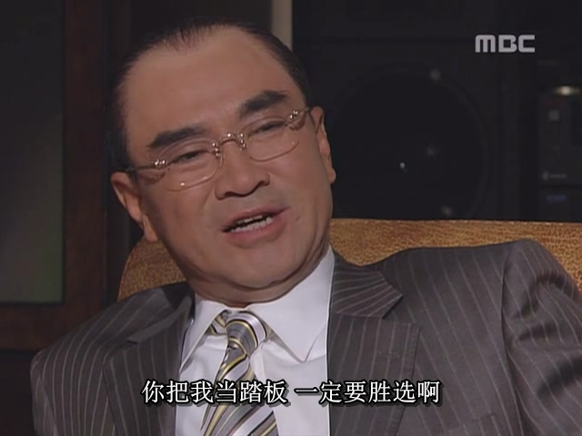

虽然张世东已经因“朴钟哲之死”而引咎辞职，但民主派仍没有善罢甘休，因为他们的根本目的本来就是要求改宪，要求一人一票选总统，没达到这个目的他们自然不会停止抗议。

1987年6月9日，延世大学（另一个名校，也相当于韩国的清华北大）的一名大学生李韩烈在自己的大学内示威抗议，被警察发射的催泪弹打中了头部要害位置，当场重伤濒死（虽然经过医院抢救，但还是在当年7月去世了）。全斗焕也是倒霉，本来让警察发射催泪弹这种非致命武器就是驱散一下示威人群就行了，没想要搞出人命，结果碰上个菜鸟警察，发射催泪弹不偏不倚正好打到李韩烈的要害部位，又是一个菜鸟闯下大祸。

本来就死了一个朴钟哲，现在又多了一个李韩烈，韩国民众更加愤怒，而民主派政客更加高兴，又多了一张牌。

从1987年6月10日开始，韩国全国范围内接连爆发大规模示威抗议活动，仅靠警察已经不能镇压如此大规模的示威人群，全斗焕政府已经摇摇欲坠。

于是，全斗焕便准备像当年那样，出动军队镇压。但是，很快他就面对三个沉重的现实：

1.     军队内部反对

张世东（此时张世东只是失去了权力，但仍以个人名义辅佐全斗焕）告诉全斗焕，军队中有人不支持全斗焕强硬镇压，而且还是至关重要的部队，特战司（就是空输部队的直属上级单位）。当年全斗焕发动双12政变以及镇压光州，靠的主要都是特战司的兵力。一旦特战司不能效忠全斗焕，那全斗焕的武力就算是废掉了大半。

造成这个局面的原因，恰恰是因为全斗焕对亲信兄弟们好所导致的。要发动政变或镇压示威，最重要的不是拉拢高级军官，而是拉拢能在现场实际指挥的中级军官。当年全斗焕政变的时候，他的最亲信的小弟们都是中级军官（例如特战司的几个空输旅旅长，首警司的警备团团长）。全斗焕一声令下，小弟们亲自带兵指挥，指哪打哪，把全斗焕送上胜利的宝座。

而全斗焕当了总统后，对这些兄弟们也是倾其所有，有福同享，留在军队的兄弟们个个升官发财，几乎全都升到中将、大将的高级位置，参谋总长这种陆军一把手位置则是兄弟们轮流坐。全斗焕还安排另一部分兄弟离开军队，跟着他进青瓦台从政，平步青云。总之，全斗焕对当年这帮最亲信的兄弟们确实是够义气，但也导致这些兄弟们都升上去了，不再是中级军官了。

而1987年时的中级军官们虽然很多也是一心会成员，但这些少壮派军官和全斗焕的关系总归是比当年那帮最亲信的兄弟们的关系更疏远一点。所谓一心会，首先是一个军校校友会，成员之间的关系首先是师兄弟关系。师兄弟之间，肯定是那种年龄差距小，入学年份接近的师兄弟更亲密，而年龄差距大的师兄弟必然会更疏远一点。所以，这时候的年轻一代的中级军官在关键大事上，不一定和全斗焕一条心。

2.     国际奥委会反对

1988年首尔奥运会是韩国全国瞩目的大事，所有韩国人都希望通过办好奥运会，展示本国的发展成果，建立民族自信。而1987年韩国爆发出如此大规模动乱，国际奥委会给韩国政府下了最后通牒：“如果动乱继续扩大而无法收拾，将取消韩国的1988年奥运主办权。”

如果全斗焕真的出动军队搞出流血事件，事情就无法善了，那首尔奥运会基本也就没戏了，连全斗焕也承担不起这个历史罪责。

3.     美国总统反对

时任美国总统里根派了特使前往韩国，告诫全斗焕政府不要出动军队，而要以和平的方式解决动乱，否则将极大地破坏美韩关系。

所以，当时全斗焕面临的是一个内忧外患的绝境。外部重压是他得罪不起的，而内部也是人心不齐。当年朴正熙就是因为内部意见不统一还想强行镇压釜马示威，而导致被自己人刺杀。朴正熙之死给全斗焕留下了深刻教训，他一直都担心自己也走上朴正熙的老路。而且，朴正熙是个有理想有追求的政治家，虽然手段强硬，但是为国为民的初衷是极其坚定的，甚至有种“虽千万人，吾往矣”的决绝。而全斗焕其实是个没什么大追求的带头大哥型的人物，只想搞点权力搞搞钱，带着兄弟们吃香喝辣享福更重要，有一种见风使舵的心态，面对困境或者敌人，打得过就打，如果打不过，他跑起来也不含糊。

所以，在现实面前，全斗焕很识趣地放弃了出动军队镇压的想法，说服卢泰愚，准备接受民主派的要求，同意一人一票选出下届总统。

卢泰愚本来不想接受对民主派妥协，因为一人一票的话，谁都不能保证自己就能赢下大选。但卢泰愚在周围人（郑镐溶，朴哲彦）的劝说下，也意识到妥协是不可避免的，于是接受了全斗焕的提议，同意民主派的要求。

不过，全斗焕卢泰愚二人还准备了一张牌，正是这张牌让他们对卢泰愚最终获胜抱有信心，因此也就相对容易地做出了妥协的决定。这张牌就是全斗焕屡试不爽的“分化三金”：全斗焕将赦免金大中（此时处于被软禁在家的状态），勾引金大中也参与总统大选，以此分化三金的选票。

全斗焕和卢泰愚都是那种一旦确立了目标就会毫不犹豫地前进的人。从这一刻起，两人做好了分工，全斗焕倾尽所有资源扶植卢泰愚去竞选总统，而卢泰愚将和全斗焕保持距离，因为全斗焕的名声已经是烂得没法挽救了，现在重点是保卢泰愚，让卢泰愚去做好人，在国民面前刷好感。

1987年6月29日，卢泰愚发表629宣言，向全斗焕提出8项建议，包括同意一人一票直选总统，赦免金大中，保护言论自由等措施。并且，卢泰愚声称如果建议不被接受的话，自己将辞去一切公职。随后，全斗焕接受卢泰愚的所有建议，向民主派妥协。通过629宣言，卢泰愚展现出自己“力挽狂澜”，推动民主进程的形象，在国民面前刷出一大波好感。

而民主派政客则被卢泰愚这一番操作搞得很别扭，明知全斗焕和卢泰愚是在演戏，但毕竟自己的目的也达到了，因此也就不再抗议，现在的当务之急是准备即将到来的下届总统大选。

全斗焕妥协后，三金之间亦敌亦友的复杂关系开始浮现出来。在面对全斗焕军政府独裁时，三金是联合反对军政府的队友，具有共同的利益。但是现在变成一人一票直选总统了，三金都有竞选总统的资格，也就成了你死我活的竞争对手。尤其是金泳三和金大中这对老队友兼老对手，两人的政治生态位几乎一模一样，都是民主活动家，都受到军政府压迫，都各有一个基本盘（金泳三的基本盘在釜山，金大中的基本盘在光州）。金泳三和金大中勾心斗角大半辈子，在此刻的关系更为敏感。全斗焕故意赦免金大中，就是勾引他参选去分化另外两金的选票，这就是一个阳谋。三金对此心知肚明，但互不相让，在最高权力面前，没有政客会自我放弃。于是，在1987年下半年，三金和卢泰愚混战，共同竞选下一届总统宝座。

期间，全斗焕还不断给三金阵营煽风点火，例如派人在金大中的拉票演讲场所高呼“支持金泳三”，而在金泳三的地盘高呼“金大中万岁”，诸如此类小动作不断。

然而，金泳三突然想到了一个人，这个人或许可以帮他打击卢泰愚的民望，他就是在双12政变中被全斗焕卢泰愚迫害的前陆军参谋总长，郑昇和。

郑昇和当年被全斗焕一方政变逮捕后，被剥夺了大将军衔，以二等兵的身份强制退役，坐了几年牢后才被释放，在1987年时已是退隐江湖不问世事的状态。金泳三立刻找上郑昇和，极力邀请他加入自己的政党，支持自己竞选总统。

这招一出，果然有了效果。随着郑昇和高调复出，让韩国国民回忆起当年双12政变那段往事。民众都意识到，全斗焕是靠政变上台，过程中有大量黑幕，而卢泰愚和全斗焕是牢牢绑定的铁杆盟友，当年这些事卢泰愚也有份。因此卢泰愚的支持率开始下跌，而金泳三的支持率开始明显上升。

眼见卢泰愚选情不利，全斗焕便立刻去卢泰愚家商量对策。全斗焕拿出1500亿韩元交给卢泰愚，让他随便用。为了卢泰愚能获胜，全斗焕也是倾注了血本。卢泰愚感激地接下这笔资金，再小心翼翼地试探全斗焕。当时民众对卢泰愚的印象还是全斗焕的继承者，二人绑定太深，由于全斗焕名声太差，对卢泰愚是个极大的拖累。因此卢泰愚建议，为了赢下大选，他需要对民众做出表态，和全斗焕保持更大的距离，甚至可能还要承诺自己上台后会查一查全斗焕任上的一些腐败事件。卢泰愚小心翼翼地说完这番话，再看着全斗焕的脸色。

没想到，全斗焕答应的很干脆，他也知道自己的名声是什么样，现在唯一的目标就是全力保卢泰愚上台，这样自己才能安稳落地，只要能赢，什么手段都可以用。反正政客的承诺都不会100%兑现，民主体制下的一人一票竞选就是一个吹牛画饼的过程。全斗焕和卢泰愚有几十年的交情，此刻全斗焕放心地把自己的身后交给卢泰愚，全无设防。

于是，卢泰愚在媒体上发布追究全斗焕政权腐败行为的公约，与全斗焕进一步切割。这一番操作把三金都打懵了，没想到卢泰愚这么狠，为了赢，连自己的好兄弟都能背刺。三金都还没说出清算全斗焕这种话，反倒是卢泰愚抢先一步做出了这种表态。三金并不知道，全斗焕卢泰愚二人对胜利的执着，以及对彼此的信任，都超出了他们的预期。

于是，从这一刻开始，卢泰愚的支持率节节攀升。并且，临近投票日时，朝鲜又搞出了一件有利于卢泰愚的事。

朝鲜为了破坏韩国举办奥运会（朝鲜对韩国举办奥运会这件事真是有刻骨铭心的恨），派2名间谍于1987年11月29日制造了大韩航空爆炸空难。这2名间谍在巴林被国际刑警抓住，但一人当场自杀，剩下一人被活捉，这人就是著名的美女间谍金贤姬（这次是真朝鲜美女间谍了，不是Suzy金那个被污蔑的）。

全斗焕政府故意在总统大选日前一天把朝鲜间谍金贤姬引渡到韩国，吸引了民众的关注，让那些摇摆票的选民觉得，朝鲜这个外部威胁依然存在，还是选择卢泰愚这种军人出身的政客当总统似乎更能保护国民。

于是，在全斗焕卢泰愚各种运筹帷幄之下，大选当日，卢泰愚从一开始就获得领先优势，毫无悬念地赢下大选，成功当选大韩民国第13任总统。最终的选票结果分别是：

1.     卢泰愚，36.6%

2.     金泳三，28.0%

3.     金大中，27.0%

4.     金钟泌，8.0%

其实，只要金泳三和金大中合流，将选票集中到一人身上，便足以打败卢泰愚，但这两金终究是有自己的私心，抗争大半辈子终于得到了一人一票制，面对最高权力宝座，谁也不想将机会让给对方。这次大选固然是民主派的胜利，但对三金个人而言却是失败的，卢泰愚成为了韩国第一个通过全民大选选出的总统，必然会在韩国历史上留名。

于是，全斗焕正式将总统之位交给好兄弟卢泰愚，第五共和国正式结束，韩国开启了第六共和国。

但是，属于全斗焕的故事仍没有结束，而他和几十年的好兄弟卢泰愚之间的关系即将出现前所未有的裂痕。
