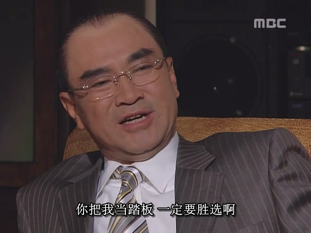

장세동이 "박종철 사망 사건"으로 책임을 지고 사임했지만, 민주파는 여전히 물러서지 않았다. 그들의 근본 목적은 헌법 개정과 대통령 직선제 요구였기에, 이 목표를 달성하지 못한 이상 시위를 멈출 수 없었다.

1987년 6월 9일, 연세대학교(한국의 명문 대학) 학생 이한열이 캠퍼스 내 시위 중 경찰이 발사한 최루탄에 머리 급소를 맞아 중태에 빠졌다(병원에서 치료를 받았으나 같은 해 7월 사망). 전두환은 최루탄과 같은 비살상 무기로 시위대를 해산시키려 했으나, 경찰의 미숙한 대응으로 인명 피해가 발생한 것이다. 초보 경찰이 최루탄을 정확히 이한열의 급소에 명중시키는 실수를 저지르며 참사가 벌어졌다.

박종철 사망에 이어 이한열까지 희생되자 국민의 분노는 더욱 고조되었고, 민주파 정치인들은 이를 정치적 기회로 활용하며 추가 카드를 손에 넣었다.

1987년 6월 10일부터 전국적으로 대규모 시위가 확산되자 경찰만으로는 진압이 불가능해졌다. 전두환 정권은 붕괴 위기에 직면했다.

이에 전두환은 과거처럼 군대를 동원해 강경 진압을 시도하려 했다. 그러나 그는 곧 세 가지 가혹한 현실과 마주해야 했다:

1. 군대 내부의 반대

장세동(당시 권력을 잃었지만 개인 자격으로 전두환을 보좌하던 인물)은 전두환에게 군대 내부에서 강경 진압을 반대하는 세력이 있으며, 특히 핵심 부대인 특전사(공수부대의 상급 부대)가 이에 해당한다고 전했다. 전두환이 12·12 군사 반란과 광주 진압 당시 특전사 병력을 주력으로 사용했던 만큼, 특전사의 충성이 흔들리면 그의 군사력은 절반 이상 무력화되는 것이었다.

이러한 상황은 전두환이 측근들에게 지나치게 혜택을 준 탓이었다. 쿠데타나 시위 진압에서 가장 중요한 것은 고위 장교가 아닌 현장 지휘를 담당하는 중급 장교를 포섭하는 것이었다. 전두환이 반란을 일으킬 당시 그의 최측근들은 모두 중급 장교(예: 특전사의 공수여단장, 수도경비사령부 경비연대장)였다. 이들은 전두환의 명령에 즉각 반응하며 그를 권력의 정점에 올려놓았다.

전두환이 대통령이 된 후, 이 측근들에게는 높은 계급과 권력을 안겨주었다. 군대에 남은 이들은 중장·대장으로 승진했고, 참모총長 자리도 돌아가며 맡았다. 일부는 군대를 떠나 청와대로 진출해 정치인으로 출세하기도 했다. 전두환은 측근들에게 의리를 다했지만, 이로 인해 그들은 현장 통제력이 없는 고위직이 되어버렸다.

1987년 당시 중급 장교들은 대부분 일심회(군사학교 동창회) 소속이었으나, 젊은 세대는 전두환과의 관계가 이전 세대보다 소원했다. 일심회 내에서도 입학 시기가 비슷한 선후배는 친밀하나, 연령 차이가 큰 경우에는 유대감이 약했다. 따라서 새로운 중급 장교들은 전두환의 강경 진압 명령에 순순히 따르지 않을 가능성이 컸다.

2. 국제올림픽위원회(IOC)의 반대

1988년 서울올림픽은 한국 국민 전체의 자존심이 걸린 사업이었다. 그러나 1987년 대규모 시위가 폭발하자 IOC는 한국 정부에 경고를 보냈다: "소요 사태가 수습되지 않을 경우 올림픽 개최권을 박탈하겠다." 전두환이 군대를 동원해 유혈 사태를 일으킨다면 올림픽은 무산될 것이 분명했고, 그는 역사적 죄인으로 기록될 위기에 처했다.

3. 미국 대통령의 반대

당시 미국 대통령 로널드 레이건은 특사를 파견해 전두환 정부에 경고했다: "군대를 동원하면 미·한 관계가 파탄날 것이다." 미국의 압력은 전두환으로서는 무시할 수 없는 외교적 부담이었다.

결국 전두환은 내부의 분열과 외부의 압박이라는 절체절명의 위기에 직면했다. 외부의 압력은 그가 거스를 수 없는 것이었고, 내부 역시 결속력이 흔들리고 있었다. 박정희도 과거 부마 시위 당시 내부 의견 불일치를 무시하고 강경 진압을 시도하다 측근에게 암살당한 전례가 있었다. 박정희의 죽음은 전두환에게 깊은 교을 남겼고, 그는 자신도 같은 길을 걷지 않을까 늘 두려워했다. 더욱이 박정희는 비록 강압적 수단을 사용했더라도 국가와 국민을 위한 확고한 신념을 가진 정치가였으며, "천만인이 막아도 나는 간다"는 결단력이 있었다. 반면 전두환은 큰 이상이 없는 우두머리형 인물이었고, 권력과 부를 누리며 측근들과 호의호식하는 것을 더 중요히 여겼다. 그는 위기에 맞서 싸울 힘이 있으면 싸우고, 없으면 후퇴하는 기회주의적 성향을 지니고 있었다.

이러한 현실 앞에서 전두환은 군대 동원 계획을 포기하고, 노태우를 설득해 민주파의 요구를 수용하기로 결정했다. 대통령 직선제를 통해 차기 대통령을 선출하는 방안이었다.

노태우는 원래 민주당과의 타협을 받아들이고 싶어하지 않았다. 한 사람이 한 표를 가지게 되면 누구도 선거에서 이길 수 있다는 보장을 가질 수 없기 때문이다. 그러나 노태우는 주변인들(정호용, 박철연)의 설득으로 타협이 불가피하다는 것을 깨닫고 전두환의 제안을 받아들여 민주당의 요구에 응했다.

그러나 전두환과 노태우는 한 장의 카드를 숨겨두고 있었다. 바로 "삼김 분열" 전략이었다. 전두환은 가택 연금 상태였던 김대중을 사면해 대선에 참여하도록 유도함으로써 김영삼·김대중·김종필의 표를 분열시키려 했다. 이 전략 덕분에 노태우의 승리를 확신할 수 있었고, 결국 타협 결정이 상대적으로 수월해졌다.

전두환과 노태우는 목표를 정하면 주저 없이 전진하는 스타일이었다. 이때부터 두 사람은 역할을 분담했다. 전두환은 모든 자원을 동원해 노태우의 대통령 당선을 지원했고, 노태우는 전두환과의 거리를 두며 "개혁적 이미지"를 구축하기 시작했다. 전두환의 이미지는 이미 회복 불가능할 정도로 추락한 상태였기에, 이제 초점은 노태우를 통해 국민의 지지를 얻는 것이었다.

1987년 6월 29일, 노태우는 6·29 선언을 발표하며 전두환에게 8개 항목의 건의를 제안했다. 대통령 직선제 도입, 김대중 사면, 언론 자유 보장 등이 주요 내용이었다. 그는 "이 건의가 받아들여지지 않으면 모든 공직에서 물러나겠다"고 선언했고, 전두환은 이를 전면 수용하며 민주파와 타협했다. 이를 통해 노태우는 "국가 위기를 극복하고 민주화를 이끈다"는 이미지를 구축하며 국민의 광범위한 지지를 얻었다.

민주파 정치인들은 노태우와 전두환의 협상이 연극임을 알면서도 목표 달성 후 더 이상 시위를 이어가지 않았다. 이제 그들의 우선순위는 다가올 대통령 선거 준비로 옮겨갔다.

전두환의 타협 이후, 삼김(김영삼·김대중·김종필)의 복잡한 관계가 드러났다. 군사 정권에 맞설 땐 공동의 적을 상대하는 동맹이었지만, 직선제 도입으로 서로의 최대 경쟁자가 되었다. 특히 김영삼과 김대중은 평생을 함께 싸운 동반자이자 숙적이었다. 두 사람은 모두 군사 정권의 탄압을 받은 민주화 운동가였으며, 각각 부산과 광주를 지지 기반으로 삼고 있었다. 전두환이 김대중을 사면한 것은 그를 대선에 끌어들여 삼김의 표를 갈라놓으려는 노골적인 계략이었다. 삼김은 이 전략을 파악했지만, 권력의 정점을 놓고 양보하지 않았다. 1987년 하반기, 삼김과 노태우는 대통령 자리를 두고 혼전을 벌였다.

전두환은 삼김 진영의 분열을 부추기기 위해 은밀한 공작을 펼쳤다. 김대중의 유세 장소에 "김영삼 지지"를 외치는 사람들을 보냈고, 김영삼의 지지 지역에서는 "김대중 만세"를 선동하는 등 소규모 도발을 반복했다.

그러던 중 김영삼은 갑자기 한 인물을 떠올렸다. 바로 12·12 군사 반란 당시 전두환과 노태우에게 탄압받은 전 육군 참모총장 정승화였다.

정성허는 전두환의 쿠데타로 체포된 뒤 장군 계급을 박탈당하고 사병으로 예비역을 전역해야 했다. 그는 몇 년간 감옥에 갇힌 후 풀려났습니다. 1987년에는 세상에서 은퇴하여 더 이상 세상적인 일에 관여하지 않았습니다. 김영삼은 즉시 정성허에게 접근하여 자신의 정당에 가입하고 대선 캠페인을 지원해줄 것을 촉구했습니다.

이 전략은 효과를 발휘했다. 정승화가 공개적으로 복귀하자 국민들은 12·12 쿠데타의 암울한 기억을 되새겼다. 사람들은 전두환이 쿠데타로 권력을 잡았으며, 노태우도 그 과정에 깊이 관여했다는 사실을 재인식했다. 이에 따라 노태우의 지지율은 하락했고, 김영삼의 지지율은 급상승하기 시작했다.

노태우의 선거 상황이 악화되자 전두환은 즉시 그의 집을 찾아 대책을 논의했다. 전두환은 1500억 원을 건네며 "마음껏 써라"고 말했다. 노태우는 감사의 뜻을 표하며 조심스럽게 전두환을 탐색했다. 당시 국민들은 노태우를 전두환의 후계자로 인식하고 있었고, 전두환의 악명이 노태우에게 부정적 영향을 미치고 있었다. 노태우는 "선거에서 이기려면 전두환과의 거리를 더욱 벌이고, 취임 후 그의 부패 사건을 조사하겠다는 약속을 해야 한다"고 제안하며 전두환의 반응을 살폈다.

놀랍게도 전두환은 즉시 수락했다. 그는 자신의 이미지가 회복 불가능함을 잘 알고 있었고, 유일한 목표는 노태우의 당선을 통해 안전하게 은퇴하는 것이었다. "정치인의 약속은 100% 지켜지지 않는다. 선거는 허풍과 공약의 과정일 뿐"이라며, 수십 년 지기인 노태우를 완전히 신뢰했다.

이에 노태우는 전두환 정권의 부패를 조사하고 전두환과의 관계를 더욱 단절하자는 내용의 언론공고를 냈다. 이 움직임은 김씨 가문 세 사람을 모두 놀라게 했다. 그들은 노태우가 이기기 위해 자신의 좋은 동생의 등을 찔러 죽일 정도로 잔인할 것이라고는 예상하지 못했습니다. 세 사람 모두 전두환의 처형에 대해 언급한 적은 없지만, 그런 발언을 주도한 사람은 노태우였다. 삼김씨는 전두환과 노태우의 승리에 대한 헌신과 서로에 대한 신뢰가 자신들의 기대를 넘어섰다는 사실을 몰랐습니다.

그래서 이때부터 노태우의 지지율은 꾸준히 상승하기 시작했습니다. 더욱이 투표일이 다가오자 북한은 노태우에게 유리한 조치를 취했습니다.

북한은 올림픽 개최를 ​​방해하기 위해(북한은 올림픽 개최에 대해 깊은 증오심을 가지고 있다) 1987년 11월 29일 대한항공 폭파사건을 일으키기 위해 두 명의 간첩을 파견했다. 이 두 간첩은 바레인에서 인터폴에 체포되었지만, 그중 한 명은 그 자리에서 자살했고, 나머지 한 명은 살아서 체포되었다. 이 사람은 유명 뷰티 스파이 김현희였습니다.(이번에는 가짜 수지킴이가 아닌 진짜 북한 뷰티 스파이였습니다.)

전두환 정부는 대선 전날 북한 간첩 김현희를 고의로 한국으로 인도했는데, 이는 국민의 관심을 끌었고, 유권자들은 북한의 외부적 위협이 여전히 존재한다고 생각했으며, 노태우와 같은 군 출신 정치인을 대통령으로 뽑는 것이 국민을 더 잘 보호할 수 있다고 생각했습니다.

그리하여 전두환과 노태우의 기획 하에 선거 당일 노태우는 처음부터 선두를 차지하여 별다른 우여곡절 없이 선거에서 승리하여 대한민국의 13대 대통령으로 당선되었습니다. 최종 투표 결과는 다음과 같습니다：

1. 노태우: 36.6%
2. 김영삼: 28.0%
3. 김대중: 27.0%
4. 김종필: 8.0%

사실 김영삼과 김대중이 힘을 합쳐 한 사람에게 표를 집중시킨다면 노태우를 이길 수 있을 정도였다. 그러나 두 김씨 가문은 결국 각자의 이기적인 동기를 가지고 있었습니다. 그들은 평생 동안 싸운 끝에 마침내 1인 1표 제도를 얻었습니다. 절대 권력의 왕좌 앞에서 두 사람 모두 상대방에게 기회를 주고 싶어하지 않았습니다. 이번 선거는 분명 민주당의 승리였지만, 3김 씨 개인에게는 실패였습니다. 노태우는 전국민의 선거로 당선된 최초의 대한민국 대통령이 되었으며, 필연적으로 대한민국 역사에 기록될 것입니다.

결국 전두환은 공식적으로 대통령 자리를 오랜 친구 노태우에게 넘겼고, 제5공화국은 막을 내렸다. 이로써 한국은 제6공화국 시대를 열게 되었다.

그러나 전두환의 이야기는 아직 끝나지 않았고, 수십 년간 형제처럼 지낸 노태우와의 관계에 전례 없는 균열이 찾아오려 하고 있었다.
